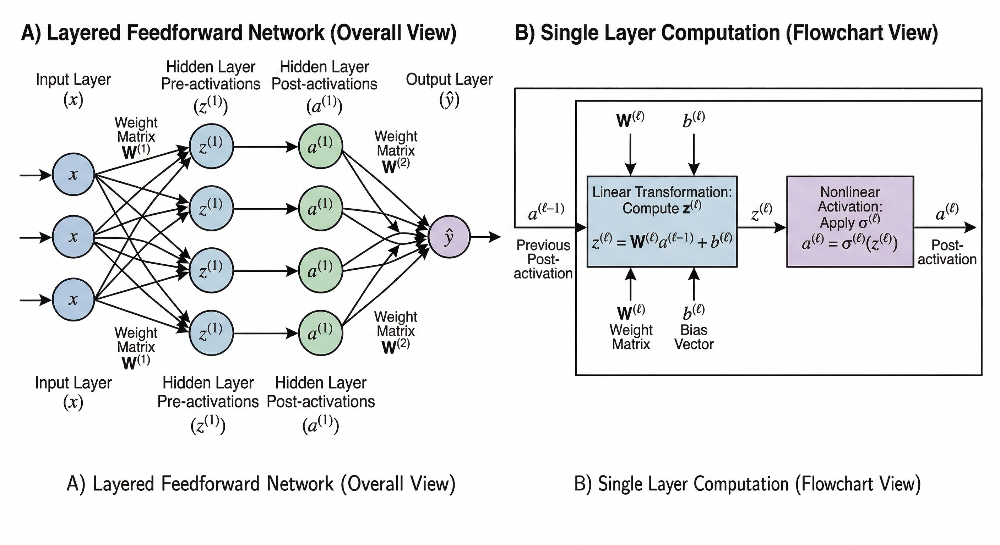
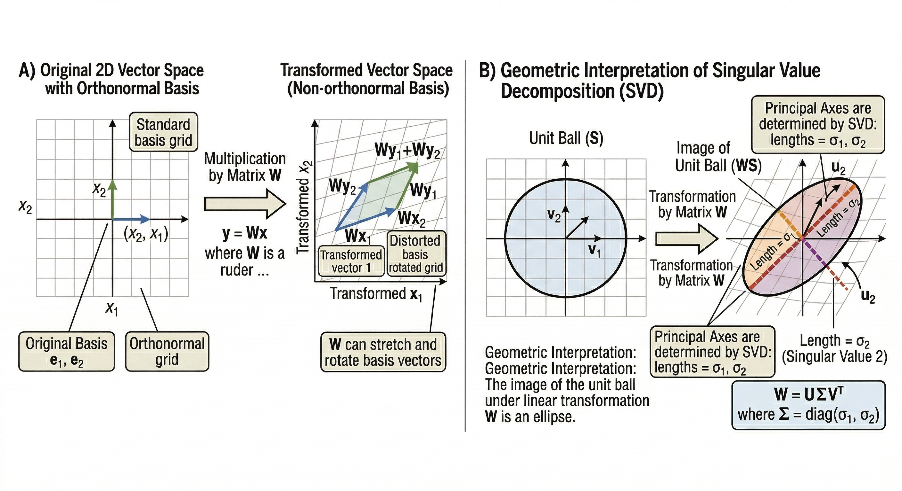

# Chapter 1: The Architecture of Thought

  

    <i>"The brain is wider than the sky"</i>
  

  

    Emily Dickinson
  

## 1.1 The Fundamental Question

Before a single equation is written, before a single parameter is defined, we must ask the question that gave birth to the entire field: *can a machine learn?*

For most of computing history, the answer was carefully circumscribed. A machine could compute - it could execute the rules we wrote for it with blinding speed and flawless consistency. But it could not *learn* those rules. If you wanted a program to recognize a cat, you had to define a cat: tell the machine exactly which pixel patterns, which edge orientations, which color distributions correspond to "catness". The programmer was the bottleneck. Human knowledge had to be painstakingly hand-translated into explicit, brittle code.

The breakthrough insight of neural networks is deceptively simple: **instead of programming the rules, program the learning**. Instead of specifying what a cat looks like, expose the system to thousands of examples and let it discover the structure itself. The machine doesn't start with knowledge; it starts with a *mechanism for acquiring knowledge*.

This chapter builds that mechanism from the ground up - not as a collection of equations to memorize, but as an inevitable architectural consequence of a handful of first principles.

## 1.2 A Brief History: Cycles of Enthusiasm and Winter

The history of neural networks is not a smooth curve of progress. It is a drama in four acts, punctuated by what researchers grimly called "AI Winters" - periods of defunded projects and broken promises.

**Act I: The Blueprint (1943–1969)** 

In 1943, Warren McCulloch and Walter Pitts proposed the first mathematical model of a neuron - a binary threshold unit that either fired (1) or didn't (0). It was a radical idea: *intelligence as logic*. If the human brain was made of simple switches arranged just right, perhaps understanding the arrangement was enough.

Frank Rosenblatt took the next step in 1958 with the **Perceptron** - the first machine that could genuinely *learn* to classify patterns by adjusting numerical weights in response to its mistakes. The excitement was enormous, perhaps too enormous. The New York Times predicted machines that could "walk, talk, see, write, reproduce itself and be conscious of its existence". Then came the reckoning.

In 1969, Marvin Minsky and Seymour Papert published *Perceptrons*, a rigorous mathematical analysis demonstrating that single-layer networks could only solve *linearly separable* problems. They could not even compute the logical XOR function - a problem a child solves instantly. Funding dried up. The First AI Winter descended.

**Act II: The Hidden Layer Revolution (1975–1989)** 

The thaw came gradually, with a crucial insight: if one layer is limited to linear boundaries, stack multiple layers. The barrier was not theoretical but algorithmic - how do you train those hidden layers? In 1986, Rumelhart, Hinton, and Williams published the paper that answered this question definitively, popularizing **backpropagation**, the algorithm that assigns blame for mistakes to every weight in the network. The hidden layer problem was solved.

By 1989, Yann LeCun combined backpropagation with a new architectural idea - the Convolutional Neural Network - to recognize handwritten digits with near-human accuracy. The mathematics was now in place. The computers were not yet fast enough.

**Act III: The Deep Learning Revolution (2006–2012)** 

Hinton, LeCun, and Bengio spent the wilderness years of the Second AI Winter refining the theoretical foundations. The breakthrough came not from a new idea but from two old friends: **data** and **hardware**. The ImageNet dataset, containing 1.2 million labeled images across 1,000 categories, provided the fuel. The GPU, originally designed for rendering video games, provided the fire.

In 2012, a deep CNN called **AlexNet** entered the ImageNet competition and won by a margin so staggering - reducing the top-5 error rate from 26% to 15% - that the entire computer vision community pivoted overnight. The modern era had begun.

**Act IV: The Attention Era (2017–present)** 

The most recent architectural revolution arrived in 2017, when Vaswani et al. published "Attention Is All You Need", introducing the **Transformer**. By replacing sequential processing with a mechanism that allows every element in a sequence to attend to every other element simultaneously, Transformers unlocked a new scaling regime. Networks with hundreds of billions of parameters, trained on essentially all human-written text, began to exhibit capabilities that seemed qualitatively different - reasoning, coding, creativity.

The story continues.

## 1.3 The Mathematical Substrate: What Neural Networks Actually Are

Beneath all the biological metaphor lies a precise mathematical object. A neural network is a **parameterized function** - a mapping $f_\theta: \mathbb{R}^{d_{\text{in}}} \to \mathbb{R}^{d_{\text{out}}}$ from input space to output space, where $\theta$ denotes all learnable parameters. The subscript $\theta$ is the crucial element: it signals that this function's behavior is not fixed but *adjustable*.

More specifically, a network with $L$ layers is a composition of simpler functions:

$$f_\theta = f_\theta^{(L)} \circ f_\theta^{(L-1)} \circ \cdots \circ f_\theta^{(1)}$$

where each $f_\theta^{(\ell)}$ represents the computation of a single layer. The symbol $\circ$ denotes function composition - the output of layer $\ell$ becomes the input of layer $\ell+1$. This compositional structure is the source of both the network's power and its training difficulty.

Every layer $\ell$ performs the same two-step computation. First, a **linear transformation**:

$$z^{(\ell)} = W^{(\ell)} a^{(\ell-1)} + b^{(\ell)}$$

where $W^{(\ell)} \in \mathbb{R}^{n_\ell \times n_{\ell-1}}$ is the weight matrix, $b^{(\ell)} \in \mathbb{R}^{n_\ell}$ is the bias vector, and $a^{(\ell-1)}$ is the output of the previous layer (with $a^{(0)} = x$, the raw input). Second, a **nonlinear activation**:

$$a^{(\ell)} = \sigma^{(\ell)}(z^{(\ell)})$$

where $\sigma^{(\ell)}$ is applied elementwise. Why this two-step structure? The linear transformation alone is insufficient - composing $L$ linear maps yields a single linear map, making depth useless:

$$W^{(L)}\bigl(W^{(L-1)}(\cdots(W^{(1)}x + b^{(1)})\cdots) + b^{(L-1)}\bigr) + b^{(L)} = Wx + b$$

for some combined $W$ and $b$. This algebraic collapse is the mathematical reason the First AI Winter happened - without nonlinearity, depth is illusion.

  
  
<b>Figure 1.1:</b> The Architecture of a Neural Network and Its Internal Computation

## 1.4 Linear Algebra: The Language of Intelligence

To truly understand neural networks, we must inhabit the geometric world they operate in. Data does not live in a spreadsheet; it lives in a high-dimensional space, and the "knowledge" of a network is best understood as a series of *geometric transformations* of that space.

Think of an input vector $x \in \mathbb{R}^n$ as a point in an $n$-dimensional space. A weight matrix $W \in \mathbb{R}^{m \times n}$ does something specific and beautiful to this point: it **transforms the space itself**. Multiplying by $W$ can rotate the space, stretch it along certain directions, compress it along others, and even project it down to a lower dimension. The bias $b$ then *shifts* the transformed space so the learned patterns are not forced to pass through the origin.

This geometric view makes several deep facts transparent. The **rank** of $W$ determines the maximum dimensionality of the transformed output. If $W$ is rank-deficient, information is being lost - the network is "collapsing" some dimensions of its representation. The **singular values** of $W$ (from its Singular Value Decomposition $W = U\Sigma V^T$) measure exactly how much the transformation stretches space along each direction. Large singular values amplify signals; small ones suppress them.

These properties are not merely aesthetic. During training, the **Hessian** matrix $H_{ij} = \partial^2 \mathcal{L} / (\partial \theta_i \partial \theta_j)$ describes the curvature of the error surface - the "shape of the valley" the optimizer must navigate. If the Hessian has a large **condition number** (ratio of largest to smallest eigenvalue), the loss landscape resembles a narrow canyon rather than a round bowl, causing gradient descent to oscillate instead of converging. This is why techniques like batch normalization, which implicitly condition the Hessian, are so effective.

For a researcher, the geometric intuition translates directly into theoretical results. The capacity of a linear layer to separate classes is governed by its Rademacher complexity, which depends on the spectral norm of $W$. This is why **spectral normalization** - constraining the largest singular value - is the key to stable GAN training.

  
  
<b>Figure 1.2:</b> Geometric Transformations of Vector Space and Unit Ball

## 1.5 The Universal Approximation Theorem: Power and its Limits

The theoretical justification for why neural networks *can* work is the **Universal Approximation Theorem**, first proved by Cybenko in 1989 and later generalized by Hornik, Stinchcombe, and White.

**Theorem (Cybenko, 1989).** Let $\sigma$ be any continuous, bounded, nonconstant function. For any continuous function $f: [0,1]^n \to \mathbb{R}$ and any $\varepsilon > 0$, there exists a single-hidden-layer network $g$ of the form:

$$g(x) = \sum_{i=1}^{N} v_i\, \sigma(w_i^T x + b_i)$$

such that $|g(x) - f(x)| < \varepsilon$ for all $x \in [0,1]^n$.

The theorem says: *a sufficiently wide single-hidden-layer network can approximate any continuous function to arbitrary precision*. This is the theoretical bedrock of deep learning - it guarantees that the hypothesis class of neural networks is rich enough, in principle, to express the solution to any well-posed learning problem.

But the theorem comes with two critical caveats that separate theoretical elegance from practical utility.

The first caveat is **existence versus constructibility**. The theorem guarantees that an approximating network *exists* but says nothing about how to find it. Gradient descent is not guaranteed to converge to the approximating network - and for a single wide layer, it often does not. The optimization landscape can be treacherous.

The second caveat is **the depth advantage**. While one wide layer is theoretically sufficient, it may require exponentially many neurons. Deep networks can represent the same functions exponentially more efficiently. The parity function on $n$ bits, for instance, requires $O(2^n)$ neurons in a shallow network but only $O(n)$ neurons in a deep one. This exponential advantage of depth over width is the theoretical argument for going deep.

A 2024 development worth noting: **Kolmogorov-Arnold Networks (KANs)** invert the standard architecture by placing learnable functions on the *edges* (connections) rather than fixed activations inside nodes. This allows the network to learn not just the weights but the shape of each transformation, offering a different inductive bias and potentially higher interpretability - though their practical advantages over standard MLPs remain an active research question.

## 1.6 Probabilistic Foundations: Networks as Density Estimators

Neural networks are not merely function approximators; they are *probabilistic models*. The output of a classification network is not a hard category but a probability distribution over categories. This probabilistic lens is essential for understanding both loss functions and generalization.

The standard framework is **maximum likelihood estimation (MLE)**. Given a dataset $\mathcal{D} = \{(x^{(i)}, y^{(i)})\}_{i=1}^N$ drawn i.i.d. from an unknown distribution $p_{\text{data}}$, we seek parameters $\theta$ maximizing the likelihood of the data under our model:

$$\theta^* = \arg\max_\theta \prod_{i=1}^N p_\theta(y^{(i)} | x^{(i)}) = \arg\max_\theta \sum_{i=1}^N \log p_\theta(y^{(i)} | x^{(i)})$$

The logarithm converts a product into a sum, transforming a stability-threatening numerical computation into a stable one. Different assumptions about the noise structure of $p_\theta$ lead naturally to different loss functions. If outputs are Gaussian-distributed, MLE reduces to minimizing mean squared error. If outputs are categorical, MLE reduces to minimizing cross-entropy:

$$\mathcal{L}_{\text{CE}} = -\sum_{i=1}^N \sum_k y_k^{(i)} \log p_\theta(k | x^{(i)})$$

where $y_k^{(i)}$ is 1 if example $i$ has label $k$ and 0 otherwise (a "one-hot" encoding). The beauty of this derivation is that the loss function is no longer an arbitrary engineering choice - it is the *optimal* objective given a specific probabilistic model of the world.

The **bias-variance decomposition** reveals the fundamental tension in learning. For a regression target $y = f(x) + \varepsilon$ where $\varepsilon$ has zero mean and variance $\sigma^2$, the expected prediction error decomposes as:

$$\mathbb{E}\bigl[(\hat{f}(x) - y)^2\bigr] = \underbrace{\bigl(\mathbb{E}[\hat{f}(x)] - f(x)\bigr)^2}_{\text{Bias}^2} + \underbrace{\mathbb{E}\bigl[(\hat{f}(x) - \mathbb{E}[\hat{f}(x)])^2\bigr]}_{\text{Variance}} + \sigma^2$$

Bias measures systematic error - how wrong the model is *on average*. Variance measures sensitivity to the specific training set used. The irreducible noise $\sigma^2$ is the inherent randomness in the data no model can eliminate. Regularization techniques, covered in depth in Chapter 4, are precisely the instruments by which we navigate this decomposition.

## 1.7 Activation Functions: The Nervous System of the Network

An activation function is the element that breaks linearity, and the history of choosing the right one spans the entire arc of modern deep learning.

The **sigmoid function**  was the canonical choice for decades. It outputs values in $(0,1)$, making it interpretable as a probability. $$\sigma(z) = (1 + e^{-z})^{-1}$$ Its derivative $\sigma'(z) = \sigma(z)(1 - \sigma(z))$ is at most $0.25$, which seems harmless until you consider a 50-layer network. During backpropagation, gradients are multiplied by derivatives at each layer. After 50 layers, the gradient has been multiplied by values at most $0.25^{50} \approx 10^{-30}$. The gradient has not vanished - it has been annihilated. Early layers of deep sigmoid networks receive essentially zero gradient signal and learn nothing. This is the **vanishing gradient problem**.

The **tanh function** improves on sigmoid by being zero-centered - its outputs range over $(-1, 1)$. $$\tanh(z) = (e^z - e^{-z})/(e^z + e^{-z}) = 2\sigma(2z) - 1$$ Zero-centering matters because gradients from zero-centered activations have balanced positive and negative components, making the optimizer's path through parameter space smoother. But tanh still saturates, and its maximum derivative of 1 means the vanishing gradient problem, while slower, is not solved.

The revolution came with **ReLU**: $$\text{ReLU}(z) = \max(0, z)$$ Its derivative is exactly 1 for all positive inputs and 0 for negative inputs. For positive neurons, backpropagation does not attenuate the gradient at all - the signal passes through at full strength. This simple, non-differentiable-at-zero function unlocked the training of networks with tens, then hundreds, of layers.

ReLU has its own pathology: the **dying neuron problem**. If a neuron's pre-activation is always negative (which can happen with poor initialization or large learning rates), its gradient is permanently zero - the neuron contributes nothing and never recovers. **Leaky ReLU** with $\alpha \approx 0.01$ allows a trickle of gradient for negative inputs, keeping neurons "barely alive". $$\text{LReLU}(z) = \max(\alpha z, z)$$

Modern architectures increasingly use smoother variants. **GELU** (Gaussian Error Linear Unit), defined as $\text{GELU}(z) = z \cdot \Phi(z)$ where $\Phi$ is the standard normal CDF, and **Swish** $\text{Swish}(z) = z \cdot \sigma(z)$ are non-monotonic, smooth approximations to ReLU that often outperform it in Transformer architectures. They can be interpreted as "stochastic gates" - the activation weights the input by its probability of being positive, implicitly performing a kind of learned regularization.

> TODO: <DIAGRAM: Four panels showing Sigmoid, Tanh, ReLU, and GELU on the same axis range (-3, 3). Each panel includes both the function and its derivative. Annotations highlight: saturation regions for sigmoid/tanh, the gradient of 1 for ReLU, and the non-monotonic region of GELU.>

The choice of activation function is not cosmetic. It determines gradient flow, optimization dynamics, and ultimately whether a network with a given depth and architecture is trainable at all. The right activation for a given depth, initialization scheme, and task is a design decision with profound mathematical consequences.

## 1.8 The Forward Pass: Information as Water Through a Network

Imagine water flowing through a series of filters, each one transforming the stream in a specific way. The raw input - a pixel grid, a word embedding, a sensor reading - enters the first filter and emerges changed. What was a flat grid of numbers becomes a representation of edges and textures. What were raw word frequencies become a vector that captures semantic relationships. By the time the signal reaches the final layer, it has been transformed from raw sensation into structured understanding.

This is **forward propagation**, and it deserves to be understood not just mechanically but geometrically.

For a fully connected network with $L$ layers, the forward pass computes:

$$z^{(\ell)} = W^{(\ell)} a^{(\ell-1)} + b^{(\ell)}, \qquad a^{(\ell)} = \sigma^{(\ell)}(z^{(\ell)}), \quad \ell = 1, \ldots, L$$

with $a^{(0)} = x$. At each layer, the weight matrix $W^{(\ell)}$ performs a linear transformation - rotating and stretching the representation - while the activation $\sigma^{(\ell)}$ introduces nonlinearity, allowing the network to fold space in ways that separate previously inseparable classes.

In practice, we never process a single example at a time. We stack $B$ examples into a **minibatch matrix** $X \in \mathbb{R}^{d_{\text{in}} \times B}$, transforming the vector operations into matrix operations:

$$Z^{(\ell)} = W^{(\ell)} A^{(\ell-1)} + b^{(\ell)} \mathbf{1}_B^T, \qquad A^{(\ell)} = \sigma^{(\ell)}(Z^{(\ell)})$$

where $\mathbf{1}_B$ is a vector of ones and the bias is broadcast across all examples. This matrix formulation is the reason GPUs transformed deep learning: a GPU with thousands of cores can perform matrix multiplication orders of magnitude faster than a CPU, enabling the batched computation that makes training feasible.

The **output layer** is specialized to the task. For regression, a linear (identity) activation allows any real-valued output. For binary classification, a sigmoid squashes the output to a probability in $(0,1)$. For $K$-class classification, the **softmax** function:

$$\text{softmax}(z)_k = \frac{e^{z_k}}{\sum_{j=1}^K e^{z_j}}$$

produces a probability distribution over all classes - all outputs are positive and sum to one. The softmax amplifies the largest logit and suppresses the rest, creating sharp, confident predictions when the model is certain and flat, uncertain predictions when it is not.

## 1.9 Major Architectural Families: Structure as Inductive Bias

Not all data is created equal, and not all network architectures are suited to all data types. The key concept here is **inductive bias**: the structural assumptions baked into an architecture before a single training step. A well-chosen inductive bias is like hiring a specialist - the architecture's structure already encodes what kinds of patterns are likely to be important.

### Feedforward Networks (MLPs)

The simplest architecture, the **Multi-Layer Perceptron**, makes no assumptions about the structure of inputs. Every neuron in each layer connects to every neuron in the next. For a network with layer sizes $[n_0, n_1, \ldots, n_L]$, the total parameter count is:

$$|\theta| = \sum_{\ell=1}^L n_\ell \cdot n_{\ell-1} + n_\ell$$

For high-dimensional inputs like images - a $256 \times 256$ color image has $196{,}608$ dimensions - even a single fully connected layer produces hundreds of millions of parameters. MLPs have no spatial awareness; they treat a flipped image and its original as completely unrelated inputs. This makes them poor default choices for structured data, though they remain indispensable as "read-out" layers at the end of more structured encoders.

### Convolutional Neural Networks (CNNs)

CNNs, explored in depth in Chapter 5, encode the **spatial locality** and **translation equivariance** of visual data. Instead of unique weights for every pixel-to-neuron connection, CNNs use **shared filters**: small windows that slide across the entire input, applying the same weights at every position. This encodes the prior belief that a vertical edge detector useful in the top-left corner of an image is equally useful in the bottom-right.

The core operation for a filter $W \in \mathbb{R}^{k \times k}$ sliding over a 2D input $X$ is:

$$(X * W)[i, j] = \sum_{m=0}^{k-1} \sum_{n=0}^{k-1} X[i+m, j+n] \cdot W[m, n]$$

The computational savings are dramatic. A $3 \times 3$ filter applied to a 64-channel input producing 128 output channels requires $3 \times 3 \times 64 \times 128 \approx 73{,}000$ parameters - compared to the billions a fully connected layer would need for the same spatial transformation.

The architectural milestone of **ResNet** (He et al., 2016) solved the depth problem with **residual connections**:

$$y = \mathcal{F}(x; W) + x$$

Instead of learning the full mapping $H(x)$, the layer learns only the *residual* $\mathcal{F}(x) = H(x) - x$. If a layer is useless, it can learn $\mathcal{F} = 0$ and pass the identity through. More importantly, during backpropagation:

$$\frac{\partial y}{\partial x} = \frac{\partial \mathcal{F}}{\partial x} + I$$

The identity term $I$ ensures that gradient always has a path to flow backward, regardless of how small $\partial \mathcal{F}/\partial x$ becomes. This elegant bypass was the key that unlocked networks with hundreds of layers.

### Recurrent Neural Networks (RNNs) and LSTMs

For sequential data - text, audio, time series - the relevant inductive bias is **temporal order**: the state at time $t$ depends on the state at time $t-1$. RNNs encode this with a hidden state $h^{(t)}$ updated at each step:

$$h^{(t)} = f(W_{hh} h^{(t-1)} + W_{xh} x^{(t)} + b_h)$$

The same weight matrices $W_{hh}$ and $W_{xh}$ are shared across all time steps - an inductive bias saying "the rules of the sequence do not change with time". This allows RNNs to process sequences of arbitrary length. The vanishing gradient problem in time, however, makes it hard for standard RNNs to learn long-range dependencies - a problem solved by **LSTMs** and **GRUs**, discussed at length in Chapter 6.

### Transformers

The Transformer (Vaswani et al., 2017) abandons the recurrence assumption entirely. Instead of processing sequences step-by-step, it allows every position in a sequence to attend to every other position simultaneously via **self-attention**:

$$\text{Attention}(Q, K, V) = \text{softmax}\!\left(\frac{QK^T}{\sqrt{d_k}}\right) V$$

where $Q$ (query), $K$ (key), and $V$ (value) are linear projections of the input. The scaling by $\sqrt{d_k}$ prevents the dot products from becoming so large that the softmax saturates. **Multi-head attention** runs $H$ such attention operations in parallel:

$$\text{MultiHead}(X) = \text{Concat}(\text{head}_1, \ldots, \text{head}_H) W^O$$

$$\text{head}_i = \text{Attention}(XW_i^Q, XW_i^K, XW_i^V)$$

Each head can learn to attend to different types of relationships - one head might capture syntactic structure, another semantic similarity. The full Transformer architecture interleaves self-attention blocks with feedforward layers and layer normalization, creating a deep stack capable of learning extraordinarily rich representations from sequence data.

> TODO: <DIAGRAM: A side-by-side comparison. Left panel: an RNN unrolled over five time steps, showing sequential dependence and the single hidden state flowing left-to-right. Right panel: a Transformer attention map showing a 5×5 grid where all positions can attend to all others simultaneously. Color intensity indicates attention weight.>

## 1.10 Weight Initialization: Starting on the Right Foot

Before training begins, every parameter must be assigned an initial value. This choice is not ceremonial - poor initialization can cause training to fail before the first gradient step lands.

The **symmetry problem** is the primary concern. If all weights are initialized to the same constant (including zero), every neuron in a given layer computes identical outputs and receives identical gradient updates. They evolve in perfect lockstep, never diverging. The network effectively has only one neuron per layer regardless of its stated width. This symmetry is broken only by random initialization, but the *scale* of that randomness matters profoundly.

If initial weights are too large, the pre-activations $z^{(\ell)}$ will be large, pushing sigmoid and tanh activations into their saturation zones where derivatives are near zero - instant vanishing gradients. If initial weights are too small, signals will fade before reaching deep layers.

**Xavier (Glorot) initialization** is derived by demanding that the variance of activations be approximately preserved across layers. For a layer with $n_{\text{in}}$ inputs and $n_{\text{out}}$ outputs:

$$W_{ij} \sim \mathcal{N}\!\left(0,\; \frac{2}{n_{\text{in}} + n_{\text{out}}}\right) \quad \text{or} \quad W_{ij} \sim \mathcal{U}\!\left(-\sqrt{\frac{6}{n_{\text{in}}+n_{\text{out}}}},\; \sqrt{\frac{6}{n_{\text{in}}+n_{\text{out}}}}\right)$$

This initialization is optimal for saturating activations like sigmoid and tanh, where the effective gain is approximately 1. The derivation assumes linear activations and uses the condition $\text{Var}(z^{(\ell)}) = \text{Var}(z^{(\ell-1)})$ in both the forward and backward directions simultaneously.

**He initialization**, developed for ReLU networks, accounts for the fact that ReLU zeros out approximately half its inputs, halving the effective signal variance at each layer. Doubling the variance compensates:

$$W_{ij} \sim \mathcal{N}\!\left(0,\; \frac{2}{n_{\text{in}}}\right)$$

This is the modern default for any ReLU-activated network. **LeCun initialization** $\mathcal{N}(0, 1/n_{\text{in}})$ enables the "self-normalizing" property of SELU activations.

The initialization scheme is not independent of the activation function. Using Xavier initialization on a ReLU network, or He initialization on a tanh network, breaks the variance-preservation derivation and can lead to subtle, hard-to-diagnose training failures.

## 1.11 Normalization: Stabilizing the Internal Weather

Even with careful initialization, the distribution of activations at each layer shifts during training as the parameters in earlier layers change. This phenomenon, called **internal covariate shift**, can destabilize learning because each layer must constantly adapt to a moving target distribution from the layer below.

**Batch Normalization** (Ioffe & Szegedy, 2015) addresses this by normalizing activations within each minibatch. For a minibatch $\mathcal{B}$ of size $B$:

$$\mu_\mathcal{B} = \frac{1}{B}\sum_{i \in \mathcal{B}} x_i, \quad \sigma_\mathcal{B}^2 = \frac{1}{B}\sum_{i \in \mathcal{B}}(x_i - \mu_\mathcal{B})^2$$

$$\hat{x}_i = \frac{x_i - \mu_\mathcal{B}}{\sqrt{\sigma_\mathcal{B}^2 + \varepsilon}}, \quad y_i = \gamma \hat{x}_i + \beta$$

The learnable scale $\gamma$ and shift $\beta$ allow the network to recover any desired distribution - including the original unnormalized one - if that is optimal. Without them, a sigmoid layer following batch norm could never represent the identity function, since sigmoid's linear regime is narrow around zero.

Batch normalization's effects are broader than its derivation suggests. Research by Santurkar et al. (2018) showed that its primary benefit may be **smoothing the loss landscape**, reducing the magnitude and variance of gradient fluctuations. This allows larger learning rates and faster convergence. It also provides mild regularization through the batch-level noise in the estimated statistics.

**Layer Normalization** normalizes across the feature dimension of a single example, making it independent of batch size:

$$\mu = \frac{1}{d}\sum_{i=1}^d x_i, \quad \sigma^2 = \frac{1}{d}\sum_{i=1}^d (x_i - \mu)^2, \quad \hat{x}_i = \frac{x_i - \mu}{\sqrt{\sigma^2 + \varepsilon}}$$

Layer normalization is the standard for Transformers and RNNs, where variable-length sequences make batch-level statistics unstable. The normalization statistics depend only on the single example being processed, making training and inference identical - no running mean/variance accumulation is needed.

## 1.12 Open Horizons: What We Do Not Yet Understand

The practical success of deep learning far outpaces its theoretical understanding. Several fundamental questions remain open at the frontier of research.

**Why do overparameterized networks generalize?** Classical statistical learning theory predicts that a model with billions of parameters, trained on millions of examples, should overfit catastrophically. Modern deep networks routinely violate this prediction, generalizing well to unseen data even when they perfectly memorize the training set. The theory of **double descent** (Belkin et al., 2019) shows that test error can decrease again *beyond* the interpolation threshold as model size grows further. Neural tangent kernel theory provides one lens on this, but a complete theory remains elusive.

**What determines which representations form?** When a CNN learns to detect edges, textures, and objects, is this an inevitable consequence of the architecture and data, or could the same architecture learn entirely different representations given different training procedures? Recent work on representational similarity suggests the representations learned by different networks trained on the same task converge surprisingly strongly - but the theoretical reasons are not understood.

**How do capabilities emerge with scale?** Large language models trained on text suddenly acquire abilities - in-context learning, chain-of-thought reasoning, arithmetic - that appear qualitatively different from smaller models. These "emergent capabilities" are not predicted by smooth scaling laws and their origins are poorly understood.

These are not merely academic puzzles. Understanding *why* deep learning works would allow us to design better architectures, identify failure modes in advance, and build systems that are genuinely reliable rather than empirically reliable. The mathematical foundations laid in this chapter - the geometry of linear transformations, the power of nonlinear composition, the probabilistic framework of likelihood maximization - are the tools with which these questions will eventually be answered.

## Summary

This chapter established the foundational principles of neural networks: the compositional structure of layered functions, the necessity of nonlinearity, the geometric language of linear algebra, and the probabilistic framework of maximum likelihood estimation. We traced the historical arc from Perceptrons to Transformers, understanding each architectural innovation as a response to a specific theoretical or practical limitation.

The key insights to carry forward are:

- A neural network is a parameterized composition of linear transformations and nonlinearities, trained to minimize a probabilistic loss via gradient descent.
- The choice of activation function determines gradient flow and, by extension, how deep a network can be trained.
- Different architectural families - MLPs, CNNs, RNNs, Transformers - encode different inductive biases, making each appropriate for different types of structured data.
- Initialization and normalization are not engineering footnotes; they are mathematical prerequisites for stable gradient flow.

In Chapter 2, we descend into the machinery that makes learning possible: backpropagation, the algorithm that computes the gradient of the loss with respect to every parameter in a single efficient backward pass.

---

*Continue to **[Chapter 2: The Calculus of Learning - Backpropagation and Gradient Flow](/DeepLearning/02_Backpropagation.md)***
