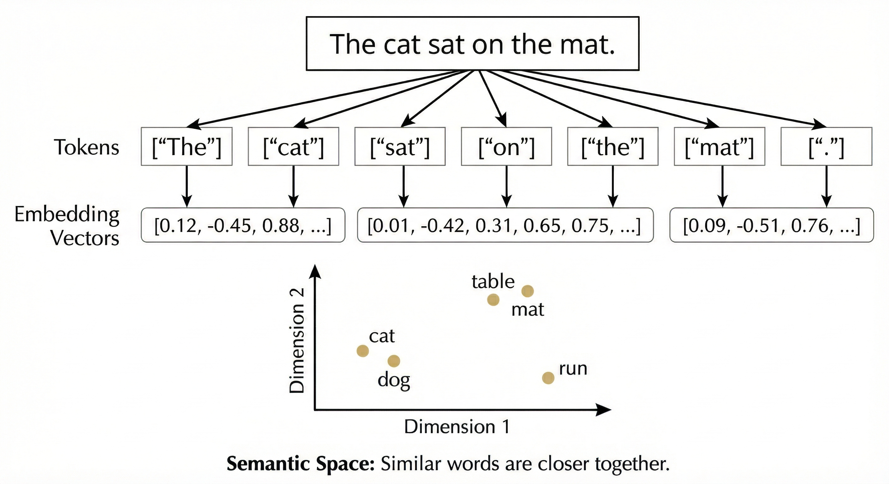
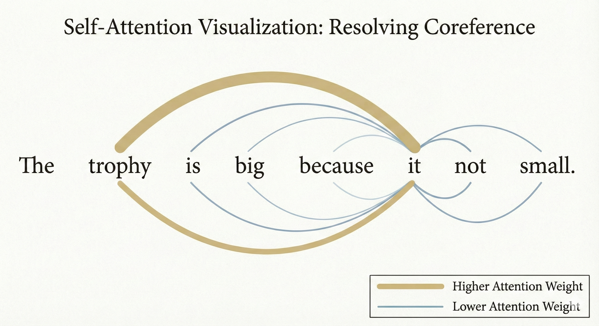
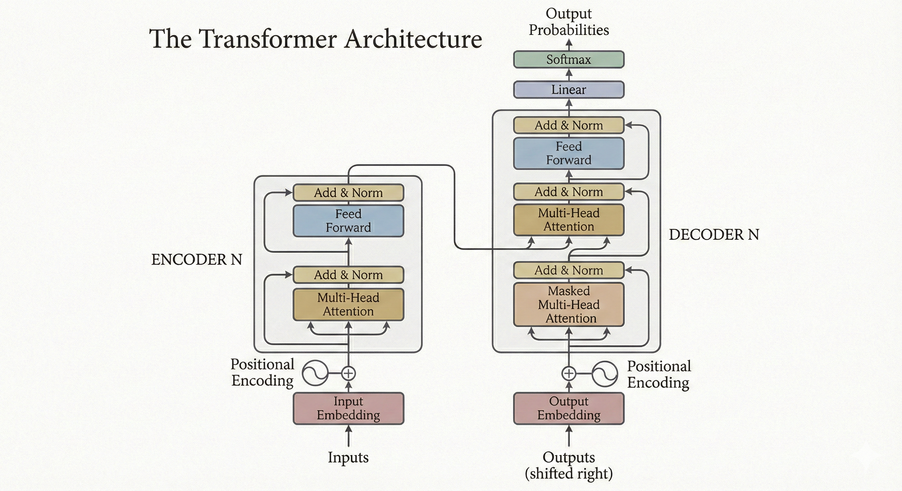
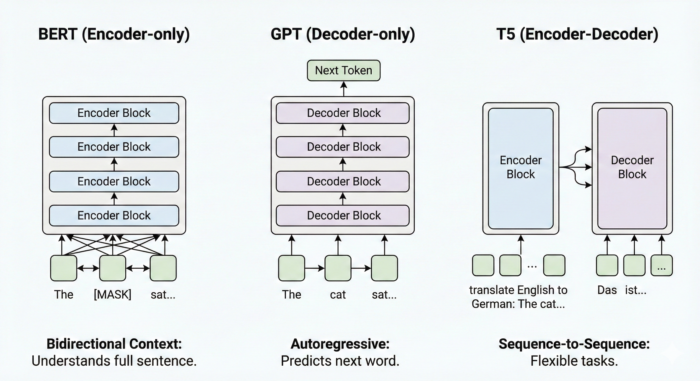

# LLM Architecture Overview

#### Table of Contents
1. [Introduction](#introduction)
2. [Understanding Large Language Model Architecture](#understanding-large-language-model-architecture)
3. [How LLMs Process Language](#how-llms-process-language)
4. [The Transformer Revolution](#the-transformer-revolution)
5. [The Complete Transformer Architecture](#the-complete-transformer-architecture)
6. [Different Architectural Approaches](#different-architectural-approaches)
7. [Training Large Language Models](#training-large-language-models)
8. [Model Scaling and Computational Requirements](#model-scaling-and-computational-requirements)
9. [Real-World Applications](#real-world-applications)
10. [Understanding the Limitations](#understanding-the-limitations)

---

## Introduction

**Large Language Models** have fundamentally transformed how we interact with artificial intelligence and how machines process human language. To truly understand how these remarkable systems work, we need to explore two fundamental aspects that form the foundation of every large language model: **their underlying architecture** and **the critical process of tokenization**.

When we talk about large language models, we are referring to AI systems that have been specifically designed to process and generate human-like text. These models differ from traditional natural language processing approaches in several key ways:

- **Scale**: They contain billions or even trillions of parameters
- **Training methodology**: They learn from massive amounts of text data
- **Versatility**: They can perform multiple tasks without task-specific training

Unlike older systems that required explicit programming for each specific task, large language models **learn patterns and relationships in language** by analyzing massive amounts of text data, developing an internal understanding that allows them to perform a wide variety of tasks without task-specific training.

---

## Understanding Large Language Model Architecture

The term **"large"** in LLM refers to several interconnected characteristics that define these systems. First and most obviously, these models contain an **enormous number of parameters** - the internal numerical values that the model adjusts during training to learn patterns in data. Modern large language models can have billions or even trillions of these parameters.

To put this in perspective, the human brain contains approximately 100 billion neurons with around 100 trillion connections between the,. The largest language models are approaching similar scales of complexity, though they work in fundamentally different ways than biological brains.

The size of these models is not arbitrary. Researchers have discovered that as models grow larger, they exhibit what are called **"emergent capabilities"** - abilities that only appear once the model reaches a certain scale:

- **Small models** might struggle with basic grammatical tasks
- **Medium-sized models** can handle simple language understanding
- **Truly large models** demonstrate sophisticated reasoning, can follow complex instructions, and can learn new tasks from just a few examples

This relationship between size and capability means that building more powerful language models often requires making them larger, though recent research has also focused on making models more efficient so they can do more with fewer parameters.

Beyond just the number of parameters, these models are **"large" in terms of the data they consume during training**. Training a modern large language model requires processing hundreds of billions or even trillions of words of text. This training data comes from diverse sources including books, websites, scientific papers, and other written materials. 

The model learns by repeatedly trying to **predict what comes next** in text sequences, gradually adjusting its internal parameters to become better at this prediction task. Through this seemingly simple objective, the model develops sophisticated understanding of grammar, facts about the world, reasoning patterns, and much more.

---

## How LLMs Process Language

  

At the most fundamental level, large language models face a challenge that might seem simple but is actually quite profound: **computers work with numbers** (more specifically, binary), but **language is made of words and sentences**. To bridge this gap, language models must convert text into numerical representations that can be processed by mathematical operations. This conversion happens through a **multi-stage process** that transforms raw text into rich numerical representations that capture meaning, context and relationships. 

#### From Text to Tokens

The first step in this process is **tokenization**. We will cover this topic later, but for now we only need to understand that it breaks text into smaller units called **tokens**: 

$$
\text{"Some text about LLMs"} \quad \xrightarrow{tokenization} \quad [\text{"Some"}, \text{"Text"},\text{"About"},\text{"LLMs"}]
$$

These tokens might be whole words, parts of words, bytes, etc. depending on the tokenization approach being used. 

#### From Tokens to Embeddings

Once text has been broken into tokens, each token is converted into a **dense vector of numbers** called an **embedding**. These embeddings are not arbitrary - they are learned during training so that tokens with similar meanings end up with similar numerical representations.

Consider this example. If we represented the word $\text{"cat"}$ with one set of numbers and $\text{"dog"}$ with another set, we want those number sets to be relatively similar as they are similar (both animals). On the other hand, the numbers representing these words should be fundamentally different from $\text{"justice"}$ (for example), as the concepts are fundamentally different. 

The model learns these relationships automatically during training by observing how words are used in context. Words that appear in similar contexts end up with similar embeddings.

Once tokens have been converted to embeddings, the model must account for the **order of words**. This is crucial because $\text{"the dog chased the cat"}$ means something different from $\text{"the cat chased the dog"}$ even though both sentences have the exact same words. 

To encode position information, transformers add **positional encodings** to the embeddings. These positional encodings are carefully designed patterns of numbers that give each position in a sequence a unique signature. By adding these patterns to the word embeddings, the model can distinguish between the same word appearing in different positions.

---

## The Transformer Revolution

The architectural breakthrough that enabled modern large language models was the invention of the **transformer** in 2017. Before transformers, most language models used **recurrent neural networks (RNNs)**, which processed text sequentially one word at a time. While this sequential processing seemed natural - after all, we read and speak one word at a time - it created serious limitations:
- Processing had to happen in strict order, preventing parallelization across the sequence
- Training was very slow due to sequential dependencies
- Information from early in a sequence had to pass through many computational steps to reach later parts, gradually degrading or becoming distorted along the way

### The Attention Mechanism

  

The transformer architecture solved these problems through a mechanism called **attention**. To understand attention, imagine we are reading a sentence like $\text{"The trophy is big because it is not small ".}$ When we read the word $\text{"it"}$, we automatically associate $\text{"it"}$ with $\text{"trophy"}$ by looking at the earlier part of the sentence. The attention mechanism allows transformer models to do something similar - when processing each word, the model can look at all other words in the sequence and determine which ones are most relevant for understanding the current word.

**The mathematics behind attention** is elegant. For each word in a sequence, the model creates three different representations:
- **Query** - Represents what information the word is looking for
- **Key** - Represents what information the word has to offer
- **Value** - The actual information content

To compute attention, the model compares the query from one word with the keys from all other words. These scores are then used to take a weighted combination of the values, producing an output that incorporates relevant information from across the entire sequence.

### Why Attention Is Powerful

What makes this mechanism so powerful is that it allows **every word to directly interact with every other word** in a single computational step. There is no sequential processing, no gradual degradation of information through many intermediate steps. This brings two major advantages:
- **Faster training**: Transformers can be trained much faster than recurrent models because all words can be processed in parallel
- **Better long-range dependencies**: Transformers capture long-range relationships more effectively because the path length between any two words is constant rather than growing with their distance

### Multi-Head Attention

Modern transformers don't use just one attention mechanism. Instead, they use **multiple attention "heads" operating in parallel**. Each head learns to capture different types of relationships between words:
- One head might specialize in linking pronouns to the nouns they refer to
- Another might focus on identifying syntactic relationships like subject-verb agreement
- Another might track semantic relationships between conceptually related words

By combining information from multiple attention heads, the model builds a **rich, multifaceted understanding** of the text. 

---

## The Complete Transformer Architecture

  

A complete transformer consists of **multiple identical layers stacked on top of each other**. Each layer contains two main components:
- **Multi-Head Attention Mechanism** - Allows words to exchange information with each other
- **Feed-Forward Neural Network** - Allows each word's representation to be independently transformed and refined. 

Around these core components are several important technical details that make training stable and effective.

### Residual Connections: The Highway for Gradients

One crucial detail is the use of **residual connections**. In a residual connection, the input to a component is added to its output. This might seem pointless at first - why add the input to the output instead of just using the output? 

The answer has to do with how neural networks are trained. Training involves computing **gradients** that indicate how to adjust each parameter to improve performance and these gradients must flow backward through the network. In very deep networks, gradients can become vanishingly small as they propagate back through many layers, making it hard to train the early layers effectively. **Residual connections provide shortcut paths** that allow gradients to flow more easily, enabling the training of much deeper networks.

### Layer Normalization: Keeping Values in Check

Another important detail is **layer normalization**, which standardizes the representations at various points in the network. Without normalization, the scale of values can grow or shrink through the layers in ways that make training unstable. Layer normalization ensures that the values stay in a reasonable range, which leads to more stable and faster training. 

The exact placement of normalization layers has been studied extensively, with modern architectures typically using what's called **pre-norm**, where normalization happens before each sub-layer rather than after.

### The Role of Feed-Forward Networks

The feed-forward network in each transformer layer might seem simple compared to the complex attention mechanism, but it plays a **crucial role**. This network consists of two linear transformations with a non-linear activation function in between. Despite its conceptual simplicity, the feed-forward network often contains **more parameters than the attention mechanism** and is essential for the model's ability to learn complex transformations of the linguistic representations.

You can think of the attention mechanism as allowing information to **move around and interact**, while the feed-forward network allows that information to be **transformed and refined**.

---

## Different Architectural Approaches

  

While the basic transformer architecture is remarkably versatile, researchers have developed **several important variants** optimized for different types of tasks. The original transformer architecture consisted of two parts: an **encoder** that processes the input text and a **decoder** that generates output text. This encoder-decoder structure works well for tasks like translation where we need to read in one piece of text and produce another.

However, for many tasks, only one part of this architecture is necessary. This led to the development of three main architectural families: 

### Encoder-Only Models (BERT)

**BERT** (Bidirectional Encoder Representations from Transformers) uses only the encoder part of the transformer and is trained by randomly masking some words in the input and asking the model to predict what the masked words were. This training approach allows BERT to build **bidirectional representations** where each word's meaning is informed by both the words that come before it and the words that come after it. 

BERT excels at **understanding tasks** like:
- Question answering
- Text classification
- Named entity recognition

The goal in these tasks is to analyze or extract information from existing text rather than generate new text.

### Decoder-Only Models (GPT)

On the other end of the spectrum are **decoder-only models** like the GPT family. These models use only the decoder part of the transformer and are trained **autoregressively** - that is, they learn to predict the next word given all previous words. When generating text, they produce one word at a time, with each newly generated word being fed back as input for generating the next word. 

This architecture makes GPT models particularly good at **text generation tasks**. They can complete prompts, answer questions, write code, and perform many other tasks through clever prompting, even though they were only trained on the simple objective of predicting the next word.

### Encoder-Decoder Models (T5)

The encoder-decoder architecture is preserved in models like **T5** (Text-to-Text Transfer Transformer), which frames every natural language processing task as a **text-to-text problem**. Whether the task is translation, summarization, question answering, or classification, T5 treats it as taking input text and producing output text. This unified framework allows a single model to handle many different tasks, and the encoder-decoder structure provides the flexibility to transform input text of one form into output text of potentially very different form.

### Comparing the Architectures

Each architectural variant has its strengths:

- **Encoder-only models** can use context from both directions, making them powerful for understanding tasks
- **Decoder-only models** are naturally suited for generation and have shown remarkable versatility through in-context learning, where they can learn new tasks from examples provided in the prompt
- **Encoder-decoder models** offer maximum flexibility but require more computation

The choice of architecture depends on the intended application and the types of tasks the model needs to perform.

---

## Training Large Language Models

Training a Large Language Model is one of the most computationally intensive tasks in modern artificial intelligence. The process typically unfolds in two main phases: **pretraining** and **fine-tuning**. 

During pretraining, the model learns general language understanding from enormous amounts of text. This phase requires **massive computational resources** and can take weeks or months even on hundres or thousands of powerful processors. The goal of pretraining is to give the model broad knowledge about language, reasoning and the world, which it can then apply to many different tasks.

***The pretraining process is fundamentally about prediction***. For a decoder-only model like GPT, pretraining involves showing the model sequences of text and training it to predict what comes next. If the model sees $\text{"The cat sat on the"}$, it should predict something like $\text{"mat"}$ or $\text{"chair"}$ or another plausible continuation. For encoder-only models like BERT, pretraining involves masking out random words and training the model to predict what the masked words were. Through billions of these prediction tasks, the model gradually learns patterns in language - grammar rules, common phrases, factual relationships, reasoning patterns and much more.

***The data used for pretraining is critically important***. Modern large language models are trained on datasets containing hundreds of billions or trillions of words, drawn from books, websites, scientific papers and other text sources. The quality and diversity of this data directly impacts what the model learns. If the training data contains biased viewpoints, factual errors or problematic content, the model will learn and potentially reproduce these issues. Careful curation and filtering of training data is therefore essential, though it remains a challenging problem to ensure training data is both large enough and high quality enough.

During training, the model starts with **randomly initialized parameters** and gradually adjusts them to improve its predictions. This adjustment happens through a process called **backpropagation with gradient descent**:

1. The model makes a prediction
2. A **loss function** measures how wrong the prediction was
3. The system computes **gradients** that indicate how each parameter should be adjusted to reduce the loss
4. The parameters are updated in small steps in the direction that reduces the loss
5. This process repeats millions of times with different batches of data

Gradually, the model's parameters converge to values that make good predictions across a wide range of text.

Training stability is a major concern for very large models. Various technical problems can derail training:
- **Exploding gradients**: Parameter updates become so large they destroy previously learned patterns
- **Vanishing gradients**: Updates become so small that learning slows to a crawl

Modern training techniques to ensure stability include:
- Careful initialization of parameters
- Gradient clipping to cap the maximum size of updates
- Learning rate schedules that adjust how quickly parameters change
- Architectural choices like residual connections and layer normalization

After pretraining creates a model with broad language understanding, **fine-tuning** adapts it for specific tasks or domains. Fine-tuning uses **much smaller amounts of data** - thousands or millions of examples rather than billions - and takes much less time than pretraining. During fine-tuning, the model's parameters are adjusted to specialize it for a particular application. For instance, a model might be fine-tuned on medical literature to improve its performance on medical questions, or on code repositories to enhance its programming capabilities, or on conversational data to make it better at dialogue.

**Types of fine-tuning:**

- **Supervised fine-tuning**: The model is trained on input-output pairs specific to a task. For sentiment analysis, we provide sentences paired with sentiment labels. For question answering, we provide questions and contexts paired with answers.

- **Instruction tuning**: The model is fine-tuned on a diverse set of instructions, even for tasks it hasn't explicitly seen. This has become increasingly popular in recent years.

- **Reinforcement Learning from Human Feedback (RLHF)**: This approach was crucial in developing conversational AI systems like ChatGPT. Humans provide feedback on model outputs, comparing different responses and indicating which are better. This feedback trains a reward model that predicts how a human would evaluate any given response. Then the language model is further trained using reinforcement learning to generate responses that score highly according to the reward model. This process helps align the model's behavior with human preferences, making it more helpful, harmless, and honest in its responses.

---

## Model Scaling and Computational Requirements

The scale of modern Large Language Models is difficult to overstate. Training the largest models requires computational resources that only major technology companies and research labs can afford. Training GPT-3 from scratch, for example, would cost **millions of dollars** in computing resources. The process requires distributing the computation across hundreds or thousands of specialized processors, typically **graphics processing units (GPUs)** or **tensor processing units (TPUs)** that are optimized for the matric operations that neural networks perform.

Several forms of parallelism are used to train these massive models:

- **Data parallelism**: Distributes different batches of training data to different processors, each running a copy of the model. The gradients computed by each processor are then averaged to update the shared model parameters.

- **Model parallelism**: Splits the model itself across multiple processors when it's too large to fit on a single device. Different layers or different parts of layers live on different processors, and activations are passed between processors as needed.

- **Pipeline parallelism**: Divides the model into stages and processes multiple batches simultaneously in a pipeline fashion, with each stage working on a different batch.

These computational requirements mean that **most organizations do not train foundation models from scratch**. Instead, they use existing pretrained models in two main ways:

- Through **APIs** provided by companies like OpenAI and Anthropic
- By downloading **open-weight models** from organizations like Meta and using them directly or fine-tuning them for specific needs

This democratization of access to large language models, where the most expensive pretraining is done once by well-resourced organizations and then made available to others, has been crucial for the widespread adoption of these technologies.

Researchers have also discovered interesting patterns in how model performance scales with size. There appear to be **power law relationships** between model size, amount of training data, amount of computation, and resulting performance: 

- Doubling the model size tends to produce a **predictable improvement** in performance
- Doubling the amount of training data or computation has similar effects
- These scaling laws have guided decisions about how to allocate resources when training models

More recently, research has shown that many models have been **under-trained** - they had plenty of parameters but didn't see enough training data. The optimal approach seems to be to **scale up both model size and training data in a balanced way**.

As models have grown larger, they have exhibited **emergent capabilities** that don't appear in smaller models. For example:

- A small model might not be able to do basic arithmetic reliably
- A sufficiently large model suddenly becomes quite competent at it, even though it wasn't explicitly trained on arithmetic

This emergence of new capabilities at scale has been one of the most surprising and exciting findings in large language model research, though it's not yet fully understood why this happens or how to predict what capabilities will emerge at what scales.

---

## Real-World Applications

Large language models have found applications across virtually every domain that involves text, transforming how professionals work and how services are delivered.

### Healthcare Applications

In healthcare, these models assist doctors by:
- Summarizing patient records
- Helping interpret medical literature
- Suggesting potential diagnoses based on symptoms

The ability to quickly process and synthesize information from vast medical databases can help healthcare providers make more informed decisions, though these systems are **tools to assist human judgment rather than replace it**.

### Legal Industry

In the legal field, large language models help lawyers **review contracts, research case law, and draft legal documents**. The ability to quickly analyze hundreds of contracts to find specific clauses, or to search through decades of legal precedents to find relevant cases, can save enormous amounts of time and ensure more thorough analysis. The models can also help make legal services more accessible by providing preliminary guidance to individuals who might not otherwise be able to afford legal consultation.

### Education and Learning

Education has been transformed by these models, which can serve as **tutoring systems that adapt to individual students**. Unlike traditional educational software that follows rigid scripts, large language models can engage in natural dialogue with students, explaining concepts in multiple ways, generating practice problems, and providing personalized feedback. A model can recognize when a student is struggling with a particular concept and try different explanatory approaches until something clicks, much like a human tutor would.

### Business Applications

The business world uses these models for:
- **Customer service**: Chatbots that handle complex inquiries, understanding context from previous messages and providing thoughtful, relevant responses
- **Content creation**: Generating marketing materials and analyzing customer feedback
- **Data analysis**: Processing and summarizing large amounts of business data
- **Code development**: Writing, explaining, and debugging code

### Programming and Software Development

One particularly impactful application has been in **programming and software development**. Large language models trained on code can:
- Understand multiple programming languages
- Explain what existing code does
- Generate new code from natural language descriptions
- Suggest fixes for bugs

A programmer can describe what they want a function to do in plain English, and the model can generate working code that implements that functionality. While the generated code isn't always perfect and needs human review, this capability dramatically speeds up development and makes programming more accessible to people who are learning.

---

## Understanding the Limitations

Despite these impressive capabilities, it's crucial to understand the **limitations of large language models**.

These systems **don't truly understand language the way humans do** - they are sophisticated pattern matching systems that have learned statistical relationships between words and concepts. This means they can sometimes generate text that sounds confident and fluent but is factually incorrect. 

**Hallucinations**: Researchers call these errors "hallucinations" - the model generates plausible-sounding information that isn't actually true. The model might:
- Cite a scientific paper that doesn't exist
- Attribute a quote to the wrong person
- Invent facts that sound plausible but are incorrect

This happens because models learn patterns about how information is formatted without having access to a reliable database of facts.

Large language models struggle with certain types of reasoning that humans find relatively straightforward:

- **Mathematical calculations**: Difficulty with precise calculations, especially with larger numbers
- **Multi-step logical reasoning**: Can be challenging, though this has improved significantly with techniques like **chain-of-thought prompting** that encourage the model to break down its reasoning into explicit steps
- **Physical world understanding**: Models lack true understanding of the physical world - they know about physics only through textual descriptions, not through embodied experience, which can lead to mistakes in reasoning about spatial relationships or physical causality

Another important limitation is that these models **learn from their training data**, which means they can perpetuate and amplify biases present in that data. If the training data contains biased viewpoints about certain groups of people, the model will learn and may reproduce those biases. 

**Key considerations**:
- Significant research effort has gone into understanding and mitigating these biases, but it remains an ongoing challenge
- The models have **no inherent sense of ethics or values** - they generate content based on patterns in their training data
- They need **careful oversight and safety measures** to prevent misuse

---

  <a href="README.md">Back to Overview</a>
  <a href="Tokenization.md">Next</a>

