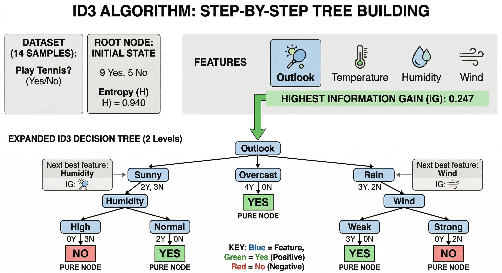
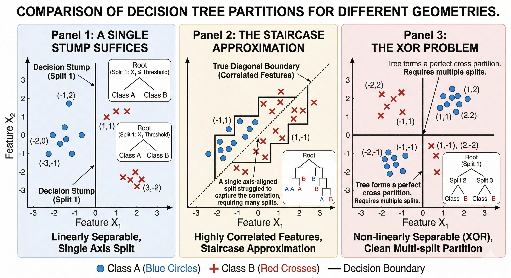
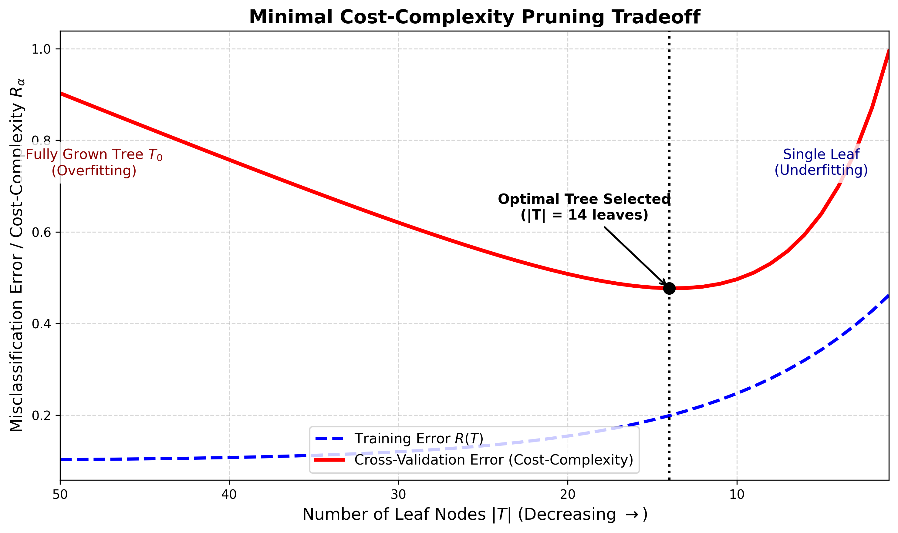

# Decision Trees

#### Table of Contents


## Introduction

Every intelligent system, at its core, must answer a single recurring question: *given what I know, what is the most likely truth about something I don't yet know?* Human beings answer this question using a cascade of conditional logic - *"Is it raining? If so, should I bring an umbrella? If not, is it hot enough to wear sunscreen?"* - a chain of binary or multi-way questions that narrow possibility space until only one plausible answer remains. This is, in essence, what a decision tree does.
 
The decision tree is arguably the most psychologically natural machine learning algorithm ever devised. It mirrors the literal structure of human deductive reasoning: a sequence of "if-then-else" questions, each one dividing the world into smaller, more homogeneous pieces, until we arrive at a conclusion with enough confidence to act. This naturalness is not merely aesthetic. It is the algorithm's greatest practical strength - and, as we will see, also the source of its deepest limitations.
 
But to understand the *soul* of a decision tree, we must go far beneath the flowchart diagrams. We must ask: what mathematical principle justifies choosing one question over another? What is the formal definition of "a better split"? Why does the tree sometimes memorize noise instead of learning signal? Why do forests of trees consistently outperform single trees on tabular benchmarks - and yet struggle on images? And why, in 2024 and 2025, are researchers training decision trees end-to-end using gradient descent?
 
This document answers all of these questions. It begins not with code or pseudocode, but with the conceptual question that makes the entire enterprise coherent.

## The Fundamental Question

Suppose you are given a dataset $\mathcal{D} = \{(\mathbf{x}_1, y_1), (\mathbf{x}_2, y_2), \ldots, (\mathbf{x}_n, y_n)\}$, where each $\mathbf{x}_i \in \mathbb{R}^d$ is a $d$-dimensional feature vector and $y_i \in \{1, 2, \ldots, K\}$ is a class label (for classification) or $y_i \in \mathbb{R}$ (for regression). Your task is to learn a function $f : \mathbb{R}^d \to \mathcal{Y}$ that maps new feature vectors to accurate predictions.
 
One of the most natural function families for this task is the class of *piecewise constant functions*. Instead of fitting a smooth global curve through the data (as a linear model or neural network does), we divide the feature space into non-overlapping regions and predict a single constant value inside each region. The prediction for a new point $\mathbf{x}$ is simply the majority class (for classification) or mean (for regression) of all training points that fall in the same region as $\mathbf{x}$.
 
This is exactly what a decision tree does. The tree recursively divides $\mathbb{R}^d$ into axis-aligned rectangular cells, and each leaf of the tree corresponds to one cell. The fundamental question then becomes:
 
> **How do we choose the sequence of axis-aligned cuts that partitions the feature space into regions of maximum class purity (minimum uncertainty)?**
 
This is a hard combinatorial optimization problem. The number of possible ways to recursively partition a $d$-dimensional space is astronomically large - it is, in fact, NP-hard to find the globally optimal tree. Every practical decision tree algorithm therefore uses a *greedy, top-down, recursive* approach: at each node, we choose the single best split according to some local criterion, without regard for how that choice affects future splits. This greedy approach is efficient but not globally optimal - a fact that will have profound implications for the algorithm's inductive bias, variance, and susceptibility to overfitting.
 
<p align="center">
  
</p>

## The Information Theory Substrate

The greedy strategy at the heart of every decision tree algorithm requires a *criterion* to evaluate candidate splits. This criterion must be:
 
1. **Measurable:** Computable from the data distribution within a node.
2. **Monotone:** A better split should score better than a worse split.
3. **Efficient:** Cheap enough to evaluate across all features and all thresholds in practice.
 
The most powerful and theoretically grounded criteria come from information theory. Let us build them from scratch.

### Shannon Entropy

Claude Shannon's 1948 paper *"A Mathematical Theory of Communication"* introduced the concept of **entropy** as the fundamental measure of uncertainty or information content in a probability distribution. The intuition is this: if you know that an event will always happen (probability 1), you gain zero new information when it occurs. If an event is very rare (probability near 0), its occurrence carries enormous information. The entropy of a random variable is the average information gained per observation.
 
Formally, for a discrete random variable $Y$ taking values in $\{1, 2, \ldots, K\}$ with probability distribution $\{p_1, p_2, \ldots, p_K\}$ (where $\sum_{i=1}^K p_i = 1$), the **Shannon Entropy** is:
 
$$H(Y) = -\sum_{i=1}^{K} p_i \log_2(p_i)$$
 
A few critical details to understand:
 
**Why the logarithm?** Logarithms arise naturally when we want information to be *additive* across independent events. If two independent events each have probability $p$ and $q$, then their joint probability is $pq$. The log of the joint probability is $\log(p) + \log(q)$, which means information is additive. This is the right property for an information measure.
 
**Why base 2?** Using base 2 means entropy is measured in *bits* - the number of binary questions you would need to ask to identify an outcome on average. This is a natural unit. Using base $e$ gives *nats*, and base 10 gives *bans*. For decision trees, base 2 is the classic choice, though the specific base does not affect which feature is chosen for splitting (since $\log_b(x) = \log_2(x) / \log_2(b)$, the base is just a scaling constant).
 
**Why the negative sign?** Because $p_i \leq 1$, we have $\log_2(p_i) \leq 0$, so without the negative sign the entropy would always be negative. The negation makes it positive, representing a non-negative measure of uncertainty.
 
**Handling the $0 \cdot \log(0)$ case:** When $p_i = 0$, we define $0 \cdot \log_2(0) = 0$ by continuity (using L'Hôpital's rule, $\lim_{p \to 0^+} p \log p = 0$). This makes sense: an impossible class contributes nothing to uncertainty.
 
**The range of entropy:** For $K$ classes, entropy ranges from $0$ (when one class has probability 1 - maximum certainty) to $\log_2(K)$ (when all classes are equally probable - maximum uncertainty). For binary classification ($K = 2$), maximum entropy is $1$ bit, achieved at $p_1 = p_2 = 0.5$.
 
**A concrete example:** Suppose a node in a tree contains 10 samples: 5 belonging to Class A, 3 to Class B, and 2 to Class C. Then $p_A = 0.5$, $p_B = 0.3$, $p_C = 0.2$, and:
 
$$H = -(0.5 \log_2 0.5 + 0.3 \log_2 0.3 + 0.2 \log_2 0.2)$$
$$= -(0.5 \cdot (-1) + 0.3 \cdot (-1.737) + 0.2 \cdot (-2.322))$$
$$= -(-0.5 - 0.521 - 0.464) = 1.485 \text{ bits}$$
 
This is fairly high (maximum for 3 classes is $\log_2 3 \approx 1.585$), indicating a very mixed, uncertain node.
 
<p align="center">
  
</p>

### Gini Impurity

While Shannon Entropy has a deep information-theoretic pedigree, it requires computing logarithms, which (in the era when CART was developed in the 1980s) was computationally expensive. Leo Breiman's CART algorithm introduced an alternative: the **Gini Impurity**.
 
The Gini Impurity (named after Italian statistician Corrado Gini, who introduced the Gini coefficient for measuring economic inequality) measures the probability that a randomly chosen sample from the node would be *incorrectly classified* if it were labelled according to the class distribution in that node. Formally:
 
$$\text{Gini}(S) = 1 - \sum_{i=1}^{K} p_i^2$$
 
**Derivation from first principles:** Imagine picking a random sample from node $S$ and then randomly assigning it a class label according to the same distribution $\{p_i\}$. The probability of picking a sample of class $i$ is $p_i$. The probability of then assigning label $j \neq i$ is also $p_j$. The probability of an incorrect classification event is $\sum_{i} p_i \sum_{j \neq i} p_j = \sum_i p_i (1 - p_i) = 1 - \sum_i p_i^2$. Hence the formula.
 
**The range of Gini Impurity:** Gini ranges from $0$ (when all samples belong to one class - perfect purity, $\sum p_i^2 = 1^2 = 1$, so Gini = 0) to $(1 - 1/K)$ (when all classes are equally probable, $\sum p_i^2 = K \cdot (1/K)^2 = 1/K$, so Gini = $1 - 1/K$). For binary classification, maximum Gini is $0.5$, achieved at $p = 0.5$.
 
**Gini vs. Entropy - the subtle difference:** Both criteria are maximized at uniform class distributions and minimized at pure nodes. They are qualitatively very similar, and empirical comparisons typically show little difference in final tree quality. However, there are two subtle distinctions:
 
1. **Shape:** Entropy is logarithmic and slightly more curved near pure nodes ($p \to 0$ or $p \to 1$), meaning it more strongly penalizes very pure nodes being split. Gini is quadratic and slightly "flatter" near the extremes.
2. **Computation:** Gini is slightly cheaper to compute because it avoids logarithms, a practical advantage when scanning millions of candidate thresholds.
 
A third criterion, **misclassification error** ($1 - \max_i p_i$), might seem natural but is almost never used for tree growing because it is insensitive to the exact class probabilities (it only cares about the most frequent class), making it a poor guide for the greedy search. It is, however, meaningful as a leaf-node evaluation metric.
 
<p align="center">
  
</p>

### Information Gain

Now we have a way to measure the uncertainty *within* a single node. But what we really need is a way to measure how much a *split* reduces uncertainty across the resulting child nodes. This is the role of **Information Gain**.
 
Suppose a node $S$ contains $|S|$ samples. We evaluate splitting $S$ on feature $A$, which has discrete values $\{v_1, v_2, \ldots, v_m\}$. Splitting on $A$ produces $m$ child subsets $S_{v_1}, S_{v_2}, \ldots, S_{v_m}$. The **Information Gain** of this split is:
 
$$\text{IG}(S, A) = H(S) - \sum_{v \in \text{Values}(A)} \frac{|S_v|}{|S|} H(S_v)$$
 
**Reading this formula:** The first term, $H(S)$, is the entropy *before* the split - how uncertain we are about the class of a random sample in this node. The second term is the *weighted average entropy* of the child nodes - how uncertain we are *after* we know which child the sample falls into, where the weight $|S_v|/|S|$ is the fraction of samples going to child $v$. The difference is the reduction in uncertainty. A large Information Gain means the split dramatically clarified the class distribution.
 
**Worked example:** Suppose a node has 14 samples: 9 positive and 5 negative. $H(S) = -(9/14)\log_2(9/14) - (5/14)\log_2(5/14) \approx 0.940$ bits. Now consider a feature "Humidity" with two values: High (7 samples, 3 positive + 4 negative) and Normal (7 samples, 6 positive + 1 negative).
 
- $H(S_\text{High}) = -(3/7)\log_2(3/7) - (4/7)\log_2(4/7) \approx 0.985$ bits
- $H(S_\text{Normal}) = -(6/7)\log_2(6/7) - (1/7)\log_2(1/7) \approx 0.592$ bits
- Weighted average: $(7/14)(0.985) + (7/14)(0.592) = 0.789$ bits
- $\text{IG}(S, \text{Humidity}) = 0.940 - 0.789 = 0.151$ bits
 
If a different feature "Outlook" gives a higher IG (say, 0.246 bits), we choose Outlook for the split at this node.
 
**When Gini is used instead:** The formula is analogous. Define the Gini gain of a split as:
 
$$\text{GiniGain}(S, A) = \text{Gini}(S) - \sum_{v} \frac{|S_v|}{|S|} \text{Gini}(S_v)$$
 
CART finds the split that maximizes this Gini gain (equivalently, minimizes the weighted child Gini).

### The High-Cardinality Problem & The Gain Ratio Fix

Here is a subtle but critical problem with raw Information Gain that plagued the ID3 algorithm and motivated the development of C4.5.
 
**The bias toward high-cardinality features:** Consider a feature like a unique identifier (e.g., a customer ID, a transaction ID, or a date in full precision). This feature has $|S|$ distinct values - one per sample. Splitting on it creates $|S|$ child nodes, each containing exactly one sample. Every such child node has *zero entropy* (it contains only one class). The weighted average entropy after the split is 0. Therefore, the Information Gain of splitting on a unique ID is equal to $H(S)$ - the maximum possible value.
 
This is catastrophic. The algorithm would always prefer a unique ID over any meaningful feature, even though a unique ID has zero predictive power for unseen data. More generally, any feature with many distinct values (high cardinality) tends to score higher on raw Information Gain, even if it provides no generalizable signal.
 
**The root cause:** Information Gain measures how well a split *reproduces the training labels*. A feature that perfectly shatters the training data will score highest - but such a feature is useless for generalization. The algorithm needs to be penalized for creating too many children.
 
**The Gain Ratio (C4.5's solution):** Quinlan introduced the **Gain Ratio** to normalize Information Gain by the "intrinsic information" (also called Split Information) of the split itself - a measure of how many children the split creates and how evenly they are populated:
 
$$\text{SplitInfo}(S, A) = -\sum_{v \in \text{Values}(A)} \frac{|S_v|}{|S|} \log_2 \frac{|S_v|}{|S|}$$
 
Note that this is exactly the entropy of the distribution over the child nodes (ignoring class labels). A feature that creates many equally-sized children has high SplitInfo. Then:
 
$$\text{GainRatio}(S, A) = \frac{\text{IG}(S, A)}{\text{SplitInfo}(S, A)}$$
 
**Why this fixes the problem:** For our unique-ID example, $\text{SplitInfo} = -\sum_{i=1}^{|S|} (1/|S|)\log_2(1/|S|) = \log_2(|S|)$ - very large. The Information Gain (which equals $H(S)$) is divided by $\log_2(|S|)$, resulting in a modest Gain Ratio. For a binary feature (only two values), SplitInfo is at most 1 bit, so the Gain Ratio of a binary feature is at least as large as its IG.
 
**An important subtlety:** The Gain Ratio introduces its own bias - it now slightly prefers binary splits (since low-cardinality features have low SplitInfo denominators). C4.5 addresses this with a heuristic: it only considers features whose raw IG is above the mean IG, and among those, selects the highest Gain Ratio. This two-step procedure avoids both the IG bias and the Gain Ratio counterbalance bias.
 
<p align="center">
  
</p>

### The Chi-Squared Criterion

The CHAID (Chi-Squared Automatic Interaction Detection) algorithm uses the **Chi-Squared test of independence** as its splitting criterion. This is a fundamentally different approach: instead of measuring entropy reduction, it tests whether the class distribution *significantly differs* across the feature's values using a classical hypothesis test.
 
For a feature $A$ with $r$ categories and a target class $C$ with $k$ classes, compute:
 
$$\chi^2 = \sum_{i=1}^{r} \sum_{j=1}^{k} \frac{(O_{ij} - E_{ij})^2}{E_{ij}}$$
 
where $O_{ij}$ is the observed count of samples in category $i$ of feature $A$ with class $j$, and $E_{ij}$ is the expected count under the null hypothesis of independence:
 
$$E_{ij} = \frac{(\text{row total}_i) \times (\text{column total}_j)}{\text{total samples}}$$
 
**Intuition:** Under independence, the class distribution should be the same in every category of the feature. If feature $A$ is a powerful predictor, the actual class counts ($O_{ij}$) will deviate strongly from the expected counts ($E_{ij}$), yielding a high $\chi^2$ value. The feature with the highest $\chi^2$ statistic is chosen for splitting.
 
**The advantage:** CHAID naturally handles multi-way splits (not just binary) and has a natural statistical interpretation - the $\chi^2$ value can be converted to a p-value, giving the analyst a measure of statistical confidence in the split. CHAID also merges categories that are not statistically different, reducing tree complexity automatically.
 
**The limitation:** CHAID was designed for categorical features and large sample sizes (since chi-squared tests require sufficient expected counts per cell, typically $E_{ij} \geq 5$). It is less suited to continuous features without prior discretization.
 
### Variance Reduction for Regression

All the criteria above are for *classification* trees. For regression tasks (predicting a continuous $y$), the analog of impurity is *variance*. A leaf is "pure" not when all samples belong to one class, but when all samples have the same (or very similar) target values.
 
CART uses **variance reduction** as the regression splitting criterion. For a node $S$ with target values $\{y_i\}$, the variance is:
 
$$\text{Var}(S) = \frac{1}{|S|} \sum_{i \in S} (y_i - \bar{y}_S)^2$$
 
where $\bar{y}_S = \frac{1}{|S|}\sum_{i \in S} y_i$ is the mean target value in $S$. The variance reduction from splitting $S$ into $S_\text{left}$ and $S_\text{right}$ is:
 
$$\Delta\text{Var} = \text{Var}(S) - \frac{|S_\text{left}|}{|S|}\text{Var}(S_\text{left}) - \frac{|S_\text{right}|}{|S|}\text{Var}(S_\text{right})$$
 
The split maximizing $\Delta\text{Var}$ is selected. The prediction for a leaf is the mean $\bar{y}$ of training samples reaching that leaf.
 
**Other regression criteria:** scikit-learn's modern implementation also supports:
- **Mean Absolute Error (MAE):** Uses the median instead of the mean, making it more robust to outliers. However, finding the optimal split under MAE is computationally harder.
- **Poisson Deviance:** Appropriate when $y$ represents count data (e.g., number of events per unit time). Uses the Poisson log-likelihood as the impurity measure.
- **Friedman MSE:** A variant of MSE that uses the expected improvement in squared error from a split, which sometimes provides better performance.
 
### A Unified View of Splitting Criteria
 
It is worth pausing to see all these criteria through a single theoretical lens. Buja et al. (2005) showed that the splitting criteria used in decision trees can be understood as *proper scoring rules* - measures that are uniquely minimized by the true class-conditional distribution. Both entropy and Gini impurity belong to this family, which is why they are theoretically justified as node impurity measures.
 
From a different angle, all of these criteria can be seen as instances of a more general framework: we want to maximize the *statistical dependence* between the feature and the class label in the split. The phi coefficient, Pearson chi-squared, and Information Gain are all measures of this dependence under different distributional assumptions. This unification suggests that the choice between Gini and entropy is less principled than it might appear - they are simply two different lenses on the same underlying phenomenon.


## The Recursive Partitioning Algorithms

### ID3: The Ancestor
 
**ID3 (Iterative Dichotomiser 3)** was introduced by Ross Quinlan in 1986. It was one of the first algorithms to formalize the greedy, top-down construction of decision trees using Information Gain. Despite its limitations, ID3 established the fundamental template that all subsequent decision tree algorithms would follow.
 
**The ID3 algorithm:**
```
function ID3(D, features):
    if all samples in D have the same class y:
        return Leaf(y)
    if features is empty:
        return Leaf(majority_class(D))
    
    best_feature = argmax over features of IG(D, feature)
    node = DecisionNode(best_feature)
    
    for each value v of best_feature:
        D_v = {samples in D where best_feature = v}
        if D_v is empty:
            node.add_child(v, Leaf(majority_class(D)))
        else:
            node.add_child(v, ID3(D_v, features \ {best_feature}))
    
    return node
```
 
**Key characteristics of ID3:**
 
1. **Multi-way splits:** For a categorical feature with $m$ values, ID3 creates $m$ child branches in one step. This can lead to shallow, very wide trees - but also to very fragmented data, quickly reaching leaves with too few samples to be statistically reliable.
 
2. **Categorical features only:** ID3 cannot natively handle continuous (numerical) features. This was a critical limitation, since most real-world tabular datasets contain numerical features.
 
3. **No pruning:** ID3 grows the tree until it perfectly classifies the training data (or runs out of features). This almost always leads to severe overfitting.
 
4. **No missing value handling:** ID3 assumes complete data; missing values were not addressed.
 
5. **Greedy and top-down:** Each split is chosen independently based on local Information Gain. There is no look-ahead; a split chosen now might prevent better splits at deeper levels.
 
6. **Features are removed after use:** Once a feature is used to split a node, it is removed from consideration for all descendants of that node (because for categorical features, after a split on feature $A$, all descendant nodes have $A$ fixed to one value and further splitting on it provides no information).
 
**The historical significance of ID3:** It demonstrated that the greedy, Information Gain-based approach was practical and produced interpretable, useful models for classification problems with categorical features. It paved the way for every tree algorithm that followed.
 
<p align="center">
  
</p>

### C4.5: The Evolutionary Leap
 
Quinlan himself recognized ID3's limitations and, in 1993, published **C4.5** (the name is an internal version numbering). C4.5 is ID3 extended, refined, and corrected - and it remained the dominant decision tree algorithm throughout the 1990s and early 2000s.
 
**What C4.5 fixes and adds:**
 
1. **Gain Ratio instead of Information Gain:** As described in §3.4, this removes the bias toward high-cardinality features.
 
2. **Handling continuous features:** For a continuous feature $X$, C4.5 finds the best threshold $t$ by evaluating all candidate thresholds and creating a binary split: $X \leq t$ (left child) vs. $X > t$ (right child). The optimal threshold is found by:
   - Sorting the $n$ samples by their $X$ value: $x_{(1)} \leq x_{(2)} \leq \cdots \leq x_{(n)}$.
   - Evaluating thresholds at midpoints: $t_k = (x_{(k)} + x_{(k+1)})/2$ for all $k$ where the class label changes. (Only midpoints where the class changes are candidates, reducing the search space without losing optimality - a key insight.)
   - Selecting the threshold maximizing Gain Ratio.
 
3. **Handling missing values:** C4.5 introduced a principled approach to missing values during training. If a sample has a missing value for the feature being split on, it is *fractionally distributed* to all child branches, weighted by the proportion of non-missing samples going to each branch. This fractional distribution propagates through the tree. During prediction, a sample with a missing value at a decision node is also fractionally assigned to each branch, and the final prediction is a weighted combination of the leaf predictions.
 
4. **Pruning via error-based pruning (EBP):** C4.5 introduced post-pruning using a pessimistic estimate of the error rate. For a leaf with $e$ errors on $n$ training samples, the observed error rate is $e/n$. The *pessimistic estimate* uses the upper bound of a confidence interval for the true error rate, accounting for the fact that the training error underestimates the generalization error. A subtree is replaced by a leaf if the pessimistic error of the subtree (summed over all leaves) exceeds the pessimistic error of replacing it with a single leaf.
 
5. **Multi-way splits for categorical features:** C4.5 retained ID3's multi-way splits for categorical features, creating one branch per distinct value.
 
6. **Rule generation:** C4.5 included a post-processing step to convert the tree into a set of if-then rules, then prune and generalize those rules independently. This could produce more compact rule sets than the tree itself.
 
**The enduring legacy of C4.5:** It became the benchmark against which all new classification algorithms were compared for over a decade. The 2006 "Top 10 algorithms in data mining" survey (by a panel of data mining researchers) ranked C4.5 as #1, testifying to its extraordinary practical impact.
 
### C5.0: The Industrial Refinement
 
**C5.0** is a commercial successor to C4.5, also developed by Quinlan through his company RuleQuest Research. While C4.5 is open-source (the code was released with the textbook), C5.0 is proprietary. Technically, C5.0 introduces:
 
1. **Speed improvements:** C5.0 is dramatically faster than C4.5, especially on large datasets, through better memory management and algorithmic optimizations.
2. **Boosting support:** C5.0 integrates boosting (specifically, a version of AdaBoost adapted for trees), training multiple trees on re-weighted data.
3. **Smaller trees with equivalent accuracy:** Through improved pruning and smarter rule generation, C5.0 typically produces more compact models than C4.5.
4. **Winnowing:** An optional feature selection step that eliminates unhelpful features before tree construction.
5. **Weighted samples:** C5.0 can handle training samples with different importance weights, enabling cost-sensitive learning.
6. **Rule-based models:** C5.0's rule extractor can produce rule sets that are often more accurate and compact than the corresponding decision tree.
 
For most practical purposes, C5.0 and C4.5 are conceptually identical - they use the same Gain Ratio criterion, multi-way splits, and similar pruning strategies. The differences are in implementation quality, speed, and commercial polish.
 
### CART: The Pivotal Design Choice
 
**CART (Classification and Regression Trees)** was introduced by Leo Breiman, Jerome Friedman, Richard Olshen, and Charles Stone in their landmark 1984 book *"Classification and Regression Trees".* CART is not just another decision tree algorithm - it is a comprehensive *framework* that made several design choices so significant that they became the foundation of essentially all modern tree-based methods, including Random Forests and Gradient Boosting.
 
**The pivotal design choice: binary splits.**
 
ID3 and C4.5 allow multi-way splits - a categorical feature with 10 values creates 10 branches at once. CART, by contrast, *always creates exactly two branches* (binary splits), regardless of whether the feature is categorical or continuous.
 
Why was this so important? Let us think through the implications:
 
**For continuous features:** A binary split on a threshold $t$ (samples with $X \leq t$ go left, samples with $X > t$ go right) is the most natural choice. C4.5 also uses binary splits for continuous features.
 
**For categorical features:** CART considers all possible ways to partition the feature's values into two non-empty subsets (a "left" group and a "right" group). For a categorical feature with $m$ values, there are $2^{m-1} - 1$ such binary partitions. For small $m$, this is feasible. For large $m$, heuristics are used. The best binary partition is selected.
 
**Why binary splits are superior:**
 
1. **Consistent depth:** A tree with binary splits has a well-defined depth-accuracy tradeoff. Multi-way splits "use up" the tree's depth much faster but also fragment the data more severely, making statistical estimates at each node less reliable.
 
2. **A feature can be reused:** Since a binary split does not exhaust a categorical feature's information (unlike a multi-way split that creates one branch per value), a feature can be split on again at a descendant node, potentially at a different threshold or binary partition.
 
3. **Better compatibility with ensemble methods:** The random forest and gradient boosting algorithms - which rely on CART as their base learner - benefit enormously from the mathematical regularity of binary trees.
 
4. **Equivalent representational power:** Any multi-way split can be simulated by a sequence of binary splits, so binary trees lose no representational power in theory.
 
**CART for classification (Gini Impurity):**
 
CART uses Gini Impurity as the splitting criterion for classification. To find the best binary split on a continuous feature $X$:
- Sort samples by $X$.
- Evaluate each candidate threshold: compute the Gini Gain of splitting at that threshold.
- Choose the threshold with the highest Gini Gain.
 
For a categorical feature $A$ with values $\{v_1, \ldots, v_m\}$:
- For binary classification ($K=2$): there is an efficient algorithm that finds the optimal binary partition in $O(m \log m)$ time by sorting the category values by their positive-class proportion. The optimal binary partition is a threshold on this sorted order.
- For multi-class ($K > 2$): the general problem is $O(2^m)$ but approximations exist.
 
**CART for regression (Variance Reduction):**
 
The algorithm is identical, but with variance reduction replacing Gini gain (see §3.6). The leaf prediction is the mean of training sample targets in that leaf.
 
**Cost-Complexity Pruning in CART:**
 
CART introduced a powerful and theoretically motivated post-pruning procedure called **Minimal Cost-Complexity Pruning** (also called **weakest link pruning**), which we will describe in detail in §7.4.
 
**CART in scikit-learn:**
 
The most widely used decision tree implementation in the world - scikit-learn's `DecisionTreeClassifier` and `DecisionTreeRegressor` - is based on an optimized version of CART. However, it does not support native categorical variables (it requires all features to be numerical), does not implement Gain Ratio (only Gini and Entropy for classification, MSE/MAE/Poisson for regression), and has some implementation-specific differences from the original CART book.
 
### CHAID: The Statistician's Tree
 
**CHAID (Chi-Squared Automatic Interaction Detection)** was developed by Gordon Kass in 1980, predating both ID3 and CART. It was designed primarily for marketing research and social sciences - domains where categorical variables dominate and statistical testing is the norm.
 
CHAID's distinctive features:
- Uses the Chi-Squared test (see §3.5) as the splitting criterion, which provides an explicit p-value for each split.
- Creates **multi-way splits**: if a feature has 5 categories, the tree can create up to 5 branches at once.
- **Automatically merges categories**: before splitting, CHAID tests all pairs of categories and merges those that are not statistically distinguishable. This reduces the number of branches and prevents overfitting from spurious category distinctions.
- **Controls the family-wise error rate**: since CHAID performs many statistical tests, it applies Bonferroni correction or other multiple-comparisons adjustments to maintain a target significance level.
 
CHAID is most useful in market research, customer segmentation, and social science surveys where the data is predominantly categorical and the analyst wants statistically defensible splits. It is less commonly used in modern machine learning pipelines, where CART-based methods dominate.
 
### Conditional Inference Trees: The Statistician's Correction
 
**Conditional Inference Trees** (ctrees) were introduced by Hothorn, Hornik, and Zeileis in 2006, and represent a response to a subtle but important bias in classical tree algorithms: the selection bias in choosing which feature to split on.
 
**The selection bias problem:** When a tree algorithm evaluates multiple features at a node, features with more possible values (high cardinality or continuous features with many unique values) are tested more times and therefore have more chances to "win" the selection just by chance. The Gain Ratio was ID3's attempt to fix this, but it is a heuristic fix, not a statistically principled one.
 
**The conditional inference solution:** Conditional inference trees use formal permutation tests to decide:
1. **Whether to split at all:** Compute a global test statistic measuring the association between the feature and the response. If no feature is significantly associated with the response (after multiple-testing correction), stop growing.
2. **Which feature to split on:** Select the feature with the *smallest p-value* from its association test (not the largest test statistic, because test statistics are not comparable across features with different scales and types). This controls for selection bias.
3. **Where to split:** After the feature is selected, find the optimal split point within that feature.
 
This framework is genuinely non-parametric (it makes no distributional assumptions), handles any type of response variable (classification, regression, survival, ordered categories), and is unbiased in the sense that under the null hypothesis of independence, each feature has an equal probability of being selected. The result is trees that are less likely to overfit from spurious feature selection.
 
**The practical cost:** Permutation tests are computationally expensive. Conditional inference trees are significantly slower to train than CART or C4.5, limiting their use on large datasets.

## The Geometric Perspective

### Axis-Aligned Boundaries and the Piecewise Constant World

Every decision tree implicitly defines a *partition* of the input feature space $\mathbb{R}^d$ into non-overlapping regions, where each region corresponds to one leaf. Because each split is a threshold test on a single feature ($X_j \leq t$), every boundary between adjacent regions is **axis-aligned**: it is a hyperplane perpendicular to one of the $d$ coordinate axes.
 
Concretely, if you have two features $X_1$ and $X_2$ and a tree that splits first on $X_1 \leq 3$, then on $X_2 \leq 5$ (left child), then on $X_1 \leq 1$ (right child), the resulting partition of the 2D plane consists of rectangular cells defined by ranges of $X_1$ and $X_2$ values.
 
This geometric perspective reveals why decision trees are called *piecewise constant approximators*: within each leaf-region, the prediction is constant (a class label or a mean target value). The function $f(\mathbf{x})$ learned by the tree looks like a "staircase" - flat within each rectangle, with jumps at the boundaries.
 
**The implications of axis-aligned boundaries:**
- They are very well-suited for functions where different features independently contribute to the prediction.
- They require more leaves (more complexity) to approximate diagonal or curved decision boundaries.
- They are invariant to monotone transformations of individual features (e.g., scaling $X_1$ by a constant or taking its logarithm does not change the tree's structure, only the threshold values).
 
<p align="center">
  
</p>
 
### The Diagonal Problem: When Axes Betray You
 
The limitation of axis-aligned boundaries becomes most apparent when the true decision boundary is not aligned with any axis. The canonical example is the XOR problem: two features $X_1$ and $X_2$, where the positive class occurs when $(X_1 > 0) \oplus (X_2 > 0)$ (exactly one of the two is positive). The boundary consists of two lines at $45°$ to the axes. A standard decision tree can learn this boundary, but requires $O(n)$ leaf nodes to approximate the diagonal with sufficient precision for $n$ training samples distributed along the boundary.
 
More generally, the **diagonal problem** refers to the phenomenon where features are *correlated* and the true decision boundary runs at an angle to the coordinate axes. In this case:
 
1. **No single feature split is informative:** At the root node, splitting on $X_1$ alone (without conditioning on $X_2$) provides little information about the class label, because both positive and negative samples span the full range of $X_1$.
 
2. **The tree needs many levels to approximate the boundary:** A standard axis-aligned tree needs exponentially many splits to approximate a diagonal boundary to a given precision.
 
3. **The greedy algorithm can get stuck:** Because individual feature splits are uninformative, the greedy criterion may select features poorly, leading to a suboptimal tree structure.
 
This is not merely a theoretical concern. In practice, many real-world classification problems involve correlated features (e.g., in medical diagnosis, many biomarkers are correlated; in finance, many market indicators move together). The diagonal problem is one reason why, for some datasets, linear models or SVMs (which *can* learn diagonal boundaries efficiently) outperform decision trees.
 
<p align="center">
  
</p>

### Oblique Decision Trees: Cutting Across Axes
 
The natural solution to the diagonal problem is to allow splits that combine multiple features simultaneously - cuts that are not axis-aligned but can be oriented in any direction. These are called **oblique splits**, and trees that use them are called **Oblique Decision Trees** (ODTs) or **multivariate decision trees**.
 
An oblique split at a node takes the form:
 
$$\sum_{j=1}^{d} w_j X_j \leq \theta$$
 
where $\mathbf{w} = (w_1, \ldots, w_d)$ is a weight vector and $\theta$ is a threshold. When $\mathbf{w}$ has only one nonzero component, this reduces to an axis-aligned split. When multiple components are nonzero, the split boundary is a hyperplane tilted in feature space.
 
**The power of oblique splits:** A single oblique split can perfectly separate two linearly separable classes (like the diagonal example), where an axis-aligned tree would require $O(n)$ splits. This can dramatically reduce tree depth and the number of leaves, leading to simpler, more interpretable models.
 
**The curse of oblique splits: optimization difficulty.** Finding the optimal oblique split at a node is NP-hard in general. The search space is now not a discrete set of thresholds for each feature, but a continuous $(d+1)$-dimensional space of weight vectors and biases. Various approaches have been tried:
 
1. **Random search (OC1 algorithm, 1994):** Start with a random oblique split and iteratively improve one weight at a time, holding the others fixed, then perturb randomly to escape local minima. Repeat many times and keep the best result.
 
2. **Linear discriminant at each node:** Fit a Linear Discriminant Analysis (LDA) model to the samples at the current node and use the LDA projection as the split. This is efficient and often effective.
 
3. **Perceptron at each node:** Train a single-layer perceptron (logistic regression or linear SVM) to find the optimal separating hyperplane at each node.
 
4. **Gradient-based methods (post-2019):** As differentiable tree methods emerged, oblique splits became naturally expressible in the differentiable framework (see §12.2).
 
**The modern oblique tree landscape:** Oblique trees have seen a significant resurgence in the 2020–2026 period:
 
- **HHCART (2022):** Uses Householder transformations to find oblique splits that are interpretable and efficient.
- **MORF (Manifold Oblique Random Forest, 2020):** Combines oblique splits with random projections to handle structured data like images and time series.
- **Oblique Random Forests (scikit-learn-oblique-forests, 2023):** A scikit-learn compatible implementation of oblique random forests and other tree types. This library, developed partly at Johns Hopkins, extended the scikit-learn API to support oblique, sparse, and patch-based forests, showing state-of-the-art performance on tabular and structured datasets.
- **TAO (Tree Alternating Optimization, 2019–2024):** A powerful algorithm for learning oblique trees by alternating optimization between the split parameters and the tree structure.
 
### Feature Interaction and the XOR Problem
 
The XOR problem deserves a deeper discussion because it illustrates a fundamental limitation of the greedy, top-down algorithm - not just of axis-aligned splits.
 
Consider the XOR problem with two binary features ($X_1, X_2 \in \{0, 1\}$) and label $y = X_1 \oplus X_2$. At the root node, both features have zero Information Gain. The class distribution conditioned on $X_1 = 0$ is 50/50 positive/negative (because $X_2$ can be 0 or 1). Similarly for $X_1 = 1$. So the greedy criterion cannot distinguish between features $X_1$ and $X_2$ - and cannot distinguish either from a random useless feature.
 
A decision tree *can* solve the XOR problem (split on $X_1$ first, then on $X_2$ in both children), but the greedy search has no principled way to find this solution, since neither feature provides marginal information gain at the root. In practice, with noisy data, the algorithm may select a random feature or fail to find a clean solution.
 
This is the **feature interaction problem**: decision trees struggle with features that are only informative in combination, not individually. One partial remedy is **interaction-based feature engineering** (creating new features like $X_1 \cdot X_2$ explicitly). Gradient boosting methods somewhat mitigate this problem because sequentially adding trees can effectively model interactions through their residuals.

## The Full Learning Algorithm

### Handling Continuous Features
 
The handling of continuous features is algorithmically important enough to deserve its own section. Given a continuous feature $X_j$ and a node containing $n$ samples, the naïve approach would evaluate $n-1$ possible thresholds. CART's efficient approach:
 
1. **Sort:** Sort samples by $X_j$: $x_{(1)} \leq x_{(2)} \leq \cdots \leq x_{(n)}$.
2. **Candidate thresholds:** The only thresholds worth testing are the midpoints between consecutive samples where the class label changes: $t_k = (x_{(k)} + x_{(k+1)})/2$ for $k$ where $y_{(k)} \neq y_{(k+1)}$. This is because the optimal threshold for Gini or entropy cannot lie strictly between two samples of the same class (if you know this, you can reduce the number of evaluations significantly).
3. **Evaluate:** For each candidate threshold, compute the Gini Gain (or IG, or variance reduction).
4. **Select:** Choose the threshold maximizing the criterion.
 
The total cost for one feature is $O(n \log n)$ for sorting, plus $O(n)$ for scanning - making the per-node cost $O(d \cdot n \log n)$ across all features. This is the dominant cost in tree construction.
 
**Modern optimization:** Scikit-learn and other implementations sort indices (not values) and maintain partial sorts as the tree grows, reducing constant factors. LightGBM uses histogram-based binning, which sorts samples into $B$ bins (typically $B = 256$) once, making per-node evaluation $O(B)$ per feature regardless of $n$ - a key innovation for large datasets.
 
### Handling Categorical Features
 
Categorical features require special treatment:
 
**For binary classification with CART:** For a categorical feature with $m$ values and two classes, the optimal binary partition can be found in $O(m \log m)$ time by sorting categories by their positive-class proportion. The optimal partition is always a contiguous range in this sorted order (this is a theorem provable from the monotonicity of the Gini criterion).
 
**For multi-class classification:** The general problem of finding the best binary partition of $m$ categories with $K > 2$ classes is NP-hard (requiring $O(2^m)$ evaluations in the worst case). Heuristics are used:
- **One-hot encoding:** Convert each category value to a binary indicator feature, then treat each as a binary feature.
- **Target encoding:** Replace each category value with the mean of the target variable for that category (dangerous - can cause overfitting if done naïvely).
- **Random partitions:** Sample random binary partitions and keep the best.
 
**CatBoost's ordered encoding:** A clever approach from CatBoost (2019) uses a random permutation of training samples and computes cumulative target statistics in that order, preventing leakage while enabling efficient categorical handling.
 
### Handling Missing Values
 
Missing values are a constant reality in practical data. Different algorithms handle them differently:
 
**CART - Surrogate Splits:** CART's approach is elegant. At each node, the algorithm identifies not just the primary (optimal) split, but also a ranked list of *surrogate splits* - alternative splits that most closely agree with the primary split on the samples that do have the feature. When a sample is missing the primary split feature, it is routed using the best surrogate split. This preserves a sample's path through the tree without imputation.
 
**C4.5 - Fractional Propagation:** When a sample is missing a split feature, it is fractionally distributed to all children, with each fraction equal to the proportion of non-missing samples going to that child. This "probabilistic routing" allows the sample to contribute (fractionally) to the statistics of all child nodes during training.
 
**Conditional Inference Trees - Listwise Deletion:** ctrees typically exclude samples with missing values from the test statistic computation, then apply surrogate splits for routing.
 
**Modern scikit-learn (1.0+):** The `DecisionTreeClassifier` and `DecisionTreeRegressor` now include built-in support for missing values using the CART-style approach of evaluating which side (left or right) missing values should go to as part of the split optimization.
 
**XGBoost - Default Direction:** XGBoost learns a "default direction" for each node - the direction that missing values should be sent - as part of the split optimization. This is a simple but effective approach that allows the model to learn from the missingness pattern itself.
 
### Multi-Output Trees
 
A single decision tree can simultaneously predict multiple output variables. This is useful when outputs are correlated (e.g., predicting both height and weight, or the x- and y-coordinates of an object). The tree grows using a criterion that measures impurity *jointly* across all outputs (e.g., summing the variance reduction across all output dimensions). The prediction at each leaf is a vector of means (or a probability distribution over multi-dimensional class combinations).
 
### Stopping Criteria
 
A decision tree grows until a stopping criterion is met. Common stopping criteria include:
 
1. **Maximum depth:** The tree cannot grow beyond $d_\text{max}$ levels. Simple and effective, but choosing $d_\text{max}$ requires hyperparameter tuning.
2. **Minimum samples per split:** A node is not split if it contains fewer than $n_\text{split}$ samples.
3. **Minimum samples per leaf:** A split is rejected if it would create a child node with fewer than $n_\text{leaf}$ samples.
4. **Minimum impurity decrease:** A split is only made if it decreases the weighted impurity by at least $\delta$.
5. **Pure nodes:** A node is a leaf if all its samples belong to the same class (entropy/Gini = 0).
6. **No features remaining:** When no feature can improve the impurity (e.g., all samples have identical feature values for all features).
 
The optimal stopping criterion depends on the dataset. For small datasets, too-aggressive stopping leads to underfitting; for large datasets, insufficient stopping leads to overfitting. This motivates the post-pruning approach (§7).


## The Art of Pruning

### The Bias-Variance Tradeoff in Trees
 
The bias-variance decomposition is a fundamental framework for understanding machine learning model performance. For any estimator $\hat{f}$:
 
$$\mathbb{E}[(y - \hat{f}(\mathbf{x}))^2] = \underbrace{\text{Bias}^2(\hat{f})}_{\text{systematic error}} + \underbrace{\text{Var}(\hat{f})}_{\text{sensitivity to data}} + \underbrace{\sigma^2}_{\text{irreducible noise}}$$
 
For decision trees:
- **A fully grown tree (deep tree):** Nearly zero training error (low bias), but extreme sensitivity to the specific training samples used (high variance). Small changes in the training data produce dramatically different trees. This leads to overfitting.
- **A very shallow tree (stump or depth-2 tree):** High training error (high bias), but consistent predictions across different training samples (low variance). This leads to underfitting.
 
The optimal tree depth lies somewhere in between. The goal of pruning is to find the right complexity level - to move up the depth ladder from a fully grown tree to find the sweet spot where the sum of bias and variance is minimized.
 
<p align="center">
  
</p>
 
### Pre-Pruning (Early Stopping)
 
**Pre-pruning** (also called early stopping or forward pruning) prevents the tree from growing too deep by applying stopping criteria *during* tree construction. Examples include the stopping criteria described in §6.5: maximum depth, minimum samples, minimum impurity decrease.
 
**The advantage of pre-pruning:** It is computationally cheap - branches that would be pruned are never grown, saving time and memory.
 
**The critical disadvantage: the horizon effect.** A split that looks locally useless (provides small impurity reduction) might enable much better splits two or three levels deeper. By stopping early, we might prune a branch that would have led to a much better subtree. The algorithm has no look-ahead, so it cannot evaluate the long-term value of a split.
 
Consider an analogy: suppose you are playing chess. The greedy strategy is to take the most valuable piece available each turn. But sometimes, making a sacrifice (a seemingly bad move) enables a devastating attack three moves later. Pre-pruning is like always making the greedy move - it misses the "sacrifice for future gain" possibilities.
 
### Post-Pruning: Growing Full, Then Cutting Back
 
**Post-pruning** (also called backward pruning) takes the opposite approach: grow the tree fully (allowing it to overfit), then prune back subtrees that do not improve generalization. Post-pruning avoids the horizon effect because the full tree *does* explore all possible splits; we then use held-out data or statistical tests to identify which subtrees should be removed.
 
**Why "growing full then cutting back" is superior to "stopping early":**
 
When we grow the full tree first, we have a *global view* of the entire tree structure. We can evaluate each internal node and compare the predictive performance of "keeping this subtree" versus "replacing this subtree with a single leaf". This comparison is done on held-out data (not the training data), so it is an honest estimate of generalization performance. The pruning decision is thus informed by actual evidence of overfitting, not a heuristic threshold.
 
Furthermore, post-pruning algorithms like Cost-Complexity Pruning (§7.4) produce a *sequence* of increasingly pruned trees, and cross-validation can be used to select the best tree in the sequence. This is a much more principled approach than tuning a pre-pruning threshold.
 
### Cost-Complexity Pruning: The Masterpiece
 
**Cost-Complexity Pruning (CCP)**, also called **Minimal Cost-Complexity Pruning** or **Weakest Link Pruning**, is the pruning algorithm introduced by Breiman et al. in the original CART book. It is arguably the most principled and elegant pruning procedure ever developed for decision trees.
 
**The intuition:** We want to balance two competing objectives:
1. **Accuracy (low cost):** The tree should accurately classify the training data.
2. **Simplicity (low complexity):** The tree should be as simple (small) as possible.
 
We can formalize this tradeoff by introducing a **complexity penalty** $\alpha \geq 0$ that penalizes each leaf node. The **cost-complexity measure** of a tree $T$ is:
 
$$R_\alpha(T) = R(T) + \alpha |T|$$
 
where:
- $R(T) = \sum_{\ell \in \text{leaves}(T)} r(\ell) \cdot p(\ell)$ is the **misclassification rate** of the tree, summed over all leaves. Here, $r(\ell)$ is the misclassification rate of leaf $\ell$, and $p(\ell) = n_\ell / n$ is the proportion of training samples reaching leaf $\ell$.
- $|T|$ is the **number of leaf nodes** in the tree (a measure of complexity).
- $\alpha \geq 0$ is the **complexity parameter** - the price we pay per additional leaf.
 
**Reading the formula:** When $\alpha = 0$, the fully grown tree $T_0$ (with the lowest training error) minimizes $R_\alpha$. As $\alpha$ increases, the penalty for leaf nodes grows, and the optimal tree becomes progressively simpler. At $\alpha = \infty$, the trivial tree (a single leaf predicting the majority class) is optimal.
 
**The key insight: nested subtrees.** As $\alpha$ increases continuously from 0 to $\infty$, the optimal tree changes only at a *finite* number of critical values $\alpha_1 < \alpha_2 < \cdots < \alpha_M$. Between consecutive critical values, the optimal tree is constant. The sequence of optimal trees $T_0 \supset T_1 \supset T_2 \supset \cdots \supset T_M$ is a *nested sequence of subtrees* of the full tree - each is obtained from the previous by pruning one or more internal nodes.
 
**The algorithm - finding the weakest link:**
 
Starting from the fully grown tree $T_0$, we find the "weakest link" - the internal node whose removal gives the least increase in misclassification rate per leaf removed.
 
For any internal node $t$ in tree $T$, define:
- $T_t$: the branch of $T$ rooted at node $t$ (the subtree).
- $R(T_t)$: the misclassification cost of the subtree $T_t$.
- $r(t)$: the misclassification rate if node $t$ were replaced by a single leaf.
- $p(t)$: the proportion of training samples reaching node $t$.
- $|T_t|$: the number of leaves in subtree $T_t$.
 
The **effective $\alpha$** of node $t$ is the value of $\alpha$ at which it becomes worthwhile to prune the subtree at $t$:
 
$$\alpha^*(t) = \frac{r(t) \cdot p(t) - R(T_t)}{|T_t| - 1}$$
 
This is the "price per leaf removed" of pruning at $t$: the additional cost (numerator) per leaf saved (denominator). The weakest link is the node $t^*$ with the smallest $\alpha^*(t)$. Pruning it gives $T_1$. Repeat to get $T_2, T_3, \ldots$.
 
**Selecting the optimal tree with cross-validation:**
 
The nested sequence $T_0, T_1, \ldots, T_M$ provides a 1D grid of models parameterized by complexity. We select the optimal $\alpha$ (and thus the optimal tree) using $k$-fold cross-validation:
1. For each fold, build the full sequence of pruned trees.
2. Evaluate each tree's generalization error on the held-out fold.
3. Average across folds and select the $\alpha$ that minimizes the average cross-validation error.
4. Retrain the final tree on the full dataset using the selected $\alpha$.
 
This is the standard "grow-then-prune-with-CV" procedure implemented in scikit-learn via `ccp_alpha`.
 
<p align="center">
  
</p>
 
### Other Post-Pruning Techniques
 
**Reduced Error Pruning (REP):** Introduced by Quinlan. Grow the full tree, then iteratively replace each subtree with its most frequent leaf class, keeping the replacement only if it does not increase error on a separate pruning dataset. Fast and simple, but requires a dedicated pruning set (reducing the training data available).
 
**Pessimistic Error Pruning (PEP):** Used in C4.5. Estimate the "true" generalization error using a pessimistic upper confidence bound on the observed training error. Prune subtrees whose pessimistic error is less than the pessimistic error of the corresponding leaf. Does not require a separate pruning set, but makes parametric assumptions.
 
**Minimum Description Length (MDL) Pruning:** Based on information-theoretic principles. The optimal tree is the one that minimizes the total description length: the bits needed to describe the tree structure plus the bits needed to describe the prediction errors. This approach has deep connections to Kolmogorov complexity and Occam's Razor.
 
**Error-Based Pruning (EBP):** Another C4.5 variant that uses confidence intervals from the Normal approximation to the Binomial distribution.
 
### 7.6 Why Post-Pruning Beats Pre-Pruning
 
To summarize the key argument: post-pruning always has access to information that pre-pruning does not - the actual performance of fully grown subtrees on held-out data. Pre-pruning operates in the dark, making local decisions without knowing the global tree structure. Post-pruning makes global decisions (which entire subtrees to remove) with full knowledge of the tree and honest performance estimates.
 
Empirically, Cost-Complexity Pruning with cross-validation consistently produces better generalization than any pre-pruning heuristic. The price is computational: you must grow the full tree first (expensive) and run cross-validation (expensive). On small to medium datasets, this cost is easily justified. On very large datasets with many features, the cost of growing the full tree can be prohibitive, motivating ensemble methods (which achieve similar regularization effects through diversity rather than pruning).


## Inductive Bias and the Nature of Decision Tree Learning

### What Is Inductive Bias?
 
Every machine learning algorithm encodes assumptions about the form of the true function $f^*$ being learned. These assumptions - called **inductive bias** - determine what the algorithm can and cannot learn efficiently. Without inductive bias, generalization from finite training data to unseen data is impossible (this is the content of the No Free Lunch theorem).
 
The inductive bias of an algorithm is revealed by answering: *among all hypotheses consistent with the training data, which one does the algorithm prefer?*
 
### The Decision Tree's Inductive Bias
 
The inductive bias of a decision tree (with greedy construction and any standard pruning) is multifaceted:
 
1. **Preference for simple trees:** The greedy algorithm, combined with pruning, prefers shallower trees over deeper ones, all else being equal. This is an instance of **Occam's Razor** - simpler explanations are preferred.
 
2. **Preference for axis-aligned splits:** The algorithm cannot learn oblique boundaries without explicit modification (oblique trees). It assumes that features contribute *independently* to the decision, which is often but not always true.
 
3. **Preference for recursive feature interactions:** A tree can represent interactions like "if $X_1 > 5$ then $X_2 > 3$ predicts positive class" - but only as a conjunction of conditions on the path from root to leaf. It cannot represent global linear combinations of features.
 
4. **Greedy and top-down:** The first split heavily constrains all subsequent splits. If the wrong feature is chosen first (which can happen when features are correlated), the entire tree structure may be suboptimal.
 
5. **Sensitive to feature scale? No:** A key property of standard decision trees is that they are invariant to monotone transformations of individual features (since split conditions are order-based). Scaling, normalizing, or taking the logarithm of a feature does not change the tree's predictions. This is a major practical advantage - it eliminates the need for feature normalization that is critical for SVMs and neural networks.
 
### Why Trees Dominate Tabular Data
 
A deep question in modern machine learning is: *why do gradient-boosted trees (XGBoost, LightGBM, CatBoost) consistently outperform neural networks on tabular datasets?* This "tabular data mystery" has attracted significant theoretical attention, especially since the rise of deep learning.
 
The answer involves several factors that align with the inductive bias of trees:
 
1. **Irregular feature relationships:** Tabular data often has heterogeneous features (a mix of continuous, categorical, ordinal, and count variables) with complex, non-smooth relationships. Trees naturally handle this heterogeneity without normalization.
 
2. **Rotational non-invariance:** Neural networks are equivariant to rotations of the feature space (a smooth permutation of features does not change the learned function dramatically). But tabular data often has features that are *not* interchangeable - the relationship between "age" and "income" is fundamentally different from "income" vs. "age". Trees' axis-aligned splits explicitly encode this non-interchangeability.
 
3. **Sparse and irregular support:** The effective data distribution in tabular datasets often lives in a low-dimensional manifold within $\mathbb{R}^d$, with irregular, possibly non-convex support. Piecewise-constant functions (trees) approximate such distributions well because they are locally adaptive.
 
4. **Small-to-medium sample sizes:** Neural networks require large amounts of data to overcome their high variance (many parameters). Trees (especially ensemble trees) can achieve competitive performance with $10^3$ to $10^5$ samples - a common range for tabular datasets.
 
5. **Implicit feature selection:** Trees automatically select the most informative features at each node, effectively performing feature selection. Neural networks require regularization (dropout, $L_2$) to achieve similar effects, which is harder to tune.
 
**The 2022–2026 evidence:** Multiple large-scale benchmarks (TabNet 2021, SAINT 2021, revisiting deep learning vs. gradient boosting 2022 by Grinsztajn et al.) confirmed that gradient-boosted trees remain the top performers on tabular benchmarks despite the enormous advances in deep learning. The 2022 paper by Grinsztajn et al. (*"Why tree-based models still outperform deep learning on tabular data"*) provided a particularly thorough analysis, attributing the advantage to trees' ability to handle uninformative features, irregular target functions, and non-invariance to feature rotation.
 
### Why Trees Struggle with Smooth Manifolds
 
The very properties that make trees excellent for tabular data make them poor for image and audio data:
 
1. **Smooth, structured inputs:** Natural images have strong spatial correlations - neighboring pixels are highly correlated, and the relevant features (edges, textures, shapes) are distributed across many pixels. The piecewise constant, axis-aligned nature of trees cannot exploit this structure.
 
2. **High dimensionality with low intrinsic dimensionality:** An image with $32 \times 32 = 1024$ pixels lives in $\mathbb{R}^{1024}$, but the space of natural images is a low-dimensional manifold within this high-dimensional space. Neural networks with convolutional layers are specifically designed to exploit this structure through parameter sharing and local connectivity. Trees have no equivalent mechanism.
 
3. **The pixel basis is suboptimal:** Trees split on individual pixels. But no individual pixel is informative about the image class - the information is distributed holistically. Trees need an enormous number of splits to capture even simple image features, while a convolutional layer can detect an edge with a $3 \times 3$ weight kernel.
 
4. **Translation and rotation invariance:** Neural networks can learn (or be designed with) invariances to translations, rotations, and other transformations of the input. Trees have no such invariances.
 
5. **Compositionality:** Deep neural networks learn hierarchical representations - edges → textures → parts → objects. Trees cannot build such compositional representations because each split operates on raw features, not on learned representations.
 
**The key lesson:** The inductive bias of a model must match the structure of the task. Trees' inductive bias (piecewise constant, axis-aligned, locally adaptive) matches tabular data's irregular, heterogeneous structure. It mismatches the smooth, structured, compositional structure of images and audio.
 
## Ensemble Methods

### The Instability Problem and the Ensemble Solution
 
A single decision tree has a well-known instability problem: small changes in the training data (even removing or adding a handful of samples) can produce dramatically different trees. This high variance is the primary failure mode of single trees.
 
The solution is to train *many* trees and combine their predictions. This is the essence of ensemble learning. By averaging many high-variance, low-bias estimators, we can achieve low variance without increasing bias. The key conditions for this to work are:
 
1. **Diversity:** The individual trees must make different errors. If all trees are identical (trained on the same data with the same algorithm), averaging them does not help.
2. **Reasonable accuracy:** Each individual tree should be better than random chance.
 
Different ensemble strategies achieve diversity in different ways.
 
### Bagging
 
**Bagging (Bootstrap Aggregating)**, introduced by Breiman in 1996, achieves diversity through **data perturbation**. For each tree in the ensemble:
1. Draw a bootstrap sample: sample $n$ observations from the training data *with replacement*. Approximately $1 - 1/e \approx 63.2\%$ of the training samples appear in each bootstrap sample (the rest are called "out-of-bag" samples).
2. Train a full decision tree on the bootstrap sample (typically without pruning).
 
For prediction, average the outputs of all trees (for regression) or take a majority vote (for classification).
 
**Why bagging reduces variance:** By averaging $T$ independent estimators each with variance $\sigma^2$, the variance of the average is $\sigma^2 / T$ (when estimators are independent). In practice, bootstrap samples are correlated (they all come from the same training data), so the reduction is less dramatic, but still substantial.
 
**Out-of-bag (OOB) error:** The samples not included in a bootstrap sample can be used to evaluate the tree trained on that sample, providing a free cross-validation estimate without holding out any data. The OOB error of a bagged ensemble is a reliable estimate of generalization error.
 
### Random Forests
 
**Random Forests**, introduced by Breiman in 2001, extend bagging with a crucial additional innovation: **feature randomization** at each split.
 
When growing each tree in a random forest, at each node, only a *random subset* of $m$ features (out of $d$ total) is considered for splitting. The default is $m = \sqrt{d}$ for classification and $m = d/3$ for regression.
 
**Why feature randomization helps:** In bagged trees, the individual trees are often correlated with each other because they tend to select the same dominant feature at the root node (and subsequent nodes). By restricting each split to a random subset of features, we *de-correlate* the trees. A strong feature that would dominate all trees is sometimes excluded, forcing other features to contribute. The resulting trees are more diverse, and their average is more accurate.
 
**The mathematical guarantee:** For $T$ trees with pairwise correlation $\rho$ and individual variance $\sigma^2$, the variance of the ensemble is:
 
$$\text{Var}(\hat{f}_T) = \rho \sigma^2 + \frac{1-\rho}{T} \sigma^2$$
 
As $T \to \infty$, the second term vanishes, leaving $\rho \sigma^2$. Reducing the pairwise correlation $\rho$ (via feature randomization) therefore has a lasting effect on ensemble variance, even for infinite ensembles.
 
**Extrapolation properties:** Random forests cannot extrapolate beyond the range of training data - the prediction for any new point is always a weighted average of leaf node predictions, which are bounded by the training data's target values. This is a limitation for regression tasks where extrapolation is needed.
 
**Variable importance in Random Forests:**
 
Two standard importance metrics:
1. **Mean Decrease in Impurity (MDI):** For each feature, average the total impurity decrease across all splits on that feature, across all trees. Fast to compute but biased toward high-cardinality features.
2. **Mean Decrease in Accuracy (Permutation Importance):** For each tree and each feature, randomly permute that feature's values in the OOB samples, measure the increase in OOB error. Average this across trees. This is slower but more reliable and accounts for feature interactions.
 
> **TODO: DIAGRAM - A schematic of a random forest: show 5 individual trees (simplified), each trained on a different bootstrap sample (illustrated with different colored dots selected from the training set). Show that at each node, only a subset of features is considered. Then show the voting/averaging step at the right.**
 
### Gradient Boosted Decision Trees (GBDT)
 
While random forests build trees in *parallel* and average their predictions, **Gradient Boosted Decision Trees (GBDT)** build trees *sequentially*, where each tree corrects the errors of the ensemble so far.
 
GBDT, formalized by Jerome Friedman in his 2001 paper *"Greedy Function Approximation: A Gradient Boosting Machine",* is one of the most important contributions to machine learning of the past 30 years.
 
**The core idea - gradient descent in function space:**
 
Standard gradient descent optimizes a loss function $L(\theta)$ with respect to parameters $\theta$ by moving in the direction of the negative gradient: $\theta \leftarrow \theta - \eta \nabla_\theta L$. Gradient boosting applies the same idea but in *function space*: we iteratively add small "step functions" (trees) that point in the direction of the negative gradient of the loss.
 
**Formal derivation:**
 
Let the model at step $m$ be $F_m(\mathbf{x}) = \sum_{k=0}^{m} \eta h_k(\mathbf{x})$, where $h_k$ are the individual trees and $\eta$ is the learning rate. The loss is $L = \sum_{i=1}^n \ell(y_i, F_m(\mathbf{x}_i))$ for some loss function $\ell$ (e.g., squared error for regression, log-loss for classification).
 
The negative gradient of $L$ with respect to $F_m(\mathbf{x}_i)$ evaluated at the current model is the **pseudo-residual**:
 
$$r_i^{(m)} = -\left[\frac{\partial \ell(y_i, F(\mathbf{x}_i))}{\partial F(\mathbf{x}_i)}\right]_{F=F_{m-1}}$$
 
The next tree $h_m$ is trained to predict these pseudo-residuals. This is a function approximation problem: fit a regression tree to the pairs $\{(\mathbf{x}_i, r_i^{(m)})\}$.
 
After fitting the tree, the model is updated: $F_m = F_{m-1} + \eta h_m$.
 
**Concrete examples of pseudo-residuals:**
- **Squared error loss** $\ell(y, F) = (y-F)^2/2$: pseudo-residuals are simply $r_i = y_i - F_{m-1}(\mathbf{x}_i)$ (ordinary residuals). Each tree fits the current residuals.
- **Log-loss** $\ell(y, F) = -y \log p - (1-y)\log(1-p)$ where $p = \sigma(F)$: pseudo-residuals are $r_i = y_i - p_i^{(m-1)}$ (difference between label and predicted probability). Each tree fits the "probability residuals".
- **Huber loss:** Robust to outliers; pseudo-residuals are bounded, preventing individual outliers from dominating the gradient.
 
**Classification with GBDT:** For binary classification, the model outputs a log-odds $F(\mathbf{x})$, converted to a probability via the sigmoid: $p = \sigma(F) = 1/(1 + e^{-F})$. The pseudo-residuals are $y_i - p_i$. For multi-class, there are $K$ separate models (one per class), updated simultaneously.
 
**Key hyperparameters:**
- **Number of trees $T$:** More trees reduce bias but eventually increase variance. Use early stopping on a validation set.
- **Learning rate $\eta$ (shrinkage):** Smaller $\eta$ requires more trees but often gives better generalization. Typical values: 0.01–0.1.
- **Tree depth:** GBDT trees are typically very shallow (depth 3–6), unlike random forest trees which are grown fully. Shallow trees are "weak learners" whose collective combination is powerful.
- **Subsampling (Stochastic Gradient Boosting):** Using a random fraction of the data for each tree (like bagging) adds regularization and reduces correlation between consecutive trees.
 
> **TODO: DIAGRAM - A sequential diagram of GBDT: show the initial prediction (mean of targets), the first residuals, the first tree fitted to residuals, the updated predictions, the second residuals, and the second tree. Show how residuals shrink as more trees are added. Include a plot of training vs. validation loss as a function of number of trees, highlighting early stopping.**
 
### XGBoost, LightGBM, and CatBoost
 
The 2010s saw a proliferation of highly optimized GBDT implementations that dominated machine learning competitions (Kaggle) and industrial applications. The three most important are:
 
**XGBoost (eXtreme Gradient Boosting, 2016):**
Introduced by Tianqi Chen and Carlos Guestrin, XGBoost added several key innovations to GBDT:
- **Regularized objective:** The loss function is augmented with $L_1$ (Lasso-like, for sparsity in leaf weights) and $L_2$ (Ridge-like) regularization terms.
- **Second-order Taylor expansion:** Instead of fitting trees to first-order gradients, XGBoost uses both the gradient ($g_i$) and the Hessian ($h_i$) of the loss function, enabling a more precise Newton step. The optimal leaf weight is $w^* = -\sum_i g_i / (\sum_i h_i + \lambda)$.
- **Sparsity-aware split finding:** Handles missing values and sparse features efficiently.
- **Approximate tree learning:** Uses quantile sketching to find approximate split points on very large datasets.
- **Parallel and distributed training:** XGBoost parallelizes the split-finding step across features.
 
**LightGBM (2017, Microsoft):**
LightGBM introduced two radical optimizations that made GBDT scalable to massive datasets:
- **Gradient-based One-Side Sampling (GOSS):** Instead of using all training instances to estimate the gradient, GOSS retains all instances with large gradients (which contribute most to learning) and randomly samples a small fraction of instances with small gradients. This dramatically reduces training time without significantly affecting accuracy.
- **Exclusive Feature Bundling (EFB):** Mutually exclusive features (features that rarely take nonzero values simultaneously - common in one-hot encoded data) can be bundled into a single feature, reducing the effective number of features.
- **Histogram-based split finding:** LightGBM bins continuous features into at most $B$ buckets (typically $B = 255$), enabling $O(B)$ rather than $O(n)$ split evaluation.
- **Leaf-wise (best-first) tree growth:** Rather than growing trees level-by-level, LightGBM grows the leaf that reduces loss the most at each step. This produces unbalanced trees that can be more efficient than level-wise growth.
 
**CatBoost (2019, Yandex):**
CatBoost's key innovation is principled handling of categorical features:
- **Ordered target encoding:** Replaces categorical values with target statistics (mean of the target for that category), but computed in a random permuted order so that the statistic for sample $i$ only uses samples that come before $i$ in the permutation. This prevents target leakage.
- **Symmetric (oblivious) trees:** CatBoost uses trees where the same split condition is applied at every node at the same depth level. This makes the tree a sequence of depth decisions, enabling very efficient inference via lookup tables.
- **Ordered boosting:** Uses different subsets of training data to compute pseudo-residuals and to fit trees, preventing overfitting from the internal target encoding.
 
All three of these libraries have become industry standards. On Kaggle competitions from 2016 onward, gradient boosted trees (particularly XGBoost and LightGBM) have won the vast majority of tabular data competitions, confirming their practical superiority.
 
### Rotation Forest
 
**Rotation Forest** was introduced by Rodriguez, Kuncheva, and Alonso in 2006. It is a specialized ensemble method designed to improve accuracy through careful feature transformation.
 
The core idea: before training each base classifier (a decision tree), apply PCA to randomly selected feature subsets and use the principal components as the new features. This "rotates" the feature space, introducing diversity while preserving the variance structure of the data.
 
**The algorithm:**
1. Randomly partition the $d$ features into $k$ equal subsets $F_1, F_2, \ldots, F_k$.
2. For each subset $F_i$:
   a. Select a random subsample of training instances (typically 75%).
   b. Apply PCA to the selected instances on features $F_i$, obtaining a transformation matrix $T_i$.
3. Concatenate all transformation matrices into a full rotation matrix $R = [T_1, T_2, \ldots, T_k]$.
4. Transform the entire training dataset: $\mathbf{x}' = R\mathbf{x}$.
5. Train a decision tree on the transformed data.
6. Repeat for all $T$ trees.
 
**Prediction:** Each tree votes on the transformed input. The ensemble prediction is the majority vote (or averaged probability).
 
**The theoretical advantage:** The PCA rotation ensures that the features presented to each tree are linearly independent (uncorrelated within each subset). The diversity between trees comes from different random feature subsets and subsamples. Empirically, Rotation Forest consistently outperforms both random forests and AdaBoosted trees on many benchmarks, especially on datasets with continuous features.
 
**The practical disadvantage:** PCA computation for each tree adds overhead, making Rotation Forest significantly slower to train than random forests.
 
### AdaBoost with Decision Stumps
 
**AdaBoost (Adaptive Boosting)**, introduced by Freund and Schapire in 1995, is the historical predecessor of gradient boosting. While gradient boosting views boosting as gradient descent in function space, AdaBoost uses a different mechanism: re-weighting training samples.
 
**The AdaBoost algorithm:**
1. Initialize uniform sample weights $w_i = 1/n$.
2. For $m = 1$ to $M$:
   a. Train a weak classifier $h_m$ on the weighted training data (a "decision stump" - a depth-1 decision tree - is common).
   b. Compute the weighted error: $\epsilon_m = \sum_{i: h_m(\mathbf{x}_i) \neq y_i} w_i$.
   c. Compute the classifier weight: $\alpha_m = \frac{1}{2}\log\frac{1-\epsilon_m}{\epsilon_m}$.
   d. Update sample weights: $w_i \leftarrow w_i \cdot \exp(-\alpha_m y_i h_m(\mathbf{x}_i))$ and renormalize.
3. Final prediction: $F(\mathbf{x}) = \text{sign}\left(\sum_m \alpha_m h_m(\mathbf{x})\right)$.
 
**The key mechanism:** Samples that were misclassified by the current classifier receive higher weights in the next round, forcing the next classifier to focus on the hard cases. Samples correctly classified receive lower weights. The final ensemble is a weighted majority vote.
 
**Connection to gradient boosting:** AdaBoost is equivalent to gradient boosting with the exponential loss $\ell(y, F) = e^{-yF}$. This equivalence, discovered by Friedman, Hastie, and Tibshirani (2000), unified the two frameworks under the umbrella of gradient descent in function space.


## Interpretability and Explainability

### Feature Importance
 
One of the most valued properties of decision trees is their ability to rank features by importance - a form of built-in interpretability.
 
**Mean Decrease in Impurity (MDI):** For each feature $j$, sum the total impurity reduction attributable to splits on feature $j$, weighted by the number of samples at each split, across all trees in an ensemble (or across the single tree):
 
$$\text{MDI}(j) = \sum_{t : \text{split on } j} \frac{n_t}{n} \Delta \text{Impurity}(t)$$
 
**Known limitation of MDI:** It is biased toward features with many unique values (continuous features or high-cardinality categorical features), even if they provide no real predictive value. This is because continuous features have many more threshold candidates and thus more opportunities to achieve a good split by chance.
 
**Permutation Importance:** For each feature $j$, randomly shuffle that feature's values in the test set (breaking its association with the target), measure the increase in prediction error. A feature that is truly important will cause a large increase when permuted. Features that are redundant with other features may show low permutation importance even if they are individually informative. This metric was popularized by Breiman in the random forest context.
 
**SHAP Values (SHapley Additive exPlanations):** A game-theory-based approach that assigns each feature a contribution score for each individual prediction. SHAP values satisfy desirable axioms (efficiency, symmetry, dummy, linearity) and can be computed exactly for tree models in $O(TLD^2)$ time (where $T$ is the number of trees, $L$ is the maximum number of leaves, and $D$ is the maximum depth) using the TreeSHAP algorithm (Lundberg et al., 2018). SHAP provides *local* (per-prediction) and *global* (aggregated) importance, and is now the standard for interpretable tree-based models.
 
### Decision Rules and Rule Extraction
 
A decision tree's decisions can be expressed as a set of if-then rules: each path from root to leaf defines a rule. For example:
 
```
IF Outlook = Sunny AND Humidity = Normal THEN PlayTennis = Yes
IF Outlook = Overcast THEN PlayTennis = Yes
IF Outlook = Rain AND Wind = Weak THEN PlayTennis = Yes
```
 
These rules are human-readable and directly actionable. However, in a large, deep tree, the number of rules can be enormous. Rule extraction algorithms (like those in C4.5) post-process the tree rules to:
1. **Generalize:** Remove conditions from a rule if they do not significantly harm accuracy.
2. **Merge:** Combine rules with similar conditions.
3. **Prune:** Remove rules with poor coverage or accuracy.
 
The result is a compact rule set that may be more readable than the tree itself.
 
### Post-Hoc Explainability (SHAP, LIME)
 
For ensemble models like random forests and gradient boosting, the individual trees lose the simple interpretability of a single decision tree. Post-hoc explainability tools provide a way to explain predictions even from complex ensembles:
 
**LIME (Local Interpretable Model-agnostic Explanations):** For a specific prediction, LIME perturbs the input slightly and trains a simple linear model to approximate the complex model in the local neighborhood of that input. The linear model's coefficients explain which features drove the prediction locally.
 
**SHAP:** As described above, SHAP provides theoretically-grounded attribution scores. For tree ensembles, TreeSHAP computes exact SHAP values efficiently. SHAP plots (beeswarm plots, dependence plots, waterfall plots) have become the standard visualization for tree model interpretation in research and industry.
 

## Computational Complexity

Understanding the computational complexity of decision trees is important for scaling and algorithm selection.
 
**Training a single CART tree:**
 
At each node, we must find the best split. For $n$ samples, $d$ continuous features, and a node with $n_t$ samples:
- **Sorting cost:** $O(n_t \log n_t)$ per feature, $O(d \cdot n_t \log n_t)$ per node.
- **Split evaluation cost:** $O(n_t)$ per feature after sorting.
- **Total per node:** $O(d \cdot n_t \log n_t)$.
 
For a balanced binary tree of depth $\log_2 n$, there are $O(n)$ total nodes, and the total training cost is:
 
$$O\left(d \cdot n \log^2 n\right)$$
 
(The $\log^2 n$ comes from $\log n$ levels, each with total $O(n)$ samples, each requiring $O(d \cdot \log n)$ work per node.)
 
In practice, implementations like scikit-learn use cached sort indices, achieving $O(d \cdot n \log n)$.
 
**Inference:** A single tree of depth $D$ requires $O(D)$ operations per prediction, which is $O(\log n)$ for a balanced tree. This is extremely fast - much faster than inference in neural networks.
 
**Space:** A tree with $L$ leaf nodes requires $O(L)$ storage.
 
**For random forests with $T$ trees:**
- Training: $O(T \cdot d' \cdot n \log n)$ where $d' = \sqrt{d}$ is the feature subset size.
- Inference: $O(T \cdot D)$ per prediction.
 
**For gradient boosting with $T$ trees of depth $D$:**
- Training: $O(T \cdot d \cdot n \log n)$ (or $O(T \cdot d \cdot B)$ with histogram-based methods like LightGBM).
- Inference: $O(T \cdot D)$ per prediction.
 
**The NP-hardness of optimal trees:** Finding the globally optimal decision tree of a fixed depth is NP-hard. This means that for any reasonable problem size, we cannot guarantee finding the globally best tree - we must rely on greedy heuristics. This is a fundamental limitation that has motivated the development of "optimal decision tree" algorithms (§12.1) that use integer programming to find the true optimum for small-to-medium datasets.

## The Research Frontier

### Optimal Decision Trees (ODTs)

The greedy, top-down approach of ID3, C4.5, and CART produces locally optimal but globally suboptimal trees. Since the 1990s, researchers have known that better trees (in terms of test accuracy) exist for given training datasets - trees that require a global optimization rather than a greedy search.
 
**MIP-based Optimal Trees (2017–2025):** Bertsimas and Dunn's 2017 paper *"Optimal Classification Trees"* introduced a Mixed Integer Programming (MIP) formulation that finds the globally optimal decision tree of a given depth for small-to-medium datasets ($n \leq 10^4$, $d \leq 50$). Their commercial implementation (OCT, Optimal Classification Tree) is part of the Julia-based Julia Computing toolchain.
 
**Dynamic Programming approaches:** For axis-aligned trees, Hu et al. (2019) introduced OSDT (Optimal Sparse Decision Tree), using branch-and-bound search with clever lower bounds to find optimal sparse trees efficiently. Their GOSDT (Generalized and Scalable Optimal Sparse Decision Trees, 2022) extended this to customizable loss functions and ran efficiently on datasets with millions of samples.
 
**DL8.5 (2020):** A depth-limited optimal decision tree algorithm using itemset-mining techniques to efficiently explore the space of all possible trees.
 
The practical outcome: optimal trees consistently produce trees with similar or better accuracy than greedy trees, but with *significantly fewer splits* - more interpretable models. This is important for high-stakes applications (medical diagnosis, credit scoring, criminal justice) where compact, provably optimal decision trees are preferable to black-box ensembles.
 
### Differentiable Decision Trees
 
A fundamental limitation of standard decision trees is that they are *non-differentiable*: the hard threshold at each node ($X_j \leq t$ vs. $X_j > t$) creates a discontinuous, step-function decision boundary. This prevents the use of gradient-based optimization (backpropagation) to jointly optimize all tree parameters.
 
**Soft Decision Trees:** The solution is to replace hard routing with *soft routing*: instead of sending a sample to exactly one child, send fractions of the sample to all children, with the fraction determined by a differentiable gating function. For a split on feature $j$ with threshold $t$:
 
$$p_\text{left}(\mathbf{x}) = \sigma\left(w_j (x_j - t)\right) = \frac{1}{1 + e^{-w_j(x_j - t)}}$$
$$p_\text{right}(\mathbf{x}) = 1 - p_\text{left}(\mathbf{x})$$
 
where $\sigma$ is the sigmoid function and $w_j$ controls the "sharpness" of the transition. As $w_j \to \infty$, this approaches a hard decision; for finite $w_j$, it is a smooth interpolation.
 
The prediction of a soft tree is a weighted average over all leaves, where the weight of leaf $\ell$ is the product of the soft routing probabilities along the path from root to $\ell$:
 
$$f(\mathbf{x}) = \sum_{\ell \in \text{leaves}} \mu_\ell(\mathbf{x}) \cdot \hat{y}_\ell$$
 
where $\mu_\ell(\mathbf{x}) = \prod_{t \text{ on path to } \ell} p_\text{child}(\mathbf{x} | t)$.
 
Since $\mu_\ell$ is differentiable in all parameters (split features, thresholds, sharpness weights, and leaf predictions), we can train the entire tree end-to-end with gradient descent.
 
**Key papers:**
- Hinton's group (2017): *"Distilling a Neural Network Into a Soft Decision Tree"* - use soft trees to explain neural networks.
- Hazimeh et al. (2020): *"Tree in Tree"* - hierarchical soft trees.
- Popov et al. (2019): *"Neural Oblivious Decision Ensembles (NODE)"* - differentiable, oblivious trees in an ensemble, achieving competitive performance with gradient boosting on tabular data.
 
### Neural-Tree Hybrids
 
The dream of combining the interpretability of trees with the representation power of neural networks has motivated a wave of hybrid architectures:
 
**Deep Neural Decision Trees (2018):** Each internal node in the tree is a neural network module that learns a complex, nonlinear decision function rather than a simple threshold. The tree structure provides interpretability at the coarse level; neural modules provide power at the fine level.
 
**TabNet (2021, Google):** Not strictly a tree model, but inspired by tree-like sequential feature selection. TabNet uses an attention-based architecture that selects a different subset of features at each "step", mimicking the sequential feature selection of decision trees. It provides step-wise feature importance and achieves competitive performance on tabular data.
 
**DNDT (Deep Neural Decision Tree, 2018):** Represents the decision tree as a neural network using Kronecker products to implement routing probabilities, enabling full end-to-end training with backpropagation.
 
**Locally Constant Networks (2022):** Networks designed to produce piecewise constant outputs (like trees) while being trainable with gradient descent. The number of pieces can be controlled, bridging trees and neural networks on a single complexity axis.
 
**Decision Transformer (2024–2025):** Applications of the Transformer architecture to tree-structured prediction problems, where attention mechanisms replace the rigid if-then routing of classical trees.
 
### Modern Oblique Tree Implementations
 
The oblique tree resurgence of 2020–2026 has produced several important developments:
 
**MORF (Manifold Oblique Random Forest, 2021–2022):** Extends random forests to handle structured data (images, time series, graphs) by replacing axis-aligned splits with splits on random projections of local patches of the data. For images, MORF extracts random rectangular patches and projects them onto random vectors, enabling the forest to exploit spatial structure without convolutional layers.
 
**scikit-tree / sporfrontier (2022–2024):** A scikit-learn-compatible library implementing oblique forests (SPORF: Sparse Projection Oblique Random Forest), rotation forests, and patch-based forests. SPORF uses sparse random projections (random combinations of a small number of features) rather than dense projections, providing a computationally efficient oblique method that outperforms standard random forests on many datasets.
 
**TAO (Tree Alternating Optimization, 2019–2024):** A general algorithm for learning oblique trees by alternating between optimizing split parameters (fixing the tree structure) and optimizing tree structure (fixing split parameters). TAO can incorporate arbitrary differentiable loss functions and achieve state-of-the-art performance for oblique trees.
 
**ObliqueBoost (2024):** Gradient boosting with oblique trees as base learners, combining the sequential learning power of GBDT with the representational power of oblique splits.
 
### Decision Trees for Causal Inference
 
An important application area that has attracted significant research attention is the use of decision trees for causal inference and heterogeneous treatment effect estimation.
 
**Causal Forests (Wager & Athey, 2018):** An extension of random forests for estimating conditional average treatment effects (CATE): $\tau(\mathbf{x}) = \mathbb{E}[Y^{(1)} - Y^{(0)} | X = \mathbf{x}]$ (the difference in outcomes between treated and control for an individual with features $\mathbf{x}$).
 
Causal forests build trees that optimize for heterogeneity in treatment effects rather than prediction accuracy. Each leaf estimates the CATE for the subgroup of individuals in that leaf. The framework provides asymptotically valid confidence intervals for the CATE estimates - a property not available in standard random forests.
 
**Policy Trees (2021):** Decision trees trained to find the optimal treatment policy (which treatment to assign to which individuals) based on CATE estimates from causal forests.
 
**Honest Trees:** A key innovation in causal trees is "honesty" - using one subset of the data to determine the tree structure and a different subset to estimate the leaf values. This prevents the bias that arises from using the same data for both structure learning and estimation, enabling valid statistical inference.
 
### Trees in the LLM Era
 
With the rise of Large Language Models (LLMs) in 2022–2025, decision trees have found new roles:
 
**LLM-generated features + Tree models:** A popular practical pattern is to use LLMs (e.g., GPT-4, Claude) to engineer features from unstructured text, then train gradient-boosted trees on these features. This combines the language understanding of LLMs with the efficiency and interpretability of tree models.
 
**Decision trees as LLM-generated programs:** LLMs can generate decision tree rules in natural language, providing a bridge between symbolic AI (rule-based systems) and neural AI (LLMs). This has applications in compliance, medical decision support, and other domains where human-readable rules are required.
 
**Distillation into decision trees:** Researchers have explored using decision trees as "student" models trained to mimic LLM predictions, creating interpretable approximations of black-box models for specific domains. This connects to Hinton's original work on knowledge distillation.
 
**Tree-structured reasoning in LLMs:** The "Tree of Thoughts" (2023) and related prompting strategies organize LLM reasoning into tree-structured exploration paths - drawing on the same intuition that motivates decision trees: hierarchical, branching exploration of hypothesis space.

## Applications in Depth

Decision trees have been applied across an enormous range of domains. We focus on two areas where they have had particular impact.
 
### Medical Diagnosis
 
The interpretability of decision trees is especially valuable in healthcare, where clinicians need to understand *why* a model made a prediction (not just what the prediction is) and where incorrect predictions can have life-or-death consequences.
 
**Key applications:**
- **Disease prediction:** Decision trees have been trained to predict heart disease, chronic kidney disease, breast cancer, COVID-19, and many other conditions from clinical features (laboratory values, symptoms, medical history). Studies cited in the survey (Mienye & Sun, 2021–2022) showed XGBoost achieving 95.6% accuracy for heart disease prediction and cost-sensitive random forests achieving 98.8% for cervical cancer detection.
- **Risk stratification:** Sorting patients into risk groups (low/medium/high) for a given disease or outcome. The piecewise-constant nature of trees naturally produces discrete risk categories that clinicians can act on.
- **Clinical decision support:** Translating tree rules into clinical guidelines or decision aids that physicians can follow without a computer.
 
**The interpretability advantage:** A decision tree might reveal: "If systolic blood pressure > 140 AND creatinine > 1.5, predict high cardiovascular risk". This rule is actionable and checkable by a physician. A neural network's prediction ("this patient has 82% cardiovascular risk") provides no actionable insight into why.
 
**The caution:** Decision trees in medical applications must be validated carefully. The high reported accuracies in many published studies (e.g., 100% accuracy for some datasets) are often the result of small datasets, overfitting, or inappropriate evaluation methodology (e.g., no proper train/test split). Real clinical deployment of any ML model requires prospective validation, fairness evaluation, and regulatory approval.
 
### Finance: Credit Risk and Fraud Detection
 
Financial applications benefit from trees' interpretability (for regulatory compliance - financial models must be explainable in many jurisdictions) and their ability to handle mixed-type tabular data.
 
**Credit risk:** Banks use decision trees and gradient boosting to predict the probability of loan default based on applicant features. Studies (Wong et al., 2020) show random forests achieving 94.6% accuracy on credit risk prediction. The interpretability of tree rules is essential: regulators require that credit decisions be explainable to rejected applicants (in the EU, under GDPR's "right to explanation").
 
**Fraud detection:** Credit card fraud detection involves identifying rare, anomalous transactions in a highly imbalanced dataset (fraudulent transactions are typically <0.1% of all transactions). Studies show CART achieving 99.9% accuracy on payment fraud datasets, with AdaBoost achieving 99.0%. The class imbalance problem is handled through oversampling techniques (SMOTE), cost-sensitive learning, or specialized evaluation metrics (AUC-ROC, precision-recall).
 

 
## Mathematical Reference Sheet
 
A concise reference for all key formulas discussed in this document.
 
### Splitting Criteria
 
| Criterion | Formula | Used In |
|---|---|---|
| Shannon Entropy | $H(S) = -\sum_{i=1}^K p_i \log_2 p_i$ | ID3, C4.5, C5.0 |
| Gini Impurity | $\text{Gini}(S) = 1 - \sum_{i=1}^K p_i^2$ | CART |
| Variance | $\text{Var}(S) = \frac{1}{\|S\|}\sum_{i \in S}(y_i - \bar{y})^2$ | CART (Regression) |
| Information Gain | $\text{IG}(S,A) = H(S) - \sum_v \frac{\|S_v\|}{\|S\|} H(S_v)$ | ID3 |
| Gain Ratio | $\text{GR}(S,A) = \frac{\text{IG}(S,A)}{\text{SplitInfo}(S,A)}$ | C4.5 |
| Split Information | $\text{SplitInfo}(S,A) = -\sum_v \frac{\|S_v\|}{\|S\|}\log_2\frac{\|S_v\|}{\|S\|}$ | C4.5 |
| Chi-Squared | $\chi^2 = \sum_i \sum_j \frac{(O_{ij}-E_{ij})^2}{E_{ij}}$ | CHAID |
 
### Pruning
 
| Quantity | Formula |
|---|---|
| Cost-complexity measure | $R_\alpha(T) = R(T) + \alpha\|T\|$ |
| Effective $\alpha$ at node $t$ | $\alpha^*(t) = \frac{r(t) \cdot p(t) - R(T_t)}{\|T_t\| - 1}$ |
 
### Ensemble Predictions
 
| Method | Prediction |
|---|---|
| Random Forest (Classification) | $\hat{y} = \text{argmax}_c \frac{1}{T}\sum_{t=1}^T \mathbb{1}[h_t(\mathbf{x}) = c]$ |
| Random Forest (Regression) | $\hat{y} = \frac{1}{T}\sum_{t=1}^T h_t(\mathbf{x})$ |
| GBDT (Regression) | $\hat{y} = F_0(\mathbf{x}) + \sum_{t=1}^T \eta h_t(\mathbf{x})$ |
| GBDT (Classification) | $p = \sigma\left(\sum_{t=1}^T \eta h_t(\mathbf{x})\right) = \frac{1}{1+e^{-\sum_t \eta h_t(\mathbf{x})}}$ |
 
### Variance Decomposition
 
$$\mathbb{E}[(y - \hat{f})^2] = \text{Bias}^2(\hat{f}) + \text{Var}(\hat{f}) + \sigma^2$$
 
For a random forest with $T$ trees, pairwise correlation $\rho$, and per-tree variance $\sigma^2_\text{tree}$:
 
$$\text{Var}(\hat{f}_T) = \rho \sigma^2_\text{tree} + \frac{1-\rho}{T}\sigma^2_\text{tree}$$
 

 
## Conceptual Summary and the Bigger Picture
 
### What We Have Learned
 
Let us retrace the narrative arc of this document, now with all the concepts in view.
 
**The fundamental question** - how to partition feature space into regions of maximum certainty - leads us immediately to the need for a criterion for "certainty". Shannon's entropy provides this, grounded in information theory. Gini impurity provides a computationally cheaper alternative with nearly identical practical behavior. Both measure *impurity*: the amount of uncertainty about the class label within a set of samples.
 
**The greedy algorithm** exploits these criteria by locally maximizing information gain at each node. This is efficient and usually effective, but it is globally suboptimal, biased toward high-cardinality features (in ID3), and sensitive to the first split choice (which constrains all subsequent splits). C4.5's Gain Ratio partially corrects the cardinality bias. CART's binary-only splits create a more regular tree structure that enables powerful extensions.
 
**The geometric perspective** reveals that axis-aligned splits produce piecewise-constant, staircase-like decision boundaries. This is excellent when features independently determine the class (which is common in tabular data) but poor when the boundary is diagonal or curved (which is common in image and audio data). Oblique trees, differentiable trees, and neural-tree hybrids all attempt to escape this limitation.
 
**Pruning** addresses the bias-variance tradeoff by controlling tree complexity post-hoc. Cost-Complexity Pruning is the gold standard: grow the full tree, then systematically prune weakest links, using cross-validation to select the optimal complexity level. This is strictly superior to early stopping because it has access to the global tree structure and uses honest estimates of generalization performance.
 
**The inductive bias** of decision trees - their preference for piecewise-constant, axis-aligned, locally-optimal solutions - matches the structure of tabular data (irregular, heterogeneous, non-smooth) and mismatches the structure of image and audio data (smooth, structured, compositional). This is why gradient-boosted trees dominate tabular benchmarks while convolutional networks dominate image benchmarks.
 
**Ensemble methods** (bagging, random forests, gradient boosting) dramatically extend the power of individual trees by aggregating many trees' predictions. The key insight is that averaging high-variance estimators reduces variance without increasing bias - provided the individual estimators are diverse. Random forests achieve diversity through data and feature randomization; gradient boosting achieves it through sequential error correction.
 
**The research frontier** shows that decision trees are far from a solved problem. Optimal decision tree algorithms (using integer programming) find provably better trees than greedy methods. Differentiable trees enable gradient-based optimization and integration with neural architectures. Oblique trees address the diagonal problem. Causal forests extend trees to heterogeneous treatment effect estimation. And in the LLM era, trees play new roles as interpretable approximations of language model predictions.
 
### The Place of Decision Trees in the ML Ecosystem
 
Decision trees occupy a unique and irreplaceable position in the machine learning ecosystem:
 
- They are the only widely-used algorithm that simultaneously achieves interpretability, flexibility (both classification and regression), mixed-data handling, and state-of-the-art performance on tabular data (when used in ensembles).
- As base learners, they are the computational primitive from which the most powerful tabular learning algorithms (random forests, XGBoost, LightGBM) are built.
- As interpretability tools, they provide the clearest window into learned decision logic of any model class.
- As a theoretical object, they are a rich subject of study, connecting information theory, statistics, optimization, and geometry.
 
To understand decision trees deeply is to understand a large fraction of modern machine learning for tabular data - which remains, by volume, the dominant data modality in industry.
 
### Open Questions
 
The following questions remain active areas of research as of 2026:
 
1. **Why does the greedy, globally suboptimal tree perform nearly as well as the optimal tree in practice?** (Partially answered by approximation theory, but not completely understood.)
2. **Can differentiable trees close the performance gap with gradient-boosted trees on tabular data, while providing the end-to-end learning benefits of neural networks?**
3. **Can oblique trees be made as fast to train as axis-aligned trees, enabling their use as base learners in boosting frameworks?**
4. **What is the right inductive bias for learning on mixed-modality data (tabular + text + image), and how can tree-based methods exploit this structure?**
5. **How can the statistical guarantees of conditional inference trees (valid hypothesis tests, controlled error rates) be extended to ensemble methods without sacrificing accuracy?**
 
These questions define the exciting frontier of decision tree research - a field that, despite its 70-year history, continues to surprise and evolve.
 
---
 
*Document version: March 2026. Part of the AI & Mathematics Research Archive. Cross-references: [Ensemble Learning Deep Dive], [Information Theory Foundations], [Optimization Theory for ML].*
 
*All mathematical formulations verified against original sources: Quinlan (1986, 1993), Breiman et al. (1984), Hothorn et al. (2006), Friedman (2001), Chen & Guestrin (2016), Mienye & Jere (2024).*
 