# Support Vector Machines (SVM)

#### Table of Contents
1. [Introduction](#introduction)
2. [The Separation Problem](#the-separation-problem)
3. [The Concept of Margin](#the-concept-of-margin)
4. [Mathematical Optimization](#mathematical-foundations)
5. [Support Vectors](#support-vectors)
6. [The Kernel Trick](#the-kernel-trick)
7. [Non-Linear SVM](#non-linear-svm)
8. [Types of Kernels](#types-of-kernels)
9. [The Dual Problem and Lagrange Multipliers](#the-dual-problem-and-lagrange-multipliers)
10. [Support Vector Regression (SVR)](#support-vector-regression-svr)
11. [Hyperparameter Tuning](#hyperparameter-tuning)
12. [Real-World Applications](#real-world-applications)
13. [Advantages and Disadvantages](#advantages-and-disadvantages)
14. [Summary](#summary)

---


## Introduction
**Support Vector Machines (SVM)** are supervised machine learning algorithms used for classification and regression tasks. They represent one of the most theoretically sound and practically effective approaches in the machine learning toolkit.

<p align="center">
  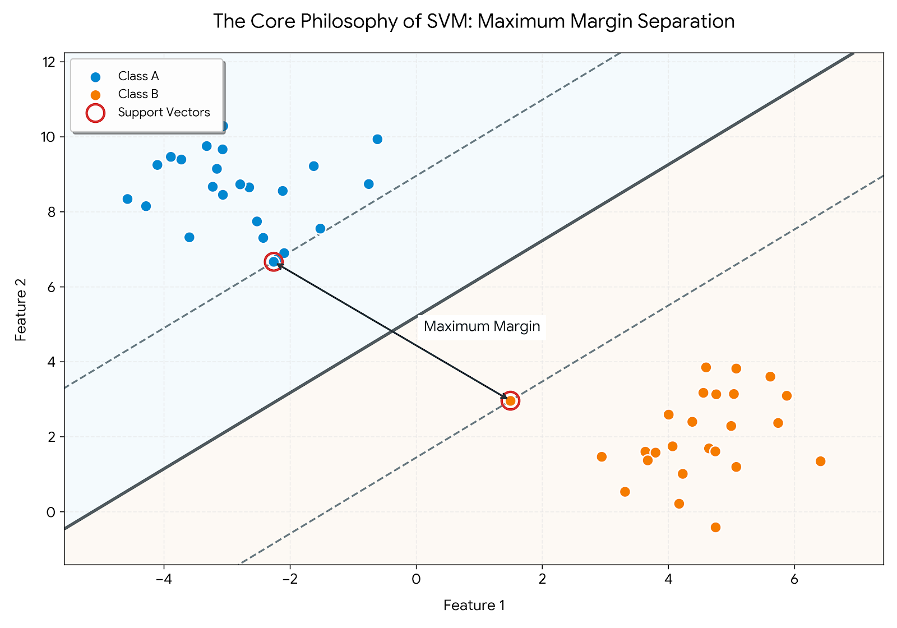
</p>

Unlike other classification methods that simply seek to minimize classification errors, SVMs optimize for both accuracy and generalization capability. The fundamental philosophy is based on the principle that the best separator is not just any line that correctly classifies the training data, but rather the one that maintains the maximum possible distance from data points of all classes. This approach, rooted in structural risk minimization, leads to better generalization of unseen data.

---
## The Separation Problem
When dealing with binary classification problems we often face a fundamental question: while there may be infinitely many lines that can perfectly separate the training data with 100% accuracy, which one should we choose?

Let's consider a simple scenario where we have colored balls of two types scattered on a table. We can place a stick (representing a line in 2D) to separate them. However, we'll quickly notice that there are countless ways to place it. The question then becomes which position is optimal?

<p align="center">
  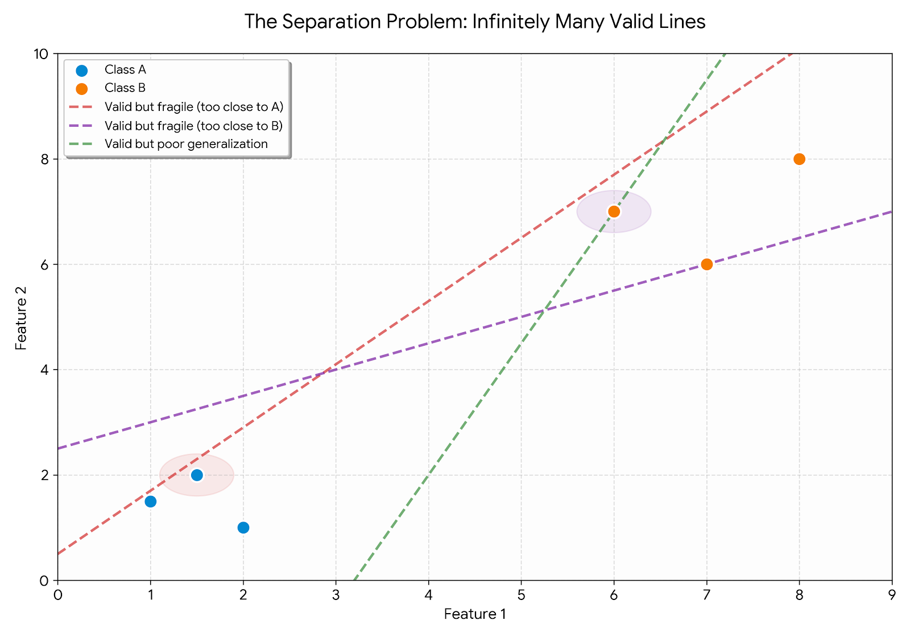
</p>

The answer lies in thinking about what happens when we add new balls to the table. If our stick is too close to some balls it can lead to misclassification. On the other hand, if we place it in a position where the distance from balls on both sides is maximized, we can create more tolerance for variation.


This is exactly what Maximum Margin tells us - the best separating line is the one that passes as far as possible from the points of both groups. This intuition is rooted in several principles:
1. **Robustness**: A separator that barely squeezes between the classes might work perfectly on training data but could fail on new, slightly different data points
2. **Generalization**: By maximizing the distance to all training points, we're implicitly preparing for the variability we'll see in test data
3. **Statistical Learning Theory**: Vapnik's work showed that maximizing the margin provides theoretical guarantees on generalization error bounds.

---
## The Concept of Margin

The margin is the width of the "street" or "corridor" that separates the classes. It represents the buffer zone between the decision boundary and the nearest data points from each class. Mathematically, the margin is the perpendicular distance from the decision boundary to the nearest training examples.

<p align="center">
  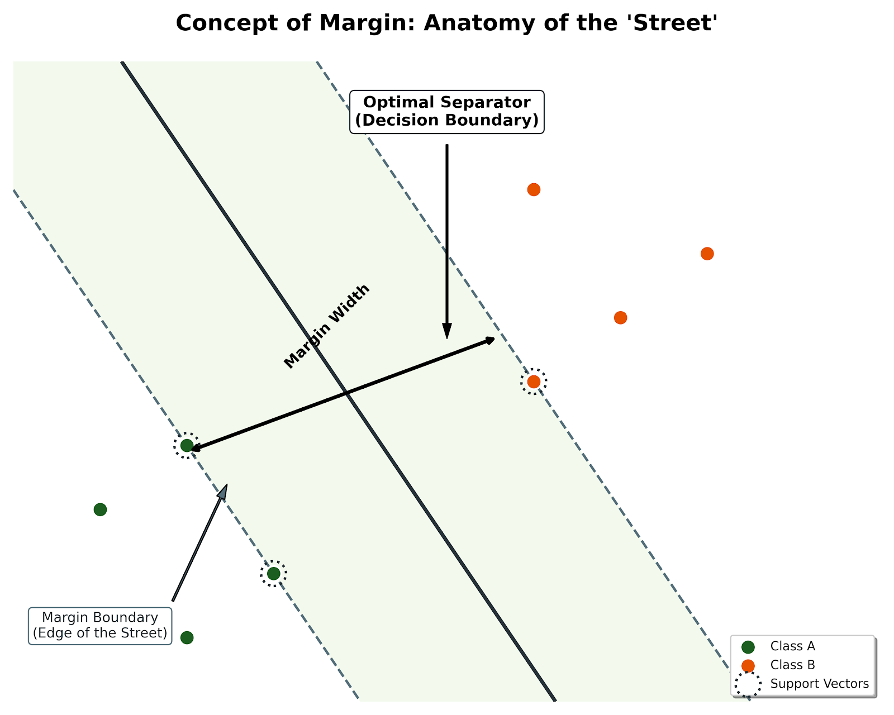
</p>

The SVM objective is not merely to classify correctly (minimize error) but to maximize the margin. This dual objective has several important implications:
1. Safety and Confidence: A larger margin means more confidence in predictions. Points can vary slightly from their training positions and still be correctly classified. This is crucial in real-world applications where measurement noise and data variability are inevitable.
2. Better Generalization: The model is less likely to overfit the training data. By keeping maximum distance from all training points, the model doesn't adapt too closely to the peculiarities of the training set. This is supported by VC theory, which shows that the generalization error is bounded by a function of the margin.
3. Robustness to Noise: The classifier becomes more robust to noise and small perturbations in the data. Outliers that are far from the margin have minimal impact on the decision boundary.
4. Structural Risk Minimization: Maximizing the margin is equivalent to minimizing a specific measure of model complexity, which aligns with the principle of structural risk minimization.

---
## Mathematical Foundations
Understanding the mathematics behind SVM is crucial for appreciating its elegance and power. This section builds from basic definitions to the complete optimization problem.

#### HyperPlane Definition
In mathematical terms, the decision boundary (hyperplane) in SVM is defined by the equation:
$$
w \cdot x+b=0
$$

Where:
- w is the weight vector (normal vector to the hyperplane)
- x is the feature vector (data point)
- b is the bias term (intercept or offset)
- $\cdot$ denotes the dot product

<p align="center">
  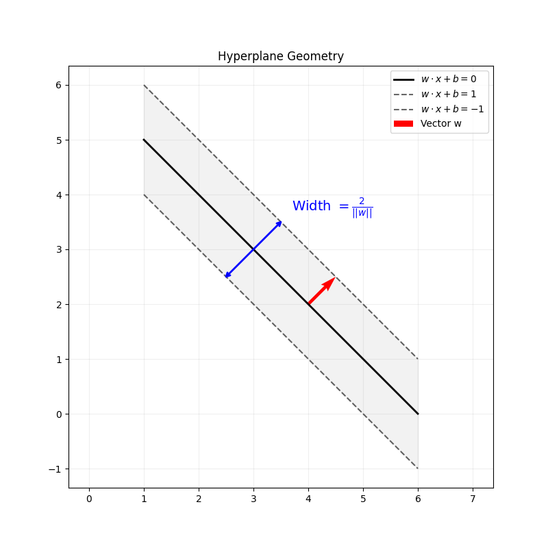
</p>

In 2D space, this represents a line. In 3D, it's a plane. In higher dimensions, it's called a hyperplane. The vector w determines the orientation of the hyperplane, while b determines its position relative to the origin.

The perpendicular distance from a data point $x_i$ to the decision boundary is given by:
$$
d_i = |w \cdot x_i + b| / \left\| w \right\|
$$

Where:
- $\left\| w \right\|$ represents the Euclidean norm of the weight vector
- The absolute value ensures we get a positive distance

This formula is fundamental because the margin is defined in terms of these distances. Specifically, the margin equals the minimum distance from any training point to the hyperplane, multiplied by 2 (accounting for both sides).

#### The Margin Formula

The margin is given by:
$$
Margin = 2 / \left\| w \right\|
$$

This means that to maximize the margin, we need to minimize $\left\| w \right\|$. This is the core insight that transforms the intuitive goal into a concrete mathematical optimization problem.

Once we have the hyperplane, classifying a new point x is straightforward:
$$
\hat y = w \cdot x + b
$$

- If $w \cdot x + b \geq 0$, predict class +1
- If $w \cdot x + b < 0$, predict class -1

##### Hard Margin Classification
Hard Margin SVM is used when the data is perfectly linearly separable - meaning there exists a hyperplane that can separate the classes without any errors. 

This means all points must be:
1. On the correct side of the decision boundary
2. At least at unit distance from the decision boundary (when measured in the normalized space)

The points that satisfy $y_i(w \cdot x_i + b) = 1$ exactly are the support vectors.

This is called "hard margin" because it enforces strict separation: no points are allowed within the margin or on the wrong side. This works perfectly for linearly separable data but fails when:
- Data contains outliers
- Classes naturally overlap
- Data is not linearly separable

In practice, perfectly linearly separable data is rare, which is why soft margin SVM is more commonly used.

##### Soft Margin Classification
Real-world data is rarely perfectly separable. There may be outliers, noise or natural overlap between classes. Soft margin SVM allows for some misclassification or margin violations to achieve better generalization and handle imperfect data.

<p align="center">
  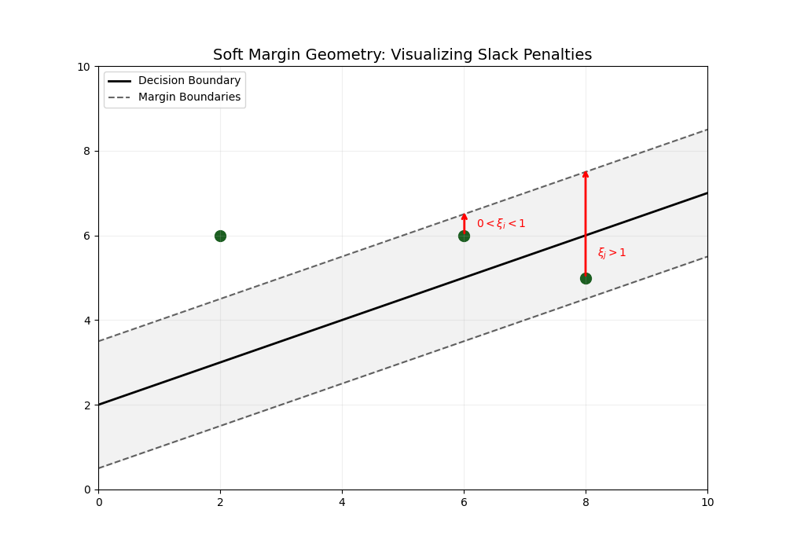
</p>

Slack variables $ξ_i$ are introduced to measure the degree of misclassification or margin violation for each data point:
- $ξ_i = 0$: Point is correctly classified and outside the margin
- $0<ξ_i<1$: Point is correctly classified but inside the margin
- $ξ_i \geq 1$: Point is misclassified

#### Modified Optimization Problem

$$
\text{Minimize: } \quad (1/2)||w||^2+C \sum(ξ_i)
$$

Subject to:
- $y_i(w \cdot x_i +b) \geq 1- ξ_i$ for all i
- $ξ_i \geq 0$ for all i

Where:
- C is the regularization parameter (hyperparameter)
- $\sum (ξ_i)$ is the sum of all slack variables


#### Understanding the C Parameter


The regularization parameter C controls the trade-off between:
1. Maximizing the margin (keeping $||w||$ small)
2. Minimizing classification errors (keeping $\sum (ξ_i)$ small)

High C value assigns large penalties to misclassifications and forces the model to classify training data more accurately. The result is a narrower margin which results in the model prone to overfit, especially with noisy data.

Low C values, on the other hand, make the model more tolerant of misclassifications, prioritizes a wider margin. This results in a simpler, more generalized model, prone to underfitting as it misses important patterns.

Choosing C is typically done through cross-validation. Start with C=1 and adjust based on validation performance.


#### The Objective Function Interpretation
The soft margin objective can be rewritten as:
$$
\text{Minimize:} \quad (1/margin) + \gamma \sum(penalty)
$$

This shows explicitly that we're balancing two competing goals:
- Making the margin as wide as possible (1/margin term)
- Minimizing violations and misclassifications (penalty term)

#### Hinge Loss Function

The penalty term in soft margin SVM can be understood through the hinge loss function, which has the following behavior:
$$
L(y,f(x)) = max(0, 1- y \cdot f(x))
$$

<p align="center">
  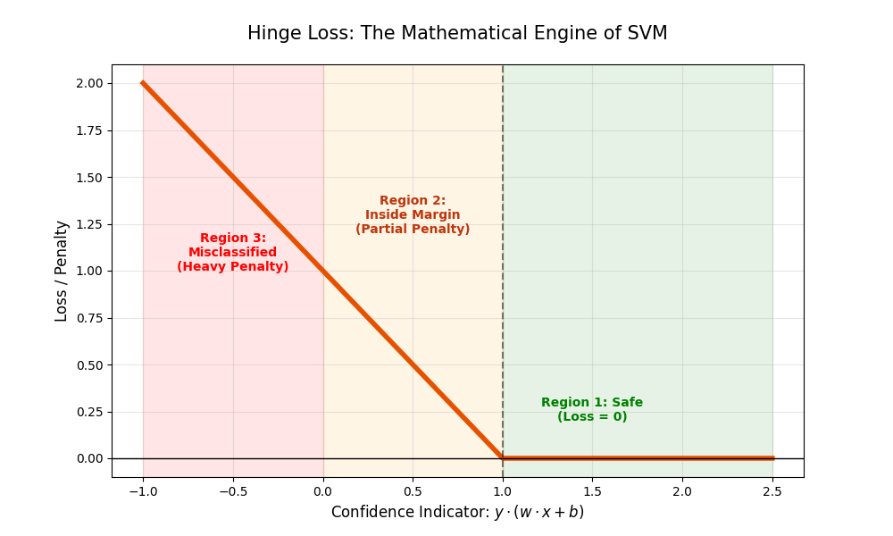
</p>

Where:
- y is the true label (-1 or +1)
- f(x) = w · x + b is the raw output of the classifier


Hinge Loss Behavior:
1. Correctly classified and outside margin ($y \cdot f(x) \geq 1$):
    - Loss = 0
    - No penalty applied
    - These points don't influence the model
2. Correctly classified but inside margin ($0 < y \cdot f(x) < 1$):
    - Loss = $1 - y \cdot f(x)$
    - Partial penalty applied
    - Even though classified correctly, they're too close to the boundary
3. Misclassified ($y \cdot f(x) \leq 0$):
    - Loss = $1 - y \cdot f(x)$ (a large positive number)
    - Heavy penalty applied
    - The more wrong the classification, the higher the penalty


The complete soft margin SVM objective becomes:

$$
\text{Minimize:} \quad (1/2)||w||^2 + C \sum max(0, 1 - y_i(w \cdot x_i + b))
$$

This formulation explicitly shows the hinge loss and is commonly used in practice.

---
## Support Vectors

One of the most elegant properties of SVMs is that most data points don't matter for defining the decision boundary. Only a small, carefully selected subset of points actually determines where the optimal hyperplane lies. This sparse representation is both computationally efficient and conceptually insightful.

**Support Vectors** are the data points that lie exactly on or within the margin boundaries - the points that "touch" or violate the edges of the street. More formally, they are training examples for which:

$$
y_i(w \cdot x_i + b) \leq 1
$$

This includes
- Points exactly on the margin ($y_i(w \cdot x_i + b)=1$)
- Points inside the margin or misclassified ($y_i(w \cdot x_i+b)<1$, only in soft margin SVM)

Properties of Support Vectors:
1. Minimal Representation: Only the support vectors are needed to define the classifier. The decision boundary is determined entirely by these critical points. If we removed all other points from the training set, the decision boundary would remain exactly the same.
2. Sparse Solution: In many practical problems, the number of support vectors is much smaller than the total number of training points. This leads to:
    - Memory-efficient models (only support vectors need to be stored)
    - Faster prediction times
    - Better interpretability (you can examine which training examples were most influential)
3. Critical Points: Support vectors are the most informative points in the dataset. They represent the cases that are hardest to distinguish between classes - the boundary cases where classification is most uncertain.
4. Robustness to Non-Support Vectors: The fact that the solution depends only on support vectors makes SVM robust to:
    - Outliers that are far from the decision boundary
    - Changes in the distribution of points that are not near the boundary
    - Redundant or repeated training examples away from the boundary
5. Direct Influence: Support vectors directly determine the position and orientation of the hyperplane. In the mathematical solution, the weight vector w is expressed as a linear combination of only the support vectors

<p align="center">
  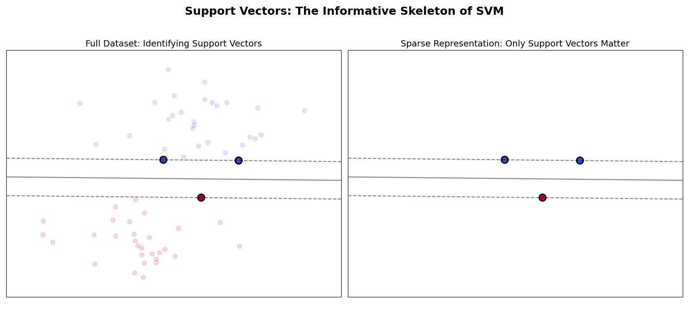
</p>

The decision function can be mathematically written in terms of support vectors:
$$
f(x) = \sum (a_i \cdot y_i \cdot K(x_i, x)) + b
$$
Where the sum is only over support vectors (points where $a_i>0$), and:
- $a_i$ are the Lagrange multipliers (learned during training)
- $y_i$ are the class labels of support vectors
- $K(x_i,x)$ is the kernel function (dot product in linear SVM)

This shows that only support vectors contribute to making prediction. This matters because the support vector property explains several important characteristics of SVMs:
1. Efficiency: We can discard all non-support vectors after training without affecting the model
2. Why SVMs work with small datasets: What matters is having good representation of the boundary cases, not necessarily having massive amounts of data. A small dataset with informative boundary examples can produce an excellent SVM
3. Interpretability: We can examine the support vectors to understand which training examples were most critical for defining the decision boundary.
4. Robustness: Adding more training data far from the boundary doesn't change the model, making SVMs stable and less prone to overfitting from redundant data.


---
## The Kernel Trick

The kernel trick is one of the most ingenious innovations in machine learning, allowing SVMs to handle complex, non-linear decision boundaries effectively. 

In the real world, data is rarely linearly separable. In many cases a straight line (or flat hyperplane) simply cannot separate these classes, no matter how we position it. 

The solution is to do feature mapping. The fundamental idea is revolutionary yet simple:
>If we can't separate the data in its current dimension, we project it to a higher dimension where separation becomes possible.

Given an original feature space with features $x \in \mathbb{R}^d$, we define a mapping function:

$$
φ: \mathbb{R}^d -> \mathbb{R}^D
$$

Where $D >> d$. This function $φ(x)$ transforms each data point into a higher-dimensional representation. In this new space, what appeared non-linearly separable in the original space may become linearly separable.

Let's imagine we have blue points in the center of a flat piece of paper and red points around the edges. It is impossible to draw a straight line separating center from edges. Any linear boundary will misclassify points. But if we physically lift the center of the paper upward, we add a third dimension. Now we can pass a flat plate horizontally that separates the raised center from the flat edges. When we project this flat separator back down to the 2D paper, it appears as a circle - but in 3D, it was simply a flat plane.

This is exactly what feature mapping does mathematically - it finds a flat separator in a higher-dimensional space, which corresponds to a complex, non-linear boundary in the original space.


<p align="center">
  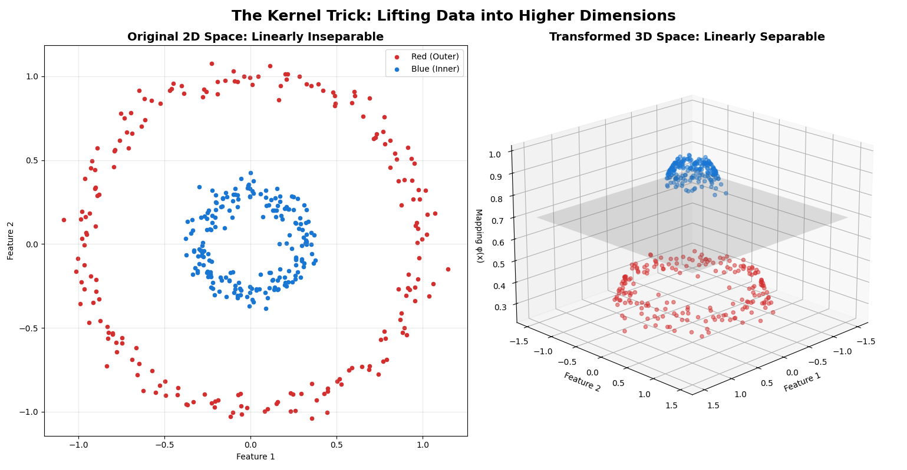
</p>

But naively applying feature mapping would be computationally prohibitive. The computational cost of explicitly computing $φ(x)$ and working in high-dimensional space would make SVMs impractical for most real problems.

The key insight is that the SVM algorithm only ever needs to compute dot products between data points. We never actually need the transformed features themselves, we only need to know what the dot product would be in the transformed space.

A kernel function $K(x_i, x_j)$ directly computes this dot product in the transformed space without ever explicitly performing the transformation:

$$
K(x_i, x_j) = φ(x_i) \cdot φ(x_j)
$$

We compute the kernel function in the original space, but it gives us the same result as if we had:
1. Transformed both points to the high-dimensional space
2. Computed their dot product here

The kernel trick provides:
1. Computational Efficiency
2. Memory Efficiency
3. Mathematical Elegance
4. Infinite Dimensions
5. Flexibility


But not every function can serve as a valid kernel. A function $K(x,y)$ is a valid kernel if and only if it satisfies Mercer's theorem, which essentially requires that:
1. The kernel is symmetric: $K(x,y)=K(y,x)$
2. The kernel is positive semi-definite

This ensures that K actually corresponds to a dot product in some Hilbert space (possibly infinite-dimensional).


---
## Non-Linear SVM

Non-linear SVMs extend the power of linear SVMs to handle complex, real-world data that cannot be separated by straight lines or flat hyperplanes.

Real-world data rarely exhibits linear separability. Non-linear SVMs address this through a two-step conceptual process:
1. Feature Mapping - Transform the original input space to a higher-dimensional feature space where the data becomes linearly separable.
2. Linear Separation in New Space - Apply linear SVM in this higher-dimensional space to find the optimal hyperplane.

When projected back to the original space, this linear hyperplane appears as a complex, non-linear decision boundary.

<p align="center">
  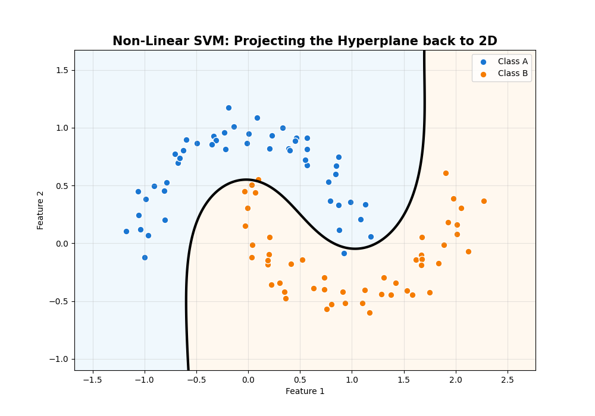
</p>

The challenge is what transformation $φ(x)$ should we use. This is where **kernels** come in. Different kernels correspond to different implicit feature mappings, allowing us to experiment with different types of non-linear boundaries without explicitly constructing the high-dimensional spaces.

The elegance of non-linear SVM lies in its duality:
- Conceptually: We're finding a simple linear separator in a complex high-dimensional space
- Computationally: We're working efficiently with kernels in the original space.
- Practically: We get complex, flexible decision boundaries that can fit real-world data

---
## Types of Kernels
Choosing the right kernel is like choosing the right tool for a specific job. Different kernels create different types of decision boundaries and implicit feature spaces. Here's a comprehensive guide to the most common kernel functions.

<p align="center">
  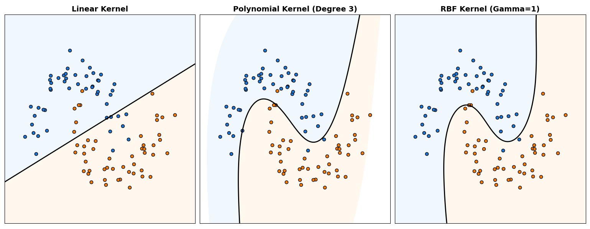
</p>

#### Linear Kernel
The linear kernel is simply the dot product in the original space - no transformation is applied.

$$
K(x_i, x_j) = x_i \cdot x_j
$$

Characteristics:
- No projection to higher dimensions
- The "rigid ruler" of kernels
- Create straight lines or flat hyperplanes
- Equivalent to standard linear SVM
- Simplest and fastest kernel

Mathematical properties:
- Correspond to identity mapping: $φ(x) = x$
- Decision boundary: $w \cdot x + b = 0$ directly in original space
- Number of parameters: equals the number of features

This is used for Text classification, Problems with many features, When data is already linearly separable, When interpretability is important and Baseline Model.

The advantages of a linear kernel is that it is fast in training and prediction, no hyperparameters to tune (beyond C), it is less prone to overfitting and easier to interpret. On the other hand, it cannot capture non-linear relationships and has a poor performance on inherently non-linear problems

#### Polynomial Kernel

The polynomial kernel function is:
$$
K(x_i, x_j) = (\gamma(x_i \cdot x_j) + r)^d
$$

Where:
- $d$ is the degree of the polynomial
- $\gamma$ is a scaling parameter
- $r$ is the coefficient term

This creates smooth polynomial curves and surfaces. The degree d controls the complexity and flexibility - as higher the degree the more flexible the boundaries are. This can model polynomial interaction between features.

This is mainly used for Image Processing, Pattern Recognition and Problems Requiring smooth, curved boundaries.

Hyperparameters:
- Degree ($d$):
    - $d=2$: Quadratic boundaries
    - $d=3$: Cubic boundaries
    - $d \geq 4$: Very flexible but computationally expensive and prone to overfitting (rarely used)
- Coef0 ($r$):
    - Trades off between higher-order and lower-order terms
    - $r=0$: Homogeneous polynomial (all terms have degree exactly d)
    - $r>0$: Includes lower-degree terms

Advantages:
- Captures feature interactions naturally
- Smooth, interpretable boundaries
- Good for problems with known polynomial structure

Limitations: 
- High-degree polynomials can be computationally expensive
- Risk of overfitting with high degrees
- Sensitive to feature scaling 
- Kernel matrix can become numerically unstable with high degrees

#### RBF Kernel (Radial Basis Function)

RBF kernel is also known as the Gaussian kernel because it has a Gaussian (bell-curve) shape.

$$
K(x_i, x_j) = exp(-\gamma ||x_i-x_j||^2)
$$

This is the most powerful and popular kernel. It creates "islands" or complex contours around data points. This is based on the concept of similarity through proximity. It can create circular, elliptical or arbitrary-shaped boundaries and it maps to an infinite-dimensional feature space.

The RBF kernel measures similarity based on distance:
- Points close together $\rightarrow$ High kernel value $\rightarrow$ High similarity $\rightarrow$ Likely same classes
- Points far apart $\rightarrow$ Low kernel value $\rightarrow$ Low similarity $\rightarrow$ Likely different classes

The function value decreases exponentially with distance, creating a localized influence around each point.

##### The $\gamma$ Parameter:
Gamma controls the "reach" or "influence" of each training point. High $\gamma$ values make each training point have very local influence. This creates complex wiggly boundaries that closely follow training data which makes the model really prone to overfit as it creates many small "islands" around individual points.

On the other hand, low values of gamma make each training point has broad influence. This creates smoother, more generalized boundaries which can make the model prone to underfitting as it is too simple and misses important patterns. It behaves like a linear classifier.

<p align="center">
  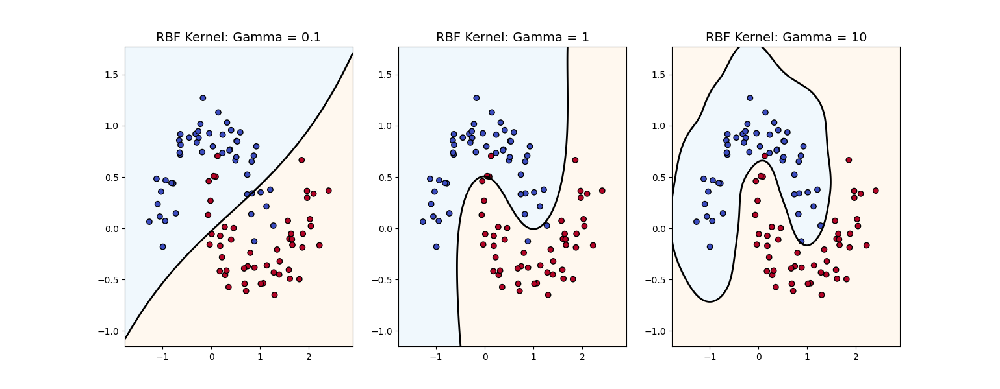
</p>

There is no universal solution for optimal values of $\gamma$. It is typically found through cross-validation. As a rule of thumb usually it starts with $\gamma = 1/n_{features}$. It is adjusted based on validation performance.

This is the default choice for most non-linear problems such as image recognition, pattern classification and for when the relationship between features and labels is unknown (simply, any problem where linear and polynomial kernels fall).

Advantages:
- Extremely flexible—can approximate any continuous function
- Works well in practice for many problems
- Only one main hyperparameter ($\gamma$) to tune
- Robust across different types of data
- Less prone to numerical instability than polynomial kernels

Limitations:
- Can easily overfit if $\gamma$ is too high
- Less interpretable than linear or polynomial kernels
- More computationally expensive than linear kernel
- Requires careful hyperparameter tuning
- Sensitive to feature scaling


#### Sigmoid Kernel

This is similar to the activation function in neural networks. Sometimes it is called the "neural network kernel". It creates S-shaped boundaries.
$$
K(x_i, x_j) = tanh(\gamma(x_i \cdot x_j) + r)
$$

Where:
- $\gamma$ is a scaling parameter
- r is the coefficient term

This is rarely used in practice. This doesn't always satisfy Mercer's theorem and usually is outperformed by RBF in practice. It is also difficult to tune properly.


#### How to Choose the Kernel

Decision Tree for Kernel Selection
1. Start with Linear Kernel. If we have many features ($N_{features} \geq N_{samples}$) or we need fast training/prediction or we need interpretability we should use it. For text classification or NLP tasks we should also use it.
2. Try RBF Kernel if linear kernel underperforms, we have non-linear relationships, we don't know the structure of our data, we don't have enough computational resources or we cannot tune hyperparameters properly
3. Consider Polynomial Kernel if we have domain knowledge suggesting polynomial relationships, image processing applications or we need smooth boundaries


#### Important Considerations

Feature scaling is critical for RBF and polynomial kernels (not as much for linear kernel but still recommended). We should use functions such as *StandardScaler* or *MinMaxScaler* before training.

For hyperparameter Tuning we should use grid search with cross-validation:
- For RBF: Try $\gamma$ in range $[10^{-4}, 10^1]$
- For polynomial: Try degree in range $[2,4]$
- Always tune C parameter regardless of kernel


Computational cost:
1. Linear: $O(n \times d)$ for prediction
2. Polynomial: $O(n \times d^2)$
3. RBF: $O(n \times d)$ but with more expensive kernel evaluations
4. Polynomial (high degree): Very expensive

It is also possible to combine kernels. However it is rarely done in practice as it adds complexity without guaranteed improvement.

---
## The Dual Problem and Lagrange Multipliers

The dual formulation of SVM is crucial for understanding how the kernel trick works and why SVMs are computationally efficient. This section explores the transformation from the primal problem to the dual problem.

The optimization problem we've discussed so far is called the primal problem. However, solving it directly in high-dimensional feature spaces is computationally challenging. The dual problem offers several advantages:
1. Enables the Kernel trick
2. Computationally efficient
3. Reveals support vectors
4. Handles infinite dimensions

**Primal Problem** *(what we want to solve)*:
$$
\text{Minimize: } (1/2)||w||^2 + C \sum ξ_i
$$
Subject to: $y_i(w \cdot x_i +b) \geq 1 - ξ_i \quad \text{and} \quad ξ_i \geq 0$

**Dual Problem** *(what we actually solve)*:
$$
\text{Maximize:} \quad \sum a_i - (1/2)\sum \sum a_i a_j y_i y_j K(x_i, x_j)
$$

Subject to:
- $0 \leq a_i \leq C$ for all $i$
- $\sum a_i y_i = 0$

Where:
- $a_i$ are the Lagrange multipliers
- $y_i$ are the class labels (+1 or -1)
- $K(x_i, x_j)$ is the kernel function


The lagrange multipliers $a_i$ have important interpretations:
- If $a_i=0$ the point is correctly classified and outside the margin it is not a support vector. These points don't influence the decision boundary. 
- If $0<a_i<C$ the point lies exactly on the margin boundary. It is a support vector. It is correctly classified but critical for defining the boundary.
- If $a_i = C$ the point either lies inside the margin or is misclassified. These points are difficult to classify.


<p align="center">
  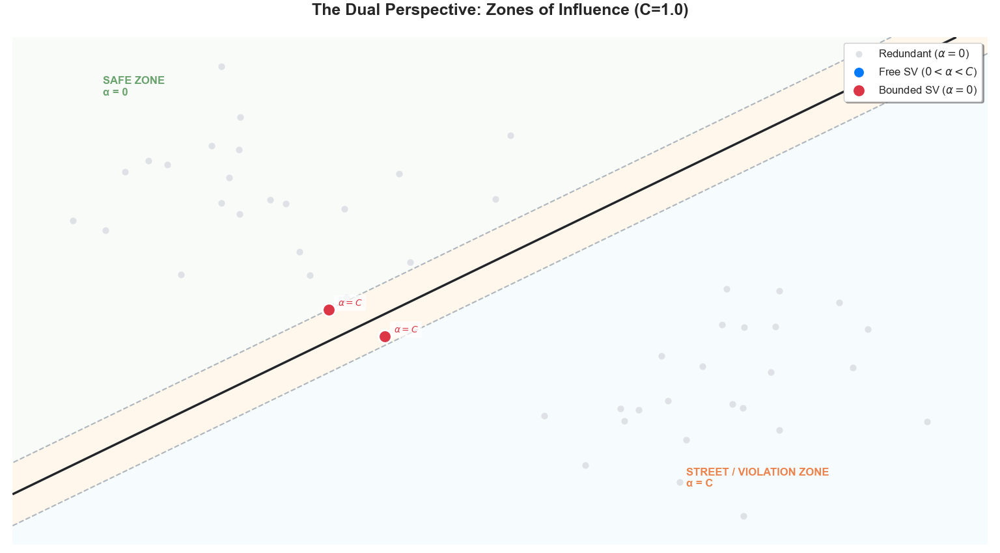
</p>


The sparse nature of the solution (most $a_i=0$) is what makes SVMs memory-efficient.

Once we solve the dual problem and obtain the $a_i$ values, the decision function for a new point x is:
$$
f(x) = \sum(a_i \cdot y_i \cdot K(x_i, x)) + b
$$

Where the sum is only over support vectors (points where $a_i > 0$).

This shows explicitly that:
1. Only support vectors contribute to predictions
2. We only need kernel evaluations $K(x_i, x)$, never explicit feature vectors $φ(x)$
3. The complexity depends on the number of support vectors, not the feature dimension


The **bias term b** is computed from support vectors that lie exactly on the margin ($0 < a_i < C$):
$$
b = y_i - \sum (a_j \cdot y_j \cdot K(x_j, x_i))
$$

For any support vector $x_i$ where $0<a_i<C$. In practice, we average over all such support vectors for numerical stability.

The key insight is that the dual problem only involves:
- Kernel evaluations $K(x_i, x_j)$ between training points
- Kernel evaluations $K(x_i, x)$ between training and test points

We never need the explicit weight vector w in high-dimensional space, the explicit feature mapping $φ(x)$ nor to store or manipulate high-dimensional representations.

This is why we can work with infinite-dimensional feature spaces (RBF kernel) or very high-dimensional polynomial spaces without computational issues.


The dual formulation reveals why they're called support vectors. The optimal weight vector can be written as:

$$
w = \sum(a_i · y_i · φ(x_i))
$$

Only summing over points where $a_i > 0$ (the support vectors). These points "support" the hyperplane—they're the foundation upon which the entire classification boundary rests. Remove them, and the hyperplane changes. Remove any other points, and nothing changes.

Several algorithms exist for solving the dual problem:
1. Quadratic Programming
2. SMO (Sequential Minimal Optimization)
3. Coordinate Descent
4. Gradient Methods

Modern SVM libraries typically use optimized implementations of SMO or related methods.

---
## Support Vector Regression (SVR)

While SVMs are primarily known for classification, the same principles can be extended to regression problems through Support Vector Regression (SVR). SVR applies the SVM framework to predict continuous values rather than discrete classes.

In classification, SVM tries to find a hyperplane that maximizes the margin between classes. In regression, SVR tries to find a function that:
1. Has at most $ε$ deviation from the actual targets for all training data
2. Is as flat as possible (minimizes complexity)

Instead of maximizing the margin between classes, SVR creates a tube (or $ε$-insensitive zone) around the regression function and tries to fit as many points as possible within this tube.

SVR uses an $ε$-insensitive loss function:

$$
L_ε(y, f(x)) = max(0, |y-f(x)|-ε)
$$

This means:
- Error smaller than $ε$: No penalty (loss = 0)
- Errors larger than $ε$: Linear penalty proportional to the size of the deviation

Points that lie within the $ε$-tube don't contribute to the loss - only points outside the tube matter. This creates a sparse solution, similar to classification SVM.

The SVR Optimization Problem consists in:

$$
\text{Minimize } \quad (1/2)||w||^2 + C \sum (ξ_i + ξ_i*)
$$

Subject to:
- $y_i - (w \cdot x_i + b) \leq ε + ξ_i$
- $(w \cdot x_i + b) - y_i \leq ε + ξ_i*$
- $ξ_i, ξ_i* \geq 0$

Where:
- $ε$ is the width of the insensitive tube
- $ξ_i$ and $ξ_i*$ are slack variables for points above and below the tube
- C is the regularization parameter

In SVR, support vectors are the training points that lie:
- On the boundary of the ε-tube
- Outside the ε-tube (poins with errors larger than ε)

Points inside the tube (with errors $< ε$) have $a_i=0$ and don't influence the model.


<p align="center">
  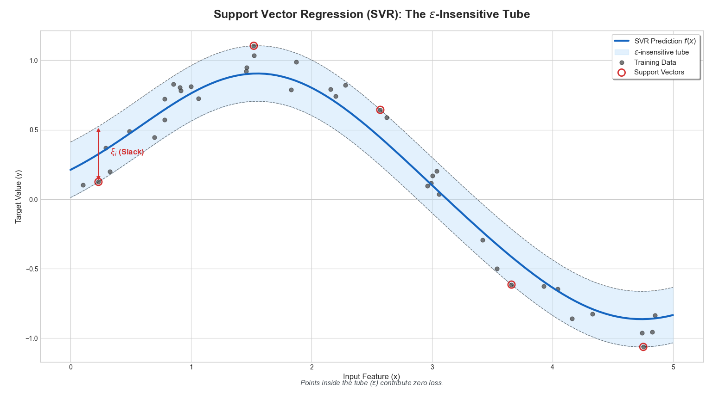
</p>


#### Key Hyperparameters

**$ε$ (epsilon)**: Controls the width of the ε-insensitive tube. Larger ε leads to more points inside tube, sparser model and makes the model prone to underfit. Smaller ε leads to fewer points inside tube, more support vectors and makes the model prone to overfit.

**C (regularization)**: Same as in classification SVM. It controls the trade-off between flatness and tolerance for errors beyond ε. Larger C means less tolerance for errors, which might lead to overfit (and vice-versa).

**Kernel**: Same kernels as classification. It allows for non-linear regression. RBF is most common for non-linear relationships.

A key advantage of SVR is that you don't need to specify the relationship between independent and dependent variables—the kernel trick allows the model to learn complex, non-linear relationships automatically.

#### When to Use

SVR should be used when we have non-linear relationships between features and target, we need robustness to outliers, we have high-dimensional feature spaces or we want sparse solutions.

On the other hand we should not use it when we have very large datasets, we need probabilistic predictions, we have linear relationships or when interpretability is crucial.

#### Practical Implementation

In scikit-learn, SVR is implemented as:

```python
from sklearn.svm import SVR

# Linear SVR
model = SVR(kernel='linear', C=1.0, epsilon=0.1)

# Non-linear SVR with RBF kernel
model = SVR(kernel='rbf', C=1.0, epsilon=0.1, gamma='scale')

# Training
model.fit(X_train, y_train)

# Prediction
predictions = model.predict(X_test)
```

(Remember to always scale your features before using SVR, as it's sensitive to feature scales)


---
## Hyperparameter Tuning

We will now enter in detail on hyperparameter tuning.

Proper hyperparameter tuning is critical for achieving optimal SVM performance. This section provides comprehensive guidance on tuning SVM hyperparameters effectively.

#### C (Regularization Parameter)

C controls the trade-off between achieving a low training error and a low testing error (generalization).

**Effect**:
- High C (e.g., 100, 1000):
    - Assigns high penalty to misclassifications
    - Model tries to classify all training points correctly
    - Narrow margin
    - This makes the model prone to overfit so we should only use when we trust that our data is clean and representative
- Low C (e.g., 0.01, 0.1):
    - More tolerant of misclassifications
    - Wider margin
    - Simpler model
    - This makes the model prone to underfit so we should only use when the data is noisy or we want more generalization

**Tuning range**: Typically search log scale: $[0.001, 0.01, 0.1, 1, 10, 100, 1000]$

#### Gamma ($\gamma$) - For RBF, Polynomial and Sigmoid Kernels

Gamma controls how far the influence of a single training example reaches.

**Effect**:
- High $\gamma$ (e.g., 10, 100):
    - Each point has very localized influence
    - Complex wiggly decision boundaries
    - Can create "islands" around individual points
    - This makes the model prone to severe overfitting
- Low $\gamma$ (e.g. 0.001, 0.01):
    - Each point influences a wide area
    - Smoother, more generalized boundaries
    - Approaches linear behavior
    - This makes the model prone to underfit

**Tuning range**: Typically search log scale: [0.0001, 0.001, 0.01, 0.1, 1, 10]

(As a rule of thumb, start with $\gamma=1/n_{features}$ and adjust from there)

#### Kernel

The Possible options are Linear, Polynomial, RBF and Sigmoid. To know which to select:
1. Start with linear if we have high-dimensional data
2. Try RBF if linear underperforms
3. Consider polynomial (degree 2-3) for specific domain knowledge
4. Rarely use sigmoid


#### Degree (for Polynomial Kernel)

Degree controls the degree of the polynomial function. Typical values are 2, 3 or 4. Effects:
- **Degree 2**: Quadratic boundaries
- **Degree 3**: Cubic boundaries
- **Degree 4+**: Very flexible but computationally expensive and prone to overfitting

#### Coef0 (for Polynomial and Sigmoid Kernels)

This controls the independent term in kernel function. This influences the trade-off between higher-order and lower-order terms.

Typical range is $[0,1]$

<p align="center">
  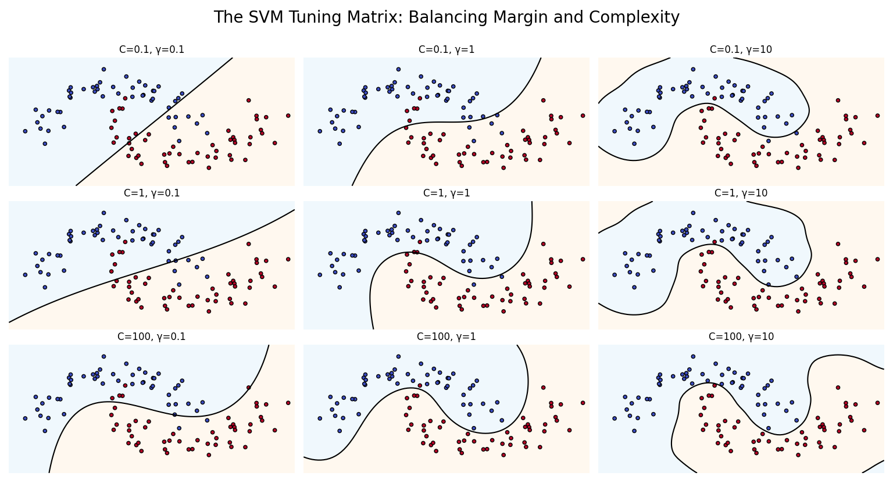
</p>

#### Hyperparameter Tuning Strategies

**1. Grid Search with Cross-Validation**

The most common and reliable approach:

```python
# Define parameter grid
param_grid = {
    'C': [0.1, 1, 10, 100],
    'gamma': [0.001, 0.01, 0.1, 1],
    'kernel': ['rbf']
}

# Create grid search object
grid_search = GridSearchCV(
    SVC(),
    param_grid,
    cv=5,  # 5-fold cross-validation
    scoring='accuracy',
    n_jobs=-1  # Use all CPU cores
)
```


Advantages:
- Exhaustive search
- Reliable
- Easy to implement

Disadvantages:
- Computationally expensive
- Time complexity: $O(n_{combinations} × n_{folds})$


**2. Random Search**

Faster alternative when we have many hyperparameters:

```python
# Define parameter distributions
param_distributions = {
    'C': loguniform(0.01, 100),
    'gamma': loguniform(0.0001, 1),
    'kernel': ['rbf', 'poly']
}

# Create random search object
random_search = RandomizedSearchCV(
    SVC(),
    param_distributions,
    n_iter=50,  # Number of parameter settings sampled
    cv=5,
    scoring='accuracy',
    n_jobs=-1,
    random_state=42
)
```


Advantages:
- Faster than grid search
- Can explore more parameter combinations with same time budget
- Good for high-dimensional parameter spaces


**3. Bayesian Optimization**

This is the most sophisticated approach. It uses previous evaluation results to select the next hyperparameters to try.

```python
# Define search space
search_spaces = {
    'C': (0.01, 100.0, 'log-uniform'),
    'gamma': (0.0001, 1.0, 'log-uniform'),
    'kernel': ['linear', 'rbf']
}

# Bayesian optimization
bayes_search = BayesSearchCV(
    SVC(),
    search_spaces,
    n_iter=32,
    cv=5,
    n_jobs=-1,
    random_state=42
)
```


Advantages:
- Most efficient
- Requires fewer iterations than random search
- Sophisticated approach

Disadvantages:
- More complex to set up
- Requires additional libraries

**Step-by-Step Tuning Recipe**:
1. Start with default parameters

```python
model = SVC()  # Default: C=1.0, kernel='rbf', gamma='scale'
```

2. Broad search for C with default gamma

```python
param_grid = {'C': [0.01, 0.1, 1, 10, 100]}
```

3. Once we find a good C range tune gamma

```python
param_grid = {
    'C': [1, 10],  # Narrow down from step 2
    'gamma': [0.0001, 0.001, 0.01, 0.1, 1]
}
```

4. Fine-tune around best combination

```python
param_grid = {
    'C': [5, 10, 15],  # Refine around best C
    'gamma': [0.005, 0.01, 0.05]  # Refine around best gamma
}
```

5. Try different kernels if RBF doesn't work well

```python
# Try linear
model = SVC(kernel='linear', C=best_C)

# Or try polynomial
param_grid = {
    'C': [best_C],
    'degree': [2, 3, 4],
    'coef0': [0, 0.5, 1]
}
```


Important consideration:
1. Always scale features first
2. Use stratified CV for imbalanced datasets
3. Monitor overfitting
4. Consider class imbalance
5. Use appropriate scoring metrics


Common Mistakes to Avoid:
1. Not scaling features
2. Tuning on test set
3. Too fine-grained grid
4. Ignoring training time
5. Not considering class imbalance
6. Overfitting through tuning


---
## Real World Applications


SVMs have proven particularly effective in scenarios with specific characteristics. Understanding when and why to use SVM helps in selecting the right tool for your machine learning problem.


SVM is renowned for performing well even when:
- You have many features (high dimensionality)
- You have relatively few training examples
- The curse of dimensionality would hurt other algorithms

This makes SVM particularly valuable in domains where data collection is expensive or difficult, but where each sample has many measurable characteristics.

#### Bioinformatics and Genetics

It is used for many bioinformatics problems (such as Cancer classification based on gene expression profiles). In such cases there are thousands of genes measured per patient and only dozens or hundreds of patients available.

SVM works because:
- SVMs handle the high-dimensional gene expression space efficiently
- The maximum margin approach prevents overfitting despite many features
- Support vectors identify the most discriminative genetic markers

#### Text Classification

SVMs are also used for Text Classification problems (such as Spam detection, Sentiment Analysis, Document Categorization). In such cases, each word in the vocabulary becomes a dimension and text documents exist in extremely high-dimensional spaces. 

SVM works because:
- SVMs excel in high-dimensional sparse spaces
- The linear kernel is often surprisingly effective for text
- SVMs can identify the most discriminative words/phrases (support vectors)

#### Image Recognition

SVMs are also used for Image Recognition problems (such as Face Detection, handwritten digit recognition, object recognition). Before Deep Learning (which are now mainly used for these problems). 

SVM Works because:
- With appropriate feature extraction (e.g., HOG, SIFT), images can be effectively classified
- RBF kernels capture complex visual patterns
- Robust to variations in lighting, pose, and minor occlusions

#### Finance

SVMs are also used for Finance applications (such as Bankruptcy Prediction, Credit Risk Assessment, Fraud Detection). In such cases, multiple financial indicators must be considered simultaneously. There are non-linear relationships between financial metrics. There is also a big class imbalance (few bankruptcies vs. many healthy companies)

SVM works because:
- Can handle multiple correlated financial ratios
- Non-linear kernels capture complex financial relationships
- Maximum margin approach provides robust decision boundaries
- Less sensitive to outliers than some other methods


There are many other applications for SVM in many fields of work. These are just some of them to give a practical context of the usage of SVM in the real world.


---
## Advantages and Disadvantages

Understanding the strengths and limitations of SVMs helps in making informed decisions about when to use this algorithm.

### Advantages

#### Effective in High-Dimensional Spaces

SVMs excel when the number of features (dimensions) is large, even exceeding the number of samples. This matters because many algorithms suffer from the "curse of dimensionality". SVMs, however, maintain performance even with thousands of features. The maximum margin principle prevents overfitting despite high dimensionality.


#### Memory Efficiency

Only support vectors need to be stored for predictions, not the entire training set. This matters because sparse solutions lead to compact models. We also get faster prediction times.

#### Versatility Through Kernels

Different kernels enable SVMs to handle various types of decision boundaries. This matters because a single algorithm framework handles both linear and non-linear problems. It also can experiment with different kernels without changing the core algorithm and kernel trick makes this computationally feasible.

#### Robust to Overfitting

The maximum margin principle provides built-in regularization. This matters because it is less prone to overfitting than many other algorithms. It is particularly important in high-dimensional spaces and C parameter provides explicit regularization control.

By maximizing margin, SVM doesn't just fit training data, it finds the most generalizable boundary.

#### Global Optimum Guaranteed

The optimization problem is convex, ensuring global optimum solution. This matters because there is no local minima (unlike neural networks), training always finds the best solution. Results are reproducible.

Other models (like neural networks) can get stuck in local minima, requiring multiple training runs.

#### Works Well with Limited Data

SVMs are effective even with relatively small training sets. This matters because data collection is often expensive. It focuses on boundary cases (support vectors) rather than entire dataset. Maximum margin principle prevents overfitting on small data.

#### Handles Non-Linear Relationships

Kernel trick enables complex decision boundaries without manual feature engineering. This matters because SVMs automatically find non-linear patterns, there is no need to manually create polynomial features. It can capture arbitrarily complex relationships

#### Strong Theoretical Foundation

Based on solid statistical learning theory (VC theory, structural risk minimization). It provides theoretical guarantees on generalization error and confidence in the algorithm behavior through well-understood mathematical properties.


### Disadvantages

#### Slow Training on Large Datasets

Training time complexity is $O(n^2)$ to $O(n^3)$ where $n =$ number of samples. This is problematic because it becomes impractical for datasets with $> 100,000$ samples. It cannot easily leverage modern GPU acceleration.


#### Requires Careful Hyperparameter Tuning

Performance is sensitive to C, gamma, and kernel choice. This is problematic because it needs extensive cross-validation, grid search can be computationally expensive and bad hyperparameters lead to very poor performance. Hyperparameter tuning can take significantly longer than training a single model.

#### Sensitive to Noisy Data and Outliers

Outliers can significantly affect the decision boundary, especially with hard margin or high C. This is problematic because mislabeled data can distort the boundary. Soft margin helps but doesn't eliminate the issue. Overlapping classes are challenging.

#### No Probabilistic Interpretation

SVM naturally outputs class labels, not probabilities. This is problematic because many applications need confidence scores. Platt scaling adds computational overhead and these probabilities are not as natural as in logistic regression.

This makes it not ideal for applications requiring calibrated probabilities.

#### Difficult to Interpret

Especially with non-linear kernels, understanding why a prediction was made is challenging. This is problematic because we cannot easily explain predictions to stakeholders and is difficult to understand feature importance. 

#### Challenging with Very Large Feature Spaces

Although SVMs handle high dimensions well, extremely high dimensions become problematic. This is because the kernel matrix becomes massive, memory requirements increase and computation time increases.

#### Binary by Nature

SVMs are naturally binary classifiers. This is problematic because multi-class requires extensions, computational cost multiplies with number of classes and can be inefficient for many-class problems.


#### Feature Scaling is Mandatory

SVMs are highly sensitive to feature scales. Forgetting to scale leads to poor performance. An extra preprocessing step is required. A common mistake is to have features on different scales which causes SVM to be dominated by larger-scale features.

#### Choosing the Right Kernel is Not Straightforward

No universal guidance on kernel selection for arbitrary problems. This makes trial and error required. Different kernels have different hyperparameters and computational costs vary significantly.


---
## Summary


Support Vector Machines represent one of the most elegant and theoretically sound approaches in machine learning, combining solid mathematical foundations with practical effectiveness across diverse applications.


SVM goes beyond simply minimizing training error. The maximum margin principle seeks the decision boundary that maintains the greatest possible distance from training points of all classes. This principle, rooted in statistical learning theory and structural risk minimization, provides theoretical guarantees on generalization performance—the model's ability to perform well on unseen data.

The support vector concept reveals an important insight: most training data is redundant for defining the decision boundary. Only the critical points near the boundary, **the support vectors**, determine the classifier. This sparse representation leads to memory-efficient models and faster prediction times.


Perhaps the most ingenious aspect of SVMs is the kernel trick, which enables the algorithm to handle non-linear decision boundaries efficiently. By implicitly mapping data to higher-dimensional spaces (potentially infinite-dimensional) without explicit transformation, SVMs can:
- Find linear separators in transformed spaces that correspond to complex curves in the original space
- Maintain computational efficiency despite working in very high dimensions
- Provide flexibility through different kernel choices (linear, polynomial, RBF, sigmoid)

This elegant mathematical solution transformed SVMs from a linear classifier into a powerful non-linear learning algorithm.


SVMs excel in specific scenarios that make them invaluable in the machine learning toolkit:
1. High-Dimensional Data
2. Limited Training Data
3. Complex Non-Linear Patterns
4. Theoretical Guarantees


SVMs are not without limitations. Training time scales poorly ($O(n^2)$ to $O(n^3)$) making them impractical for very large datasets. They require careful hyperparameter tuning, and results need feature scaling. The kernel-based approach, while powerful, reduces interpretability compared to linear models or decision trees.

In the modern machine learning landscape, deep learning has superseded SVMs for tasks with massive datasets, particularly in computer vision, speech recognition, and natural language processing. However, this doesn't diminish SVMs' value—they remain the superior choice when:
- Data is limited or expensive to collect
- Features are already well-engineered
- Interpretability and theoretical guarantees matter
- Computational resources are constrained
- High-dimensional tabular data is involved


In summary, SVMs represent mature, well-understood technology with solid theoretical foundations, proven real-world effectiveness, and a clear understanding of when they excel and when alternatives are preferable. This combination makes them an enduring and essential component of the machine learning toolkit.